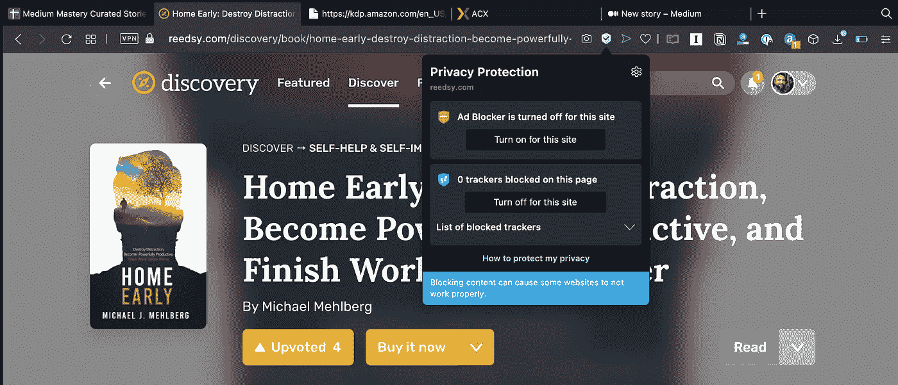
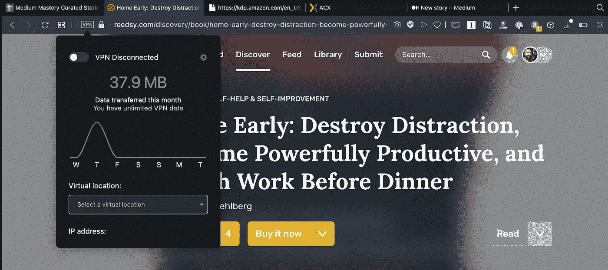
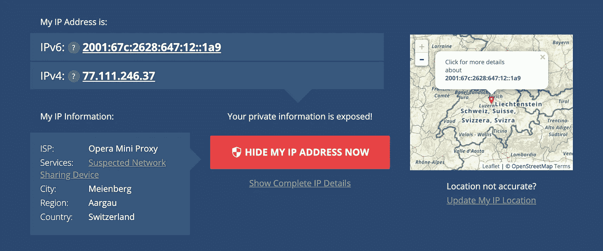
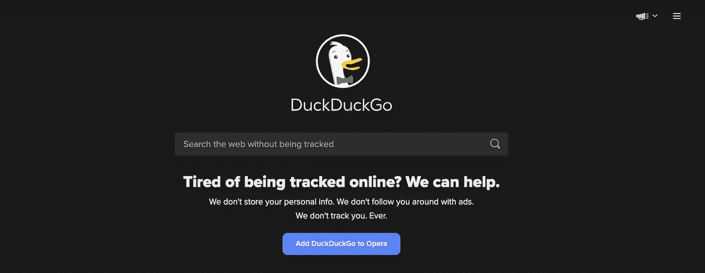
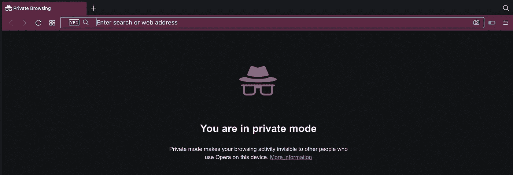
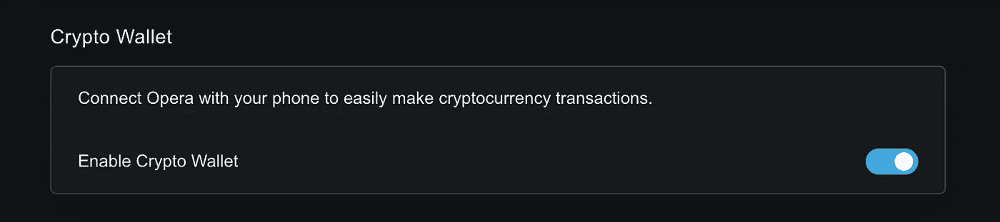

# 在社会困境的时代保护您的数字隐私

> 原文：<https://medium.datadriveninvestor.com/protecting-your-digital-privacy-in-an-age-of-the-social-dilemma-f6c8772d1ba3?source=collection_archive---------13----------------------->

## 他们在监视你。令人毛骨悚然。以下是要做的事情…

Licensed Image by [Sasun Bughdaryan](https://stock.adobe.com/contributor/206145765/sasun-bughdaryan) from [Adobe Stock Photos](https://stock.adobe.com).

我妻子从药店一回到家，就在脸书上看到了她刚买的东西的广告。

她以前从未买过这样的东西。她没有去寻找它。她也没有给任何人打电话或发邮件。但它就在那里，坐在她的脸书饲料，渴望和等待她的点击，诱使她购买更多。

有点吓到她了。

她买的东西(有史以来第一次)最终出现在她的脸书供稿中，这是巧合吗？也许吧。但是每个和她分享故事的人都有类似的经历。他们会给朋友发电子邮件，告诉他一个问题，几个小时后才看到解决方案的广告。

像她一样，这也让他们毛骨悚然。

如果你看过《社交困境》,你就会知道到底发生了什么。商店、电子邮件提供商和社交媒体平台正在向每个人和你的母亲出售你的信息。他们以“定向广告”的名义贩卖你的兴趣、欲望和购买你在网上阅读、观看或购买的一切都被仔细监控、记录，然后用来建立你是谁、你喜欢什么以及你可能购买什么的档案。然后他们用这个档案向出价最高的人做广告。

你就是产品，他们靠你发财。

问题不在于他们是如何做到的，或者为什么。问题是，你怎么让它停下来？在一个类似 1984 年的监控时代，你如何保护你的隐私，而不放弃你与世界其他地方的联系？

这正是本文的目的。详情请继续阅读。滚动到 tl 的底部；博士

# 隐私从你的浏览器开始

浏览器是你上网的窗口。你的搜索、你访问的网站、你观看的视频——一切都从那扇窗户涌入。

当你搜索这些搜索，访问这些网站，观看这些视频时，广告商正在建立你的行为档案。根据你的浏览行为，他们能够对你的年龄、性别、种族、兴趣等做出有根据的(而且非常准确的)猜测。当你生病的时候，当你在市场上买新车的时候，当你的朋友或家人去世的时候，他们开始有一种感觉。

分析脚本和被称为追踪器的隐藏图像被植入许多网站，与谷歌和脸书等公司共享你访问的网站。他们将您的浏览行为与您的 IP 地址(您的计算机在互联网上的唯一标识符)相关联，并建立您的个人资料，以便稍后将该资料出售给广告商。

除非你能关掉它。

这让我想到了我的第一个建议:如果所有这些都让你毛骨悚然，那么选择一个能给你隐私选项的浏览器。

Opera 是我现在最喜欢的浏览器，这也是很多其他原因。从下拉菜单中单击一下，你就可以关闭追踪器，防止网站串通建立你和你的互联网行为的档案。更重要的是，我可以直接阻止广告出现，提高我的上网速度，进一步保护我的身份。

Screenshot of Opera browser by Author, [Michael J. Mehlberg](https://medium.com/u/532dbb8c940b?source=post_page-----f6c8772d1ba3--------------------------------).

作为一个额外的奖励，即使没有打开广告拦截，Opera 无疑是我用过的速度最快、功耗最低的浏览器。我的 Macbook 在使用 Opera 时的电池寿命远远超过了 Chrome，甚至是 Safari(尽管 Safari 在最近的更新中变得更好)。

此外，Opera 还有一些令人难以置信的内置功能，如 My Flow，允许你保存网站和记录笔记，并在其他设备之间同步，以及 Chrome 插件支持，这是 Safari 和其他浏览器所不具备的(只是要小心安装支持你的隐私的插件，而不是破坏它)。

但是有一个功能真正突出了终极隐私保护，那就是 VPN。

# 使用虚拟专用网络保护您的浏览

VPN 代表虚拟专用网络。它在你和互联网上的服务器之间建立了一个加密的连接，保护你的网络流量不被偷窥。不仅文章、视频和搜索受到保护和保密，而且你的身份和位置也被隐藏了。

Screenshot of Opera browser by Author, [Michael J. Mehlberg](https://medium.com/u/532dbb8c940b?source=post_page-----f6c8772d1ba3--------------------------------).

有许多 VPN 解决方案。有些可以安装在你的路由器里，保护你家里所有的互联网流量，而不需要太多的技术知识。再说一次，我使用 Opera 是因为它是内置的，而且打开起来非常简单。

我在这里，用我在弗吉尼亚的 Opera 浏览器上网，互联网以为我在瑞士。

Screenshot of [www.whatismyipaddress.com](http://www.whatismyipaddress.com) by Author, [Michael J. Mehlberg](https://medium.com/u/532dbb8c940b?source=post_page-----f6c8772d1ba3--------------------------------).

因为你正在加密你所有的网络流量，因为你的浏览位置在世界各地被反弹，你的互联网性能将受到打击。但是，如果你对完全的互联网隐私和安全感兴趣，VPN 无疑是实现它的最简单的方法。

一旦你网上冲浪的位置和内容得到保护，下一步就是保护你的隐私免受你用来冲浪的工具——如社交媒体和搜索工具——的侵害。

# 搜索和隐私不一定是不一致的

毫无疑问，谷歌获得了巨大的成果。他们花了数年时间来完善他们的算法，增加智能来理解环境，如位置和时间。但是他们也花了很多年来建立你的个人档案。

您的搜索历史、位置、年龄、性别、姓名、最常访问的网站、社交媒体资料以及许多许多其他指标都融合在谷歌的伟大引擎中，以提供针对您兴趣的结果。因此，当你在谷歌上搜索时，你很可能会得到你想要的结果。但是，也正因为如此，当他们进入你的大脑，宣传一些过于针对你的需求的东西时，你会感到有点害怕。

输入鸭鸭围棋。

Screenshot of [www.duckduckgo.com](http://www.duckduckgo.com) by Author, [Michael J. Mehlberg](https://medium.com/u/532dbb8c940b?source=post_page-----f6c8772d1ba3--------------------------------).

Duck Duck Go 和 Google 一样，是一个搜索引擎。然而，与谷歌不同的是，鸭鸭 Go 不会存储您的搜索结果。它不会存储您的个人数据。你和你的搜索保持隐私。

和谷歌一样，鸭鸭 Go 通过广告赚钱。但是你看到的广告与当前搜索直接相关，而不是基于你的个人资料和你的在线活动历史。

此外，你会立即注意到你在谷歌上认不出的搜索结果——你以前从未见过的模糊网站和文章现在出现在最前面和中心。起初，这些结果并不总是让人感觉达到目标。Duck Duck Go 不会解读你的意图，也不会使用你搜索历史的个人资料来预测你的意思。但你必须承认，有时甚至谷歌也会出错，很多时候会用相同的旧东西填充你的搜索结果。

通过大约一周的使用和少量的练习，我已经能够将 Duck Duck Go 变成我的研究的搜索引擎。我对结果更满意。

他们没有给我看他们认为我想看的*。他们没有给我看更多我已经看过的*。他们没有向我展示与我的信念和盲点相符的信息，这些信息是通过多年的个人分析建立起来的。他们只是根据我搜索过的关键词向我展示网站，这既有帮助又让人耳目一新。**

# 你所有的信息都属于我们

你在网上做的每一件事——我是说每一件事——只要有合适的工具，每个人都可以看到。你的电子邮件，你的搜索，你的浏览，是的，甚至你的电话和短信。你所做的这些活动会留下信息的数字痕迹，任何爱管闲事、心怀恶意的人都可以发现。

防止他人看到你的互联网流量是不可能的……毕竟，你必须连接到互联网，公开发送这些数字位，这样你的电子邮件才能到达预定目的地，公司才能将其网站发送到你的浏览器，你的短信才能发送给你的朋友和家人。

解决方案不是隐藏你的流量，而是加密它，让它只能被你和对方理解。

加密相当于用只有你和接收者拥有的密钥把你的信息锁在一个盒子里。你可以通过邮件发送那个盒子，没有人能把它送到你的目的地。当它最终到达时，预定的目标有正确的钥匙打开盒子并阅读里面的信息。

如果没有加密，您的邮件可能会被阅读、删除、修改或重定向。通过加密，你的信息可以安全地到达预定目标。不仅如此，你的目标可以证明它来自你(而不是冒名顶替者)并且没有被修改过。

标准文本消息不加密。它们通过无线电波飞到手机信号塔，通过复杂的地下电线网络和电话公司网络中继，然后再通过空气飞到另一端的手机——所有这些都是在户外进行的。这正是为什么数百万人现在已经对手机、社交媒体和政府失去了信任，正在转向 iMessage、Telegram 和 Signal 等服务。

这三种服务对你的信息进行加密，这样你的信息就不会被中途读取。但是他们做的方式不同，这一点理解起来很关键。

虽然 iMessage 和 Telegram 发送加密信息，但它们都使用苹果和 Telegram 分别知道的密钥。换句话说，你的信息受到保护，不会被外界窥探，但苹果和 Telegram 可以使用你的加密密钥解锁你的信息，并读取其内容。这应该只发生在犯罪活动的情况下，当当局带着搜查令来找他们检索你的未加密信息时。但是值得知道。而且，这也正是 Telegram 有“秘密消息”功能和 Signal 这样的应用存在的原因。

Signal 和 Telegram 的秘密消息功能都使用只有您和您的聊天对象才能使用的密钥对消息进行加密。没有人能读懂中间的信息。没人。

如果你担心你的通信隐私，使用这样的技术有很大的帮助。

# 私人标签并不那么私人

Screenshot of Opera browser by Author, [Michael J. Mehlberg](https://medium.com/u/532dbb8c940b?source=post_page-----f6c8772d1ba3--------------------------------).

那些私人浏览标签(甚至在 Opera 中)在本地只属于你一个人。虽然这很容易保护你的浏览历史免受窥探你的电脑、平板电脑或手机的人的窥探，但它不能保护你免受你家或公司以外的窥探。

互联网搜索、浏览的文章、观看的视频、分享的迷因都会被追踪，就像你没有使用隐私浏览模式时一样。当然，在私人标签页中，你不会登录很多系统，比如谷歌、脸书等。—所以他们不能*知道*是你，并跟踪你的浏览活动——但是通过正确的工具，任何黑客或权威人士都可以访问你的互联网活动并看到这一切(假设你没有使用上面讨论的 VPN)。

打开私人标签时要小心。它会给你一种虚假的安全感。如果你只是想保护你的互联网浏览历史，你的情况很好。如果你需要保护自己免受不良分子的侵害，使用上面讨论的 VPN 技术。

# 一张图片抵得上一千个广告

不要自动下载邮件中的图片。图片向发件人提供了有关您是否打开了电子邮件以及是否参与了电子邮件内容的信息。

我有超过 800 人的电子邮件简讯，我会定期给他们发邮件。当你们每个人打开邮件或点击链接时，我能分辨出来。除非，你关掉图片自动下载，什么都不点。

您可以在大多数现代电子邮件客户端和在线电子邮件系统(如 Gmail)中调整此设置。下面是热门的链接:[关闭 Gmail、Outlook、Apple Mail、iPhone 上的 Apple Mail 中的图片自动下载](https://www.imore.com/how-disable-image-loading-gmail-apple-mail-outlook-and-more)。这是一种简单、直接的方法，可以为你打开和阅读的电子邮件增添一丝隐私。

# 在你的交流中要聪明

仅仅因为你使用 iMessage、Telegram 或 Signal 等消息平台向你的朋友和家人发送加密消息，并不意味着对方不能将你所说的内容截图并在互联网上分享。更重要的是，你*必须*假设你在电子邮件中发送的任何东西，如果没有用电子邮件加密技术(如 S/MIME 或 PGP)明确加密，任何人都可以阅读。

每天都有数十亿封电子邮件在互联网上飞来飞去。大多数是没有保护的。拥有正确访问权限的正确的人可以很容易地看到您的整个邮件，您将邮件发送给谁，从哪里发送，甚至您使用什么电子邮件客户端发送邮件。

简而言之，在你的交流中要聪明。尽可能使用加密技术。但即便如此，也要谨慎行事。

你母亲的建议一直是对的:不要给任何你不想登在《纽约时报》头版的人写任何东西。如今，对错误的人说错误的话可能会让你陷入困境。

# (别)把钱给我看！

回到我妻子的故事，我们认为她成为目标的唯一途径是通过她的信用卡记录。我们认为她购物的商店有一个自动系统向广告商出售销售信息。然后，这些广告商瞄准她和像她这样的人投放广告，增加销售额。

即使我们错了，使用加密货币或 Apple Pay 等安全支付服务仍有理由。

首先，与信用卡不同，Apple Pay 迫使你使用密码或 FaceID 才能使用信用卡。这就是所谓的双因素认证。尽管信用卡是一种单因素认证，但 Apple Pay 是一种双因素认证，因为它是你拥有的东西(你手机上的信用卡)*和*你知道的东西(你的密码)或你的东西(你的面部识别)。总之这样安全多了。如果有人偷了你的信用卡，你就完蛋了。如果有人偷了你的手机，他们无法支付，除非他们有你的脸或你的密码。

更有甚者，苹果无法访问你的原始信用卡信息，使用 Apple Pay 也不会存储任何可以与你绑定的交易信息。你的购买在你、商店和银行之间进行。这里重要的是，你的信用卡号码是*而不是*在你付款时使用。相反，一个唯一的设备 ID 被发送到支付终端，然后由您的银行进行验证。银行知道从你的信用卡里扣钱，但是商店不知道是谁买的，苹果也不知道你买了什么。

Screenshot of Opera browser settings by Author, [Michael J. Mehlberg](https://medium.com/u/532dbb8c940b?source=post_page-----f6c8772d1ba3--------------------------------).

加密货币是一个完整的蜡球，我不想在这里分享(或者理解，就此而言)。简单地说，在网上使用它，你可以获得一定程度的匿名。作为 Opera 的额外奖励，他们的浏览器内置了一个加密货币钱包，您可以使用一些现代加密货币技术进行支付。

如果你对消费的隐私很认真，在购物前考虑一下 Apple Pay、Google Pay 或加密货币等技术。小心像 Venmo、PayPal Mobile Cash、Zelle 和 Square Cash 这些*都* [出售或与私人第三方](https://www.nytimes.com/wirecutter/money/mobile-payment-apps-privacy/)分享你的数据的技术。

# 最后

把这个列在最后是因为，如果你看过《社交困境》，担心社交媒体窃取你的隐私，那么你可能已经离开或者考虑彻底离开它。但是，为了完整起见，我将以这样一句话结束:

离开任何不尊重你隐私的社交媒体网站。离开任何向广告商出售你信息的社交媒体网站。离开任何让你成为产品的社交媒体网站。

如果你不能做到这一点，或者只是不想这样做，请详细检查您的隐私设置。仔细检查每一条信息，关闭隐私设置，这可能有助于社交媒体平台建立你的个人资料或与第三方分享你的信息。

我不会提是谁做的。你知道他们是谁。

研究他们的隐私政策，听听用户的故事，做做功课。

就这样:

1.  使用 Opera 浏览器。
2.  打开防点击跟踪。
3.  打开广告拦截。
4.  打开 VPN。
5.  设置你的默认搜索引擎为 Duck Duck Go。
6.  使用安全信息服务，如 Telegram(小心)、Apple iMessage(小心)或 Signal。
7.  小心私人浏览器标签。
8.  不要自动下载邮件图片。
9.  在沟通中要聪明(截图、邮件加密等)。
10.  用 Apple Pay 或加密货币私下消费。
11.  不要让社交媒体利用你，而是开始利用它。

这些东西不会完全保护你。任何黑客都会告诉你，他们只需找到一个漏洞就可以暴露你的信息或利用一个系统。但是，所有这些技术的结合将大大减少你的在线资料，使你更能适应令人毛骨悚然的广告技术，这些技术鼓励在世界各地出售和分发你的个人隐私信息。

我做错了什么吗？你知道其他技术吗？请在评论中分享，我会将这篇文章更新到你的媒体档案中。