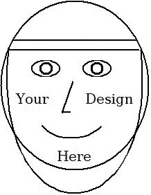

# 新时代的保护时尚

> 原文：<https://medium.datadriveninvestor.com/protective-fashion-for-these-new-times-31ee05083569?source=collection_archive---------26----------------------->

Photo by [Alex Iby](https://unsplash.com/@alexiby?utm_source=medium&utm_medium=referral) on [Unsplash](https://unsplash.com?utm_source=medium&utm_medium=referral)

*吉姆·梅森——2020 年 4 月 2 日*

请原谅我。这似乎是一个古怪的想法。几周前我自己也会这么想，但新型冠状病毒提醒了我们，面对传染病，我们是多么的脆弱。让我们变得脆弱的是我们最近的“正常”社交习惯，即与许多人有密切的身体接触。当然，我们大多数人一直都知道，我们通过在彼此附近咳嗽和打喷嚏以及用手触摸彼此和我们的脸来与他人交流感冒和流感。

新的是新冠肺炎病毒的极端传染性和它引起的疾病的严重性。我们的情况类似于许多人在艾滋病危机期间面临的情况，以及他们如何改变自己的行为以应对这一危机。因此，与新的或多个性伴侣发生性行为的人现在已经习惯于戴避孕套，以避免感染艾滋病或其他性传播疾病。我们的新情况甚至更加严重，因为它涉及到整个人口在追求我们普通的公共互动。

作为对新冠肺炎的回应，明智的反应是我们避免与大多数人直接接触，我们与人保持物理距离，当我们与大多数人非常接近时，我们戴上面部保护装置和防护服，尤其是手套。我们也认真地、例行公事地洗手。我们现在使用的防护设备相当有效，但它可能会显得不合群，甚至令人恐惧。此外，如果每个物品只能使用一次，就很难给每个人分发足够的防护装备。

 [## 冠状病毒；惊慌失措；字里行间的 z |数据驱动的投资者

### 围绕冠状病毒的话题；更准确地说，新冠肺炎几乎占据了整个新闻预报的头条…

www.datadriveninvestor.com](https://www.datadriveninvestor.com/2020/03/23/coronavirus-a-to-panic-z-between-the-lines/) 

一个更长期、更能被社会接受、甚至更有吸引力的替代方案是，我们开发新的服装，可以作为防护装备穿着，然后清洗并重复使用。他们的使用将补充，而不是取代洗手和一些物理距离的明智的预防措施。新的防护时装将包括以下物品:

首先是一个透明的保护面罩*，由类似丙烯酸的永久性材料制成。理想情况下，它的表面应该具有抗病毒和抗细菌的特性，但至少，它必须易于清洗以便重复使用，并且耐刮擦。这种盾牌可以制成各种吸引人的设计，以便人们可以选择他们喜欢的外观的盾牌。防护屏将悬挂在离面部稍远的地方，让后面的空气流通，以支持呼吸和降温。它的透明性允许我们通过面部表情来表达友好和喜爱，包括微笑和眼神拥抱来代替身体上的拥抱或亲吻。这个保护罩也可以防止我们经常触摸自己的脸。它可以在每次使用后清洗。这种盾牌可能并不太难制造。就时尚声明而言，将其与太阳镜、太阳帽和 t 恤相提并论。*

*第二件物品是 ***薄而贴身的手套* *，由具有抗菌性能*** 的永久性织物制成。铜纤维或其他抗菌材料可能会使手套具有保护作用。手套必须足够薄，以允许我们有效地使用手指，并且足够多孔，以防止我们的手过热。我承认开发那样的手套会很有挑战性，但我认为这是可能的。如果我们更多的其他衣服中的织物能够具有抗菌性能，这也将是有益的。*

*想象一下，由于新冠肺炎疫情，我们中的许多人可能很快就会像往常一样戴着时尚的防护口罩和手套，这很令人惊讶，甚至很有趣。它们不仅会减少像新冠肺炎这样的新型微生物的传播，还会有助于减少感冒和流感等更常见疾病的发病率。目的不是完全消除传染病，而是降低呼吸道感染的风险和传播速度。时髦的可重复使用的面罩将是一个良好的开端；耐用的防护手套可能会随后出现。*

*我的希望是，这个想法的实施不会让任何人变得非常富有，但会让尽可能多的人以合理的价格普及和获得这种防护服。*