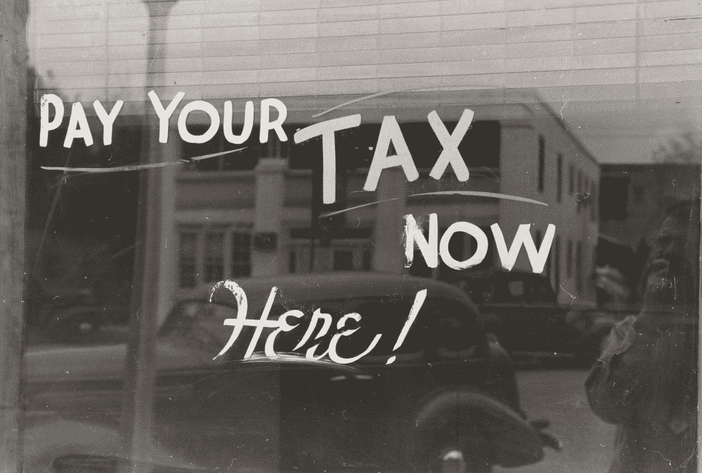

# PSA:尽快提交你的纳税申报表可能会给你一张更大的刺激支票

> 原文：<https://medium.datadriveninvestor.com/psa-filing-your-tax-returns-asap-may-grant-you-a-larger-stimulus-check-e26168330f5e?source=collection_archive---------22----------------------->

Photo by [The New York Public Library](https://unsplash.com/@nypl?utm_source=medium&utm_medium=referral) on [Unsplash](https://unsplash.com?utm_source=medium&utm_medium=referral)

纳税季。

虽然对许多人来说，这可能是一年中令人恐惧的时刻，但你可能想在本周末就开始报税。在撰写本文时(2021 年 2 月 12 日)，美国国税局刚刚开始接受 2020 年的纳税申报。通常情况下，他们会在年初接受纳税申报，但由于疫情的环境，2020 纳税年度的开始接受日期会稍晚一些。

# 2020 年报税的最佳时间是什么时候？

目前正在进行的还有另一轮刺激检查，正等待政府和国会的最终批准。在民主党提出的方案中，下一轮刺激计划很可能会包括大约 1，400 美元的金额。与第一次刺激资金注入类似，这些支票将全额寄给任何调整后总收入为 75，000 美元或更少的个人(已婚人士的门槛将是 150，000 美元)。对于一些收入高于这些水平的人，支票上的金额将根据收入调整为更低，并逐步取消 10 万美元的硬性规定。据一些消息来源称，这项刺激计划有望在三月的某个时候通过，美国国税局将在不久后开始处理支票。

重要的一点是，即将到来的刺激可能基于 2019 年或 2020 年你的纳税申报单上报告的收入。利用接下来的几周时间，将你的 2020 年纳税申报表存档，这可能是从政府获得更多款项的关键。如果你在国税局开始计算你的刺激支票金额之前提交纳税申报表，他们将根据你从 2020 年起最近报告的收入来计算。另一方面，如果你等到国税局开始计算付款后才提交纳税申报表，他们将使用他们存档的最新信息，这将是你 2019 年申报的收入。这仅对两类人很重要，并将决定你今年报税的最佳时间，以便从下一轮刺激计划中获得最大收益。

# 第一组:尽快报税将有助于获得更大的刺激支票

属于第一组的人将是可报告的调整后总收入为 10 万美元或更少，并且在 2019 年至 2020 年之间收入下降的个人。这将不包括 2019 年收入低于 75，000 美元的个人，因为无论哪一年的收入用于计算新的支付，您的刺激金额都不会改变，您将全额获得刺激。这适用于 2019 年至 2020 年间收入低于 20 万美元的 AGI 下降的已婚夫妇。

对于属于这一组的人，你要确保尽快完成纳税申报，以便在国税局处理新刺激金额的计算之前，给他们时间更新你的所有信息。

Photo by [Heather Mount](https://unsplash.com/@heathermount?utm_source=medium&utm_medium=referral) on [Unsplash](https://unsplash.com?utm_source=medium&utm_medium=referral)

不要忽视的一件重要事情是，美国国税局将根据调整后的总收入来计算你将收到的金额。这和你的总收入不一定一样。例如，如果你有一个孩子(一个额外的受抚养人)或者在过去的一年里结婚了，那么你的收入将根据税法进行相应的调整。这意味着，在许多情况下，你调整后的总收入可能会比你的实际收入低得多。人们很容易将 AGI 与你的工资混淆，但对于许多由于各种原因没有工作一整年的人来说，他们调整后的总收入将远远低于他们的固定年薪。

另一小群人可以从更早申报中受益匪浅，他们可能在 2019 年声称是受抚养人，但现在将在 2020 年申报为独立人。他们不仅将有资格获得新的刺激计划，还可能从之前几轮刺激计划中获得更高的税收回报。

# 第二组:推迟报税，接受更多刺激资金

这第二组将与第一组相反，包括 2020 年报告的调整后总收入将高于 2019 年报告的 AGI 的任何个人。只要你 2020 年申报的收入预计大于 2019 年的收入，并且超过 75，000 美元的门槛，那么根据 2019 年的纳税申报单计算你的下一笔刺激支票可能会更好。这是因为刺激计划开始逐步取消对申报收入超过 75，000 美元的个人的检查，这意味着 2020 年收入更高的个人将有更大一部分付款被取消。

与第一组一样，这些计算都是基于调整后的总收入。这意味着，在某些情况下，如果您不再能够申请受抚养人或在去年离婚，您将不再有这些注销，并且您由此申报的收入可能会在 2020 纳税年度增加。

在任何情况下，如果你属于这两个群体中的任何一个，当你准备报税时，不要忘记考虑这一点。在正常情况下，有很多原因决定你应该何时报税。如果你期待退税，为了更快收到你的钱，早点申报可能更有意义。提前申报也有助于防止身份盗窃，并且总是在新的一年完成任务的积极步骤。今年，随着国会一揽子刺激计划的出台，在规划 2020 年的纳税申报时，可能会多一件需要考虑的事情。