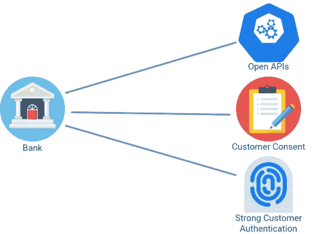
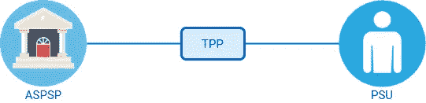

# PSD2 开放式银行

> 原文：<https://medium.datadriveninvestor.com/psd2-open-banking-67cbbf5a445c?source=collection_archive---------3----------------------->

一段时间以来，PSD2 和开放式银行一直是热门话题。如果你还不熟悉这些概念，在你深入研究之前，让我解释一下你需要知道的基础知识。

## PSD2 是什么？

支付服务指令(PSD2)是一项管理支付服务和支付服务提供商的欧洲指令(一项设定目标的立法法案)。这是一项合规性要求，有助于消费者更好地控制和访问他们的财务数据，同时增加银行保护他们的责任。

***PSD 1 vs PSD 2***

支付服务指令(PSD1)为欧盟简化的现代支付服务制定了规则和指导原则。随着时间的推移，PSD1 缺乏推动创新、创造竞争、保障支付和保护消费者的动力。为了满足这些要求，引入了 PSD2 作为经修订的支付服务指令。

PSD2 要求银行在**客户同意**的情况下，通过**开放 API**安全向第三方公开客户数据。

## 什么是开放式银行？

[开放式银行业务](https://www.openbanking.org.uk/customers/what-is-open-banking/)是在遵守 PSD2 要求的同时为提供商提供金融信息访问的安全方式。它允许新的第三方服务提供商进入市场，从而为消费者带来更多竞争、更多选择和更好的服务。

***开放银行的主要角色***

为了理解开放银行中的主要流程，你需要识别开放银行中的主要角色。

**ASPSP**

账户服务支付服务提供商(ASPSP)是为付款人提供和维护支付账户的支付服务提供商。比如银行。

*   ASPSPs 通过其 API 端点向第三方提供商提供客户的账户交易数据。
*   发布读/写 API，允许第三方提供商在客户同意的情况下发起支付。

**PSU**

支付服务用户(PSU)是作为收款人、付款人或两者使用支付服务的人(自然人/法人)。例如，银行账户持有人。

**TPP**

第三方提供商(TPP)是使用 API 访问客户账户、提供账户信息服务或发起支付的组织或个人。

TPP 可以有以下一个或多个角色:

**AISP**

帐户信息服务以在线服务的形式提供帐户信息服务。这提供了由 PSU 持有的一个或多个支付账户与 ASPSP 的组合。当 TPP 负责提供账户信息服务时，它被称为账户信息服务提供商(AISP)。

**PISP**

支付发起服务提供商提供在线服务，以应特定支付账户的 PSU 的请求发起支付指令。当 TPP 负责提供支付发起服务时，它被称为支付发起服务提供商(PISP)。

**CBPII**

基于卡的支付工具发行者是发行基于卡的支付工具的支付服务提供商，该支付工具可用于从 ASPSP 持有的支付账户发起支付交易。当 TPP 提供这种服务时，它被称为 CBPII。

要了解 TPP 如何扮演这些角色，您可以访问 https://openbanking.wso2.com/的，尝试使用 WSO2 开放式银行解决方案的用例演示。

现在你知道了基础知识，你可以很容易地开始深入挖掘！开放银行快乐！