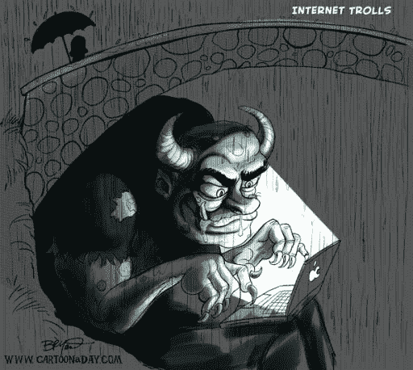

# 巨魔心理学

> 原文：<https://medium.datadriveninvestor.com/psychology-of-a-troll-330848b7679d?source=collection_archive---------21----------------------->

Credits- Caartonaday.com

在这样一个不礼貌的世界里，人们变得多么粗鲁、无礼和不文明。那么，我们该怎么办呢？

真相经常以威胁社会准则的伪装出现。通常，当我们被某人的粗鲁所打动时，我们最好的防御就是对那个人粗鲁，我认为这是对不文明人的粗鲁的回答。他们值得吗？是的，但是如果我们的回复和他们的评论一样刻薄，我们就会变得和我们面前的人一样。这可能只有在检查每一种情况之后才有可能证明哪一种是哪一种。在一个歧视、猥亵的评论和刻薄的评论就像“daal chawal*”的世界里，社会准则仍然是不成文的，有趣的是，这在发现真相的问题上提出了许多问题。

如果有人想体验一下粗鲁，那么社交媒体，Twitter 是最好的去处。住在地球不同一端的不知名的人活了过来，并喜欢让别人对自己感到难过。他们喜欢贬低别人，因为他们的生活中没有任何有趣的事情发生。他们还喜欢匿名，因为每个用户都有一定的匿名性，即使他们并非完全不为人知。巨魔们不明白的是，他们称某人为“胖子”的评论可能会对另一边的人产生负面的心理影响。巨魔应该站在另一边感受他们“匿名”攻击的人的感受。或者，他们应该有一小部分人性在他们的心里。

当收到一条粗鲁的评论时，最好的办法是忽略这条评论，或许，把它作为垃圾邮件报告并屏蔽掉。然而，这将给予巨魔更多的重要性，因为他们会知道它影响了你。因此，忽略一个负面的评论，看看成千上万的正面评论。毕竟，无知是福。

* Daal Chawal——印度的主食，基本上是小扁豆配米饭。