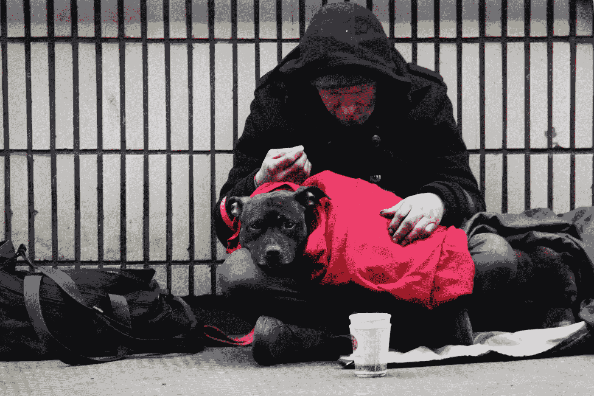
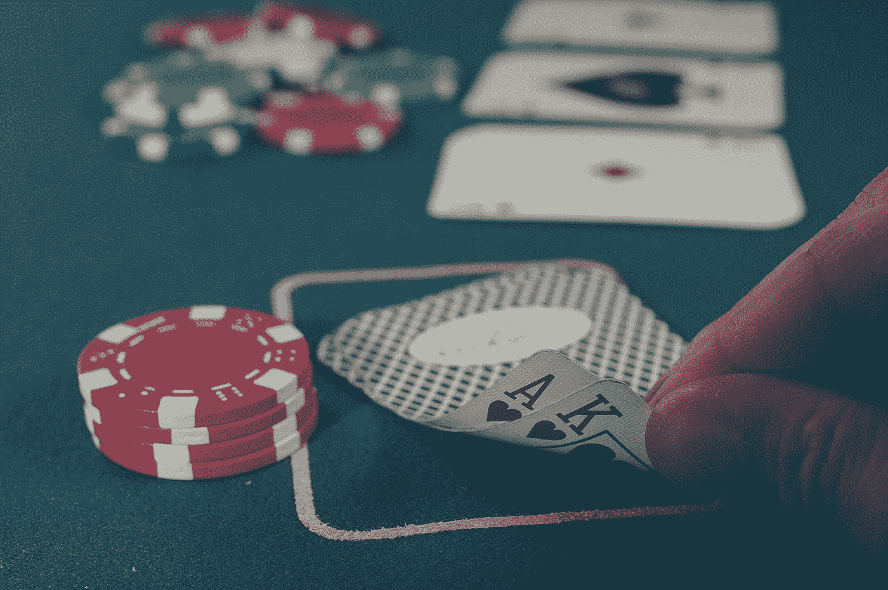

# 贫困心理学

> 原文：<https://medium.datadriveninvestor.com/psychology-of-poverty-deb0224002e0?source=collection_archive---------11----------------------->

Photo by [Nick Fewings](https://unsplash.com/@jannerboy62?utm_source=medium&utm_medium=referral) on [Unsplash](https://unsplash.com?utm_source=medium&utm_medium=referral)

似乎有一种真诚的信念，那就是只要你足够努力，有远大的梦想并努力去做，你就会摆脱贫困。如果你很穷，你只是心态不对。

很明显，这个推理是错误的。许多因素有助于某人变得富有和成功。运气在这里扮演着重要的角色，但是经常被低估。变得富有的其他重要因素是特权和时机。认为同样的因素也影响到生活在贫困中的人，而不是他们的心态，真的那么牵强吗？

现在，具有讽刺意味的是，有一个论点认为，那些生活在或曾经生活在贫困中的人与那些根本不知道贫困的人有着非常不同的思维模式。根据 Haushofer 和 Fehr 在 2014 年发表的一篇文章，贫困对精神状态有两个主要影响:风险和时间感知，这是由压力和负面影响状态的持续存在引起的。我们将依次讨论这些。

 [## 外汇投资如何帮助偿还债务|数据驱动的投资者

### 外汇是对外汇市场的投资，不同国家的货币在外汇市场上进行兑换

www.datadriveninvestor.com](https://www.datadriveninvestor.com/2019/02/13/how-forex-investment-helps-to-repay-your-debts/) 

# 贫穷和压力

不难理解，那些生活在贫困中的人可能比那些生活在贫困中的人压力更大。不知道你是否能在经济上撑到周末比不知道你是应该再等一年买 iPhone 还是现在就买更有压力。希望这是显而易见的。

在 Haushofer 和 Fehr 的论文中，他们回顾并总结了一系列研究，这些研究表明了贫困对压力水平的影响。他们确定了 25 项研究，这些研究报告了贫困增加或减少对心理健康的影响，这些研究或是在随机对照试验中进行的，或是在自然实验中进行的。其中，18 项研究显示了减贫对心理健康或压力的积极影响，5 项研究显示了对一些与健康或压力相关的心理变量(如某些精神障碍)的影响，2 项研究没有显示结果。

Photo by [nikko macaspac](https://unsplash.com/@nikkotations?utm_source=medium&utm_medium=referral) on [Unsplash](https://unsplash.com?utm_source=medium&utm_medium=referral)

最值得注意的是，他们提到了一项关于干旱时期对肯尼亚农民随机负面收入冲击的研究。这些干旱和收入减少的时期导致皮质醇水平上升，在作物可能歉收的干旱时期，自我报告的压力水平更高(Chemin 等人，2013 年)。这不是一个非常令人惊讶的发现。

这些研究中的大多数表明，由此带来的收入增加会导致因精神健康问题住院治疗的减少，抗焦虑药物的消费减少，以及自我报告的精神健康的增加。

不太直接的减贫也显示出效果；几个随机对照试验报告说，当参与者获得健康保险(45)，改善住房和获得水时，心理健康会增加。谈论为 UBI(普遍基本收入)制造一个地狱。所以，是的，收入对幸福有影响，因此，贫困对压力有影响也就不足为奇了。现在，如果你想深入了解肾上腺素(短期压力)或皮质醇(长期压力)的影响，请阅读我关于它们的两篇文章，因为它们已经被联系在一起。现在，转到风险和时间观念:

# 风险贫困

人们一再发现，生活在贫困中的人，尤其是发展中国家的人，比富裕的人更厌恶风险，更有可能贴现未来的收益。例如，美国贫困家庭的贴现率大大高于富裕家庭，同样，对埃塞俄比亚农户和印度南部样本的研究发现，较低的财富预示着较高的贴现率。在代表性样本中，较富裕的家庭或年收入较高的家庭也表现出较低的风险厌恶水平。

Photo by [Michał Parzuchowski](https://unsplash.com/@mparzuchowski?utm_source=medium&utm_medium=referral) on [Unsplash](https://unsplash.com?utm_source=medium&utm_medium=referral)

这些发现可以用不同的方式来解释。第一点相当明显:你越富有，就越有可能拥有一个安全网。所以，如果你的高风险选择没有成功，你就减少损失，继续前进。

第二种解释是，你知道，或者有错觉，认为你已经具备了赚钱的条件。即使你现在失去了它，你已经做了一次，你可以做两次！这是一个很好的归纳推理，可以很容易地归因于乐观主义，甚至自私自利的偏见。但这是一种知识(或幻觉！)那种从来没有过钱的人没有的。

另一种解释是，假设人们已经摆脱了贫困，这种避险情绪就会持续存在。为什么？因为只有穷过的人才真正知道事情会变得多糟。如果你不知道贫穷，你就不知道。因此，与风险选择相关的可能收益无法与返贫的可能性相抗衡。

有一种观点认为，那些了解 T4 的人不一定是为了规避风险而规避风险。他们其实知道其中一个选项有多糟糕。他们有别人没有的洞察力。

# 贫困时间

从风险认知到时间认知和贴现，Haushofer 和 Fehr 引用的研究表明，较贫困的家庭更有可能选择较小和较早的金钱奖励，而不是较大和延迟的金钱奖励。

这是贫穷的另一个很容易解释的特征:如果你不知道自己能否撑到下周末，那就没有必要担心两年后的事情。动物的大脑为生存而生。其他的赘肉只有在我们最终进入文明阶段时才会出现，在这个阶段，生存已经成为一种默认，而不是对聪明生活的奖励。当事情变得艰难，生存受到威胁时，我们回到边缘系统，我们被恐惧所驱使。

Photo by [Michael Longmire](https://unsplash.com/@f7photo?utm_source=medium&utm_medium=referral) on [Unsplash](https://unsplash.com?utm_source=medium&utm_medium=referral)

另一项被引用的著名研究着眼于对意外之财而非经常性收入的时间认知差异。受到负收入冲击(损失)的受试者比那些没有受到冲击影响的受试者表现出更多的偏向当下的经济行为。对于积极的收入冲击，没有发现相反的影响。因此，负收入冲击----贫困的一个普遍特征----似乎增加了时间贴现(Haushofer 等人，2013 年)。

这一发现(尽管只在实验室中发现)很有趣。它表明，对损失的直接强调触发了我们内心的某种东西，使我们抓住我们可能已经拥有的收益(直接回报)或寻求(立即)补偿，以减少损失的痛苦。这显示了收入损失的严重程度，并为与持续损失或收入不稳定相关的巨大负面影响和压力奠定了基础。

恐怕与我的大多数其他文章不同，这些发现没有真正的实际应用价值。我还没有无知到写下贫穷是一种心态，如果你变得更加冒险，等待回报的时间更长，你就可以变得富有。

重要的是要认识到贫困对个人的长期影响，不仅是对他们的经济状况，而且是对他们的身体和精神状况的影响。因此，我们将能够理解为什么贫穷会持续下去，以及如何最好地打破这种看似恶性的循环。

请务必通读这些文章和参考资料。

# 参考

Chemin，m .，De Laat，j .，& Haushofer，J. (2013 年)。负面的降雨冲击增加了肯尼亚贫困农民的压力荷尔蒙皮质醇水平。在 SSRN 2294171 有售。

Haushofer 和 e . Fehr(2014 年)。贫困心理学。*理科*， *344* (6186)，862–867。

Haushofer，j .，Schunk，d .，和 Fehr，E. (2013 年)。*负面收入冲击增加贴现率*。苏黎世大学工作文件。

莫尔·范·登·阿克是华威商学院行为科学专业的博士生。她研究了不同的支付方式，尤其是非接触式和移动支付方式，对我们管理个人财务的影响。在她的“空闲”时间里，她写了一些关于个人理财、行为科学、行为金融和博士生生活的文章，这些都发表在《金钱在头脑》上。通过 DDI，她撰写了关于个人和行为金融的文章，以确保学术界的知识流入主流，并能帮助尽可能多的人！

*原载于 2020 年 1 月 31 日*[*【https://www.datadriveninvestor.com】*](https://www.datadriveninvestor.com/2020/01/31/psychology-of-poverty/)*。*