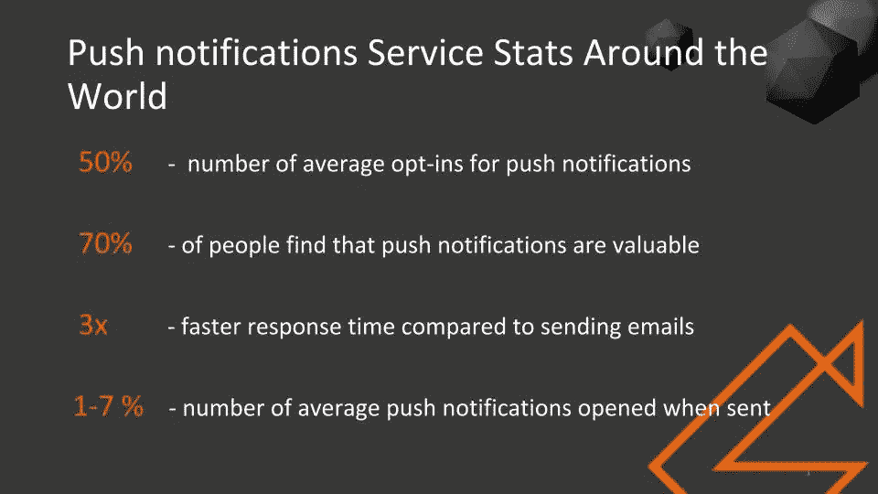
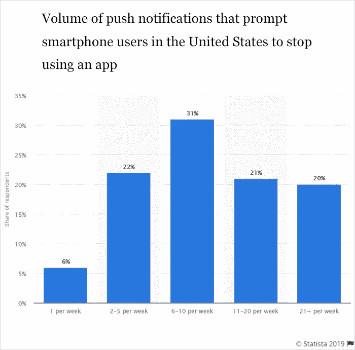

# 什么是推送通知，为什么您的移动应用程序需要它？

> 原文：<https://medium.datadriveninvestor.com/push-notification-and-why-your-mobile-app-needs-it-7aac3064fc6?source=collection_archive---------9----------------------->

Source: clevertap.com

推送通知可以显示不同行业之间的最高参与度，准确了解它们是什么以及它们的用途非常重要，以便利用它们为您带来优势。

今天的许多应用程序都充满了最新的功能和趋势，使其与用户更加相关。这种广泛接受的吸引用户的趋势之一是“[推送通知](https://www.lifewire.com/what-is-push-notification-1994351)”。

 [## 2020 年移动应用发展趋势|数据驱动的投资者

### 不可否认的事实是，智能手机正在改变运营模式、商业模式和市场…

www.datadriveninvestor.com](https://www.datadriveninvestor.com/2020/01/15/mobile-app-development-trends-to-follow-in-2020/) 

推送通知的潜力是巨大的，根据移动应用程序 Daily 的某些统计数据，推送通知的响应速度比发送电子邮件快三倍，而打开率为 1-7%。

Source: zesium.com

[如今，通过推送通知向用户发送信息的标准](https://blog.pushengage.com/kpi-measure-effectiveness-push-notifications/)已经发生了转变，因为推送通知格局中引入了多种变化。

# 什么是推送通知？

推送通知系统于 2009 年首次推出( [APNS](https://en.wikipedia.org/wiki/Apple_Push_Notification_service) )，这是一种通过智能手机提醒用户重要内容的方式。

推送通知功能被集成到移动应用程序中，用于用户和应用程序之间的持续交互，即使应用程序未被使用。

推送通知类似于发送到用户智能手机的短信，以保持对应用程序最新公告的更新。

Source: clevertap.com

[推送通知不需要任何额外的应用程序即可运行](https://www.mobiloud.com/blog/best-push-notification-services/) —即使应用程序没有运行，收件人也可以看到通知。

几乎每个应用都提供了推送通知选项，用户可以选择退出或加入来接收这些通知。即使您拒绝了通知，也可以选择撤销这些服务。

# 推送通知的优势

推送通知的好处是巨大的，因为它是吸引用户的最佳工具之一。在实现它们的时候要小心，因为如果被大量的通知困扰，许多用户会感到恼火，甚至放弃应用程序。

Source: statista.com

如果操作得当，推送通知会带来许多好处，例如:

**最低成本** —不需要单独的发送介质，因此投资最少。

**用户控制** —用户可以通过您的移动应用程序设置来设置他们的偏好，从而降低用户因过多通知而烦恼的风险

**品牌一致性** —发送给用户的最后一分钟的交易、折扣、优惠券和特别优惠往往会增强品牌一致性，因为用户会欣赏有附加值的信息

Source: wordstream.com

**参与度** —提高应用参与度和留存率的绝佳选择

**跟踪分析** —在打开率、交付收据、参与度、互动时间和点击率以及其他类型的分析中分析复杂的分析。

# 移动应用中推送通知的重要性？

如今，几乎每个移动应用都使用推送通知，并寻求用户的许可来发送它们，这显示了推送通知在移动应用中的重要性，如下所示:

# 与用户更多的互动

您可以通过推送通知传达最新的更新和新闻来维护应用程序的功能，推送通知必须包含简短而适当的词语。通过这种方式，你可以唤起用户对应用可用性提高的关注。

剩下的策略也有助于提高用户参与度。

Source: salesforce.com

# 参与度提高

推送通知可以提高您的参与度统计数据，因为关于最新新闻、事件或内容的每个提醒都可能导致用户参与度的增加。

当你的移动应用不断地通知用户最新的更新时，即使用户没有时间，它也带来了用户对你的移动应用参与的升级。

请记住，您可以尝试不同的方法来发送推送通知。

# 驾驶高流量

移动应用的另一个重要元素是增加流量。

即时的 ping 声音会驱使用户打开它，最终增加应用的流量。

向用户即时定期发送内容会增加你的流量。注意要做得恰当，因为太零星或太频繁的通知会导致最终用户失去兴趣。你提供的内容必须是相关的——除非内容对用户有吸引力，否则他们不会点击通知，从而导致潜在的应用卸载。

Source: wpengine.com

# 洞察客户行为

如果您希望通过跟踪通知消息、交互时间和持续时间、设备、平台来收集关于用户的有价值的数据，推送通知是最佳选择，因为它们可以产生最大的参与度和流量。

如果你了解用户使用你的应用的时间、原因和次数，这将有助于你通过推送通知为用户提供最好的服务。

# 易用性

与电子邮件或文本消息相比，推送通知更有效、更简单，因为它们向用户传达了带有特定信息的清晰而简短的消息。

从开发人员的角度来看，推送通知很容易在应用程序中生成和实现，因为它们不太复杂，并且易于通过用户友好的界面进行管理。

如今，iOS 和 Android(或 web)都使用[Firebase Cloud Messaging](https://firebase.google.com/docs/cloud-messaging/)(FCM)——这是一个跨平台的消息传递解决方案，让你可以可靠地免费发送消息。

最终用户只需要向下滚动他们的通知栏，然后决定他们想要对通知做什么。

# **最终拍板**

如果你想让你的移动应用具有交互性，推送通知是最好的解决方案。

原因是用户依靠推送通知功能来获得定期提醒，这节省了他们的时间和精力，并使他们随时更新。

> 注意给用户发送相关和及时的通知消息，不要用无数的消息淹没他们。通过仔细规划，您可以使用推送通知来扩大和保留您的用户群。

**访问专家视图—** [**订阅 DDI 英特尔**](https://datadriveninvestor.com/ddi-intel)