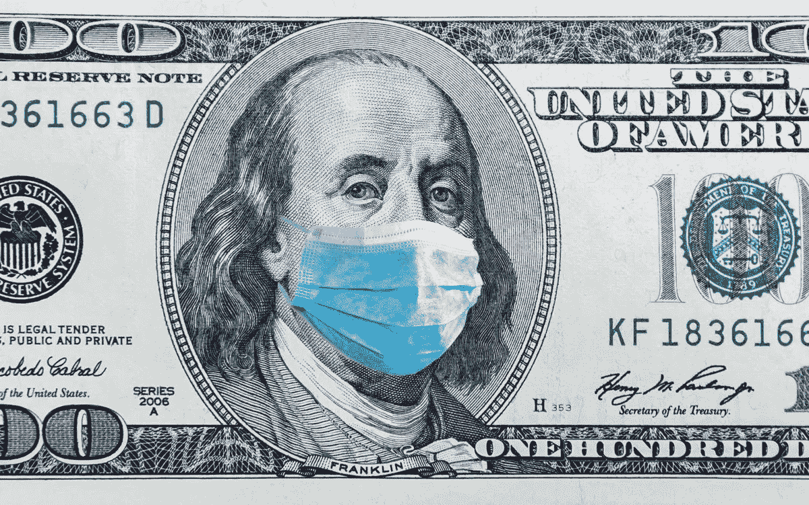

# 锁住你的钱:保护你财务的 5 个可行步骤

> 原文：<https://medium.datadriveninvestor.com/putting-your-money-on-lockdown-5-actionable-steps-to-protect-your-finances-4505b2cda358?source=collection_archive---------5----------------------->

在最近历史上最糟糕的疫情，我们的财政正在遭受打击。在英国——一个对病毒反应迟缓的国家——财政大臣已经公布了一项“前所未有”的工人支持计划，试图将财政困难降至最低。

他们支付员工 80%的工资；抵押贷款停止支付；普遍信用(本质上是我们的社会保障)更高。尽管如此，降薪 20%还是会造成压力。更不用说大量的个体经营者或被裁员的人了。

我以前写过关于财务建议的文章，但是这种独特的困境需要一套有些不同的方法。这里有一些明智的步骤，你可以立即采取，以保护你的生计，甚至你家庭的财务健康。

# 第一步:削减成本

如果你自我孤立或者在家工作，也许你的支出会因为旅行和食物成本的降低而下降。然而，现在是一个很好的时间来审查任何订阅，以确定它们有多“必要”:两周一次的自行车杂志订阅？也许现在是打破僵局的好时机。

暂停为你现在不能或不愿意去的东西定期付款，比如健身房会员卡。一些健身房允许他们的用户暂停会员资格一个月，并结转任何积分，所以请仔细检查这一点，但在大多数情况下，这些事情应该会消失。

具有讽刺意味的是，如果你打算长时间呆在家里——这看起来很有可能——网飞或 Spotify 等流媒体服务现在可能会感到非常重要。留着它们。

# 第二步:退款和账单

那些在英国通勤并支付了年票、月票或周票的人将能够获得[部分退款](https://www.telegraph.co.uk/money/consumer-affairs/working-home-could-short-changed-returning-rail-season-tickets/)。许多国家的交通系统都提供某种形式的补偿，所以值得一查。

一些能源公司也在尽自己的力量:EDF 能源公司正在[为其 500 万客户提供账单减免](https://www.telegraph.co.uk/news/2020/03/14/millions-households-set-energy-bill-break-due-coronavirus-crisis/)，具体情况具体分析。检查你所有的公用事业账单，看看你的供应商是否做了任何调整。

# 第三步:检查你的股票和股份

不需要金融天才也能看出病毒造成的经济损失。股市受到重创:商业信心低迷；许多已经完全关闭，消费者支出减少，市场份额下跌。

当恐惧消退时，有一种观点认为市场将再次上涨。然而，一些人认为它可能不会这么快反弹，消息灵通的记者[推测经济衰退](https://www.theguardian.com/business/2020/mar/15/prepare-for-the-coronavirus-global-recession)。

这里没有通用的方法。有些人会挺过去。对其他人来说，离开可能是唯一可行的选择。我哥哥在养老基金中投资了大约 2，000 英镑。他上周退出了——他的钱几乎翻了一倍，尽管在出售前股价略有下跌。然而，其他人可能没有这么幸运。

评估风险以及你的短期和长期现金需求和投资前景。然后采取适当的行动

# 第四步:保护你的收入

许多国家将个人工资的 1%发放给那些无法工作的人。在英国，全职员工可以申请每周 94.25 英镑的法定病假工资(T4)。此外，一些企业愿意向员工支付全薪。

对于那些自主创业的人来说，加入你们国家提供的任何社会支持系统都是必须的。许多政府放宽了你可以“签约”的过渡，并增加了奖金。

从更乐观的角度来看，一些企业正在招聘，主要是超市:英国连锁超市莫里森斯(Morrisons)正在增加 3500 名司机，以满足额外的需求。也许你身边也有这样的机会——如果你愿意冒险的话？

或者，你也可以考虑申请一张 0%利息的信用卡，尽管这应该由你决定。

moneysavingexpert.com 的创始人马丁·路易斯建议立即申请，以防银行开始收紧支付能力标准——就像他们在 2008 年危机期间所做的那样。就目前情况来看，大多数主要银行尚未做出任何重大改变，但如果一家银行改变立场，其他银行很可能会效仿。

# 第五步:投资？在危机中？

投资，现在，不应该是一个优先事项，它可能会挫伤。任何回报都会特别慢，可能永远不会来。仅在英国，价值 6 亿英镑的股息被削减，因为 10 家最大的公司削减了奖金。

此外，一些上市公司会破产；这让投资者容易遭受巨额损失，但如果你能忍受，并且多年内不需要这笔钱，市场下跌可能是买入的绝佳时机。然而，你不应该尝试这种策略，除非你有一大笔现金可以依靠。