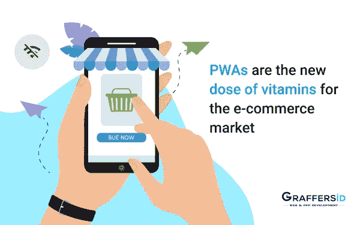
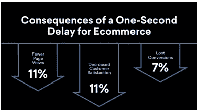

# pwa 是电子商务市场的新维生素

> 原文：<https://medium.datadriveninvestor.com/pwas-are-the-new-dose-of-vitamins-for-the-e-commerce-market-dcd8e312fef5?source=collection_archive---------19----------------------->

几年前，复制本地电子商务应用的体验被认为是一个遥不可及的挑战。然而，在不断进步的过程中，移动可访问性的增加导致了一个有趣的解决方案的发展——PWAs。别忘了进步的网络应用程序服用了所有合适的维生素，它们是面向所有人的，无论是桌面用户还是移动用户。

自 2015 年以来，我们就已经有了它们，几乎所有的科技巨头，包括 Twitter、阿里巴巴、亚马逊和沃尔玛，都已经推出了他们的网络应用程序，并报告转化率翻了一番，只是为中小企业利用相同的技术堆栈奠定了基础。

电子商务无疑是从 PWAs 的发展中受益最大的行业之一。

**我们不只是在说话，让数字告诉你故事**

根据 eMarketer 的一份报告，预计到 2021 年，移动销售将占电子商务总销售额的近 54%，这清楚地表明，在线购物品牌不能忽视移动销售渠道。尽管移动流量在增长，但由于多种因素，移动转化率仍远远落后于桌面转化率。

电子商务的网络应用解决了移动转化率低的问题，以及如何解决。Jaxenter 的一项调查显示，46%的开发人员认为 PWAs 是未来的发展方向，只有 14%的人认为原生应用最终会盛行。

在本文中，我们将弄清楚为什么 PWAs 会对电子商务行业产生如此巨大的影响，以及 web 应用程序开发的主要好处是什么。所以让我们从头开始。

# 什么是 PWA

PWA 是“**渐进式网络应用**”的缩写。简而言之，是一个高级网站，具有本机移动应用程序的外观和感觉。

毫无疑问，网站比应用程序更容易被发现，也更容易分享，而且速度更快。它在不同设备上无处不在，并实现了以用户为中心的安全性。另一方面，原生应用更可靠，提供更丰富的体验，它们离线工作(例如，你可以离线挑选你的购物车，但需要连接或确认订单和支付)，在下载它的设备上总是可见的。网站和原生应用都有独立的体验。

**那么什么更好呢？** **嗯，答案是 PWA 的**

PWAs 为您带来了两个世界的精华——它们像网站一样更易被发现、更易共享、更快，像应用程序一样丰富、可靠、安全。渐进式网络应用程序是未来的应用程序，在应用程序中带来移动网络体验。

另请阅读:[如何创建一个可扩展的点对点市场网站？](https://graffersid.com/how-to-create-a-scalable-peer-to-peer-marketplace-website/)

# 在现实生活中

PWAs 最初由 Google 提出，旨在解决应用程序开发者面临的关键问题。它们成本低，安全性高。PWAs 的主要用途已经被那些希望同时瞄准移动和网络平台的企业观察到。

[渐进式 web 应用程序开发](https://graffersid.com/)可以通过 VuePress 和 Gatsby 等静态网站生成器来实现，它们有助于启动强大的店面，这些店面稍后可以连接到电子商务后端。JavaScript 语言也广泛用于前端开发，以创建流畅的面向客户的移动 web 界面。

# 为什么 PWA 是更好的选择

它们为用户体验带来了一致性、可靠性和参与性，创造了无与伦比的消费者忠诚度。Graffersid 建议 PWAs 的某些关键属性是:

1.  **渐进式**——它们适用于每一个用户，与他们选择的浏览器无关。
2.  **反应灵敏**——它们可以在所有设备上工作——台式机、手机和平板电脑，并根据屏幕大小自动调整。
3.  **独立连接** —他们能够离线工作，在网络出现问题时不会变得不可用。
4.  **类似应用的**——它们提供真正的本地体验，可以安装在手机上。
5.  **新鲜** —它们总是与主持人发布的信息保持同步。
6.  安全**——它们的安全性建立在它们总是通过 HTTPS 提供服务的事实上。**
7.  **可发现的** —与本地应用不同，网络应用可以被搜索引擎编入索引，这使得用户更容易发现它们。
8.  **可分享的**——具有一个 URL 结构的可爱之处使得它们更容易被用户分享。
9.  **快速** —它们加载和响应用户交互的速度非常快，甚至比普通网页还要快。在大多数情况下，更快的结账可以挽救销售。
10.  **参与** —他们可以发送推送通知，并且可以安装在智能手机上，这使得他们对最终用户的再次参与价值极高。

# 为什么 PWA 是电子商务的新生态系统

首先，与本地应用程序开发相比，渐进式 web 应用程序开发需要更少的时间和预算。第二，它们比一般的移动应用程序更轻，速度快几倍。

让我们在电子商务的具体环境中详细讨论渐进式网络应用程序的类似好处。

# 智能系统

这是一个关键因素，使应用程序感觉像一个网站。每当用户第一次访问该应用程序时，PWAs 智能系统就会开始行动，不仅下载主界面组件，还下载后台组件，这给用户带来了更快的体验，并使其在离线时也可用。

# 更高的 SEO 排名

2018 年，谷歌将移动优先索引作为一种规范，这意味着他们现在将使用页面内容的移动版本，同时评估其与用户任何特定关注的相关性。

因此，在索引和排名期间，您的页面的移动版本将被考虑，而不是桌面版本，并且在移动优先索引中最重要的排名因素之一是页面速度，这在 PWA 形式中是最高的。

事实上，自 2015 年推出 PWA 以来，谷歌本身一直在给予一贯的支持。这样 PWAs 增加了你的页面的索引能力，对搜索引擎优化和整体可发现性非常有益。

# 订婚和重新订婚

这是电子商务网络应用中最重要的功能之一——吸引消费者的能力。首先，PWA 的图标可以出现在手机的主屏幕上，使它比网站更加个性化。

其次，它们允许你发送推送通知——所以现在你可以随时更新闪购和季节性折扣，甚至可以不经意地向他们提及一辆废弃的购物车。据统计，点击打开推送通知的人数是电子邮件的 2.7 倍。

谷歌报告称，近 60%的 PWA 用户允许该页面向他们发送通知，这大大增加了企业推广其产品或突出折扣的机会。

另读:[如何创建一个像 BUMBLE 这样的 APP？](https://graffersid.com/how-to-create-an-app-like-bumble/)

# 持续创新

当您在 web 应用中推出一些更新或更改时，用户会自动立即收到这些更新(在有网络的情况下)，而不像本地应用那样，他们必须去 Play Store/App Store 并自己安装更新。这在许多层面上减少了用户的摩擦。

此外，您不需要为 iOS 和 Android 版本的应用程序单独更新代码，只需在单个 web 应用程序代码库中安装更改，就可以开始了。

# 速度

PWA 的速度很快。

还需要我们多说吗！

# 易接近

谷歌报告称，如果一个网站的加载时间超过 3 秒，53%的移动用户就会放弃该网站。速度在电子商务移动解决方案中极其重要，PWAs 正是利用了这一点。它们不仅可以在几分之一秒内加载，而且在网络条件差或没有网络的情况下也可以使用。

此外，pwa 在企业服务器和用户设备上使用的磁盘空间非常少，从而为更快的加载时间、更少的数据使用量和更少的存储空间等优势腾出了空间，所有这些都带来了更多的转换。例如，Tinder 的 PWA 加载时间不到 3 秒，据报道转化率提高了 80%以上。

# 一锤定音

电子商务的网络应用在性能、离线支持、参与度、搜索引擎优化，当然还有丰富的用户体验方面有着致命的优势。PWA 完全消除了任何平台(iOS 应用程序、Android 应用程序或网站)的开发、维护和营销需求，而不仅仅是单个 PWA 网页。

电子商务中的 pwa 已被证明可以获得更好的转化率和更安全的交易。它们也有助于接触到更广泛的受众，因为它们具有响应性和可分享性。

根据谷歌的说法，当现有的电子商务商店转向渐进式网络应用程序时，他们可能会看到平均 20%的整体收入增长，这可能更多地取决于你的数字营销人员与发展相结合的其他策略。

在 Flipkart 等网站上，移动端的转化率直线上升了一倍。因此，如果你是一个电子商务企业，希望看到销售和转换方面的一些重大变化，PWA 就是答案！PWA 是未来。

*原载于 2020 年 11 月 9 日*[*【https://graffersid.com】*](https://graffersid.com/pwas-are-the-new-dose-of-vitamins-for-the-e-commerce-market/)*。*