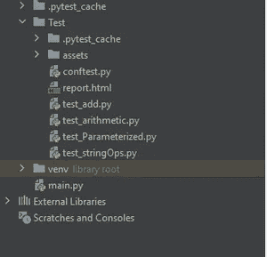

# pytest——初学者指南。📄

> 原文：<https://medium.datadriveninvestor.com/pytest-a-beginner-guide-9ba84a18d3dd?source=collection_archive---------1----------------------->

pytest 框架入门…

Pytest 是一个为 python 执行测试自动化的开源框架。开始使用 pytest 最让我兴奋的是，它非常容易上手，可以用于所有类型和级别的软件测试。Pytest 有一堆库，就像是送给我们的礼物。其中的一些待遇就像夹具、参数化、跳过测试等等。


Photo by [Marek Szturc](https://unsplash.com/@marxgall?utm_source=medium&utm_medium=referral) on [Unsplash](https://unsplash.com?utm_source=medium&utm_medium=referral)

# pytest 脱颖而出的原因

在谈论 pytest 时，我给我的朋友们举了一个最好的例子，一个拥有升级功能的房子，其中单元测试就像是一个拥有过时功能的老房子。


Photo by [Ярослав Алексеенко](https://unsplash.com/@webaliser?utm_source=medium&utm_medium=referral) on [Unsplash](https://unsplash.com?utm_source=medium&utm_medium=referral)

**pytest 的命名约定-**

*   Pytest 文件应该以 ***test_filename*** 或 ***filename_test*** 开头
*   所有函数的命名惯例应该以 **test_** 开始

本博客涵盖的主题，

*   ***创建 pytest 文件。***
*   ***基本 pytest 命令***
*   ***断言陈述***
*   ***为什么函数的命名约定是强制性的***
*   ***子串匹配***
*   ***夹具***
*   [***conftest . py***](http://conftest.py)

让我们看看 pytest 的一些入门命令，

**Pytest 安装-**

随着 python 的安装而来的是 **pip-** 一个用来安装和管理用 Python 编写的软件包的包管理系统。

```
pip install pytest
```

**Pytest 版本检查，**

要检查 pytest 的最新版本，请执行以下命令提示符，

```
pytest --version
```

**帮助信息，**

要显示帮助信息，如报告、pytest 警告、测试部分调试和配置等，请执行以下命令提示符，

```
pytest -h
```

# 创建 pytest 文件-

现在，让我们从第一个 pytest 程序开始。

首先，我们必须创建一个目录，然后在该目录中创建一个测试文件。

在这里， ***测试*** 是在一个 python 项目下创建一个包然后创建一个新的 python 文件。

现在让我们看看第一个测试文件中的操作— **test_stringOps** 。 **py**



将以下代码写入文件，在文件中执行基本的字符串操作…

```
# Replacing String with another string
def test_strReplace():
    string = "Hello, World!"
    assert string.replace("H", "J") == "Jello, World!"# String Split - Splits a string to two substrings
def test_strSplit():
    string = "Hello,World"
    assert string.split(",") == ["Hello", "World"]# String Strip
def test_strStrip():
    string = " Hello, World! "
    assert string.strip() == "Hello, World!"# String Concatenate
def test_strConcat():
    string1 = "Hello"
    string2 = "World"
    assert string1 + string2 == "HelloWorld"
```

通过查看代码，我们可以理解一切都应该在一个函数中，并且每个函数都有一个 assert 语句。让我们看看这个断言语句做了什么…

# 断言语句

在每个函数中，最后出现的语句是 assert 语句。

根据测试函数的执行情况，将返回一个值。这个返回值可以是**真**或**假。**

在 **pytest** 中，如果一个测试函数中的**断言**失败，那么该函数执行停止，该测试函数中的下一条语句不执行，继续下一个函数。

现在让我们执行上面的字符串操作文件，这可以用不同的方式来完成。

可以用来触发**当前目录和子目录**中所有文件的命令是，

```
pytest
```

要执行一个特定的测试文件，语法是

```
pytest filename.py
```

示例-要在 test_stringOps.py 文件中执行测试，命令应为

```
pytest  test_stringOps.py
```

如果我们只想执行一个特定的函数，那么就把函数名说成，

```
pytest filename.py::functionname
```

示例— ro 在 test_stringOps.py 文件中执行 test_strConcat 函数，

```
pytest test_stringOps.py::test_strConcat
```

# 为什么函数的命名约定是强制性的

在这个例子中，我们将看到函数的命名约定是如何工作的。

文件名为*test _ 算术. py，*其中四个函数符合 *test_naming* 约定。其中 as 第三个函数不遵循命名约定。如果我们尝试执行这个文件，只收集了三个函数数据，而另一个函数 *multiply()* 没有通过。

```
def test_subtract():
    a = 6
    b = 6
    assert a - b == 0 
def test_divide():
    a = 6
    b = 6
    assert a / b == 1
def multiply():
    a = 6
    b = 6
    assert a - b == 0 
def test_multiply():
    a = 6
    b = 6
    assert a * b == 36
```

输出，

```
collected 3 items test_arithmetic.py ...                                                                                                                                                                                                              [100%]==================================== 3 passed in 0.06s =======================================================================
```

# 子串匹配

假设，如果我们只想运行一组特定的测试，这可以通过**标记**测试并基于**子串匹配运行测试来实现。**

要执行名称中包含字符串的测试，我们可以使用以下语法

```
pytest -k <substring> -v
```

对于下面的测试，让我们用子替换" **str"** 来执行

```
# Replacing String with another string
def test_strReplace():
    string = "Hello, World!"
    assert string.replace("H", "J") == "Jello, World!"# String Split - Splits a string to two substrings
def test_strSplit():
    string = "Hello,World"
    assert string.split(",") == ["Hello", "World"]# String Strip
def test_strStrip():
    string = " Hello, World! "
    assert string.strip() == "Hello, World!"# String Concatenate
def test_strConcat():
    string1 = "Hello"
    string2 = "World"
    assert string1 + string2 == "HelloWorld"
```

要基于匹配子字符串执行测试，请使用以下命令执行:

```
pytest -k str -v
```

这将执行名称中包含单词**‘str’**的所有测试名称。在本例中，它们是 **test_strReplace()** ， **test_strSplit()，test_strStrip()** 和 **test_strConcat()** 。

测试执行过程，

```
test_stringOps.py::test_strReplace PASSED                                                                                                                                                                                           [ 25%]
test_stringOps.py::test_strSplit PASSED                                                                                                                                                                                             [ 50%]
test_stringOps.py::test_strStrip PASSED                                                                                                                                                                                             [ 75%]
test_stringOps.py::test_strConcat PASSED                                                                                                                                                                                            [100%]============================= 4 passed, 10 deselected in 0.07s =======================================================================
```

pytest 的另一个重要概念来了。在下面的代码中，str 变量被声明了两次，如果我们有更多的函数使用这个变量该怎么办。

```
# Uppercase
def test_upper():
    str ="python"
    assert str.upper() == "PYTHON"# Is Alpha
def test_isalpha():
    str = "python"
    assert str.isalpha() == True
```

为了减少代码长度，我们可以将这些输入数据保存在一个 fixture 中，并在需要时使用。这可以使用**夹具来完成。**

# 什么是固定装置

Fixtures 是向其他函数提供数据的函数。这个概念是 pytest 框架中最简单却最强大的概念。

这些 fixtures 在测试函数执行之前运行。函数可以被声明为 fixture，

```
@pytest.fixture
```

让我们为上面的字符串操作文件创建一个 fixture，并从调用 fixture 开始使用字符串变量。

```
import pytest@pytest.fixture
def input_value():
    return "python"
```

因此，fixture 函数名作为相应测试函数的参数传递，并在需要时使用。这里，在 fixture 函数中，返回字符串变量。这由其余的测试函数访问，而不是一次又一次地重复相同的代码。

```
# Uppercase
def test_upper(input_value):
    assert input_value.upper() == "PYTHON"# Is Alpha
def test_isalpha(input_value):
    assert input_value.isalpha() == True
```

使用 fixtures 的主要优点是降低了代码复杂性、代码长度和成本。例如，在建立数据库连接时，我们可以利用这些装置在一个地方编写关于建立连接的数据，并在任何需要的地方使用它。

这种方法也有一个缺点。如果我们想使用 fixture，我们只能在文件中使用它，因为它的作用域在文件中。

这里又出现了另一个名为 **conftest.py.** 的概念

# conftest.py

我们在一个名为 [**conftest.py**](http://conftest.py) 的文件中定义了一个 fixture 函数，以便将代码共享给多个测试文件。


Photo by [Ekaterina Shevchenko](https://unsplash.com/@shekatherine?utm_source=medium&utm_medium=referral) on [Unsplash](https://unsplash.com?utm_source=medium&utm_medium=referral)

现在让我们看看上面的例子，看看它是如何工作的。这里我们有两个名为 **test_strBasicOps.py** 和**test _ strpalindome . py .**的测试文件，在这两个文件中，我们执行一些字符串操作，这些输入数据取自一个名为 [conftest.py.](http://conftest.py) 的公共夹具

在 [conftest.py，](http://conftest.py)

```
import pytest@pytest.fixture
def input_value():
    return "python"
```

在 test_strBasicOps.py 中，

```
# Uppercase
def test_upper(input_value):
    assert input_value.upper() == "PYTHON"# Length of a string
def test_len(input_value):
    assert len(input_value) == 6
```

在 test_strPalindrome.py 中，

```
# Palindrome
def test_isPalindrome(input_value):
    assert input_value == input_value[::-1]
```

名为 input_value 的 Fixture 作为在文件和执行的测试中定义的函数的参数传递。

两个文件的输出，

使用命令 pytest test_strBasicOps.py 执行文件 test_strBasicOps.py

```
collected 2 items test_strBasicOps.py ..                                                                                                                                                                                                              [100%]==================================== 2 passed in 0.04s =======================================================================
```

使用命令 pytest test_strPalindrome.py 执行文件 test_strPalindrome.py

```
__________________________________
    test_isPalindrome
 ______________________________________ input_value = 'python' def test_isPalindrome(input_value):
        if input_value == input_value[::-1]:
            assert True
        else:
> assert False
E
assert Falsetest_strPalindrome.py: 7: AssertionError
== == == == short
test
summary
info == == == == == == == == == == == == == == == == == == == == == == 
FAILED
test_strPalindrome.py::test_isPalindrome -
assert False
== == == == == = 1
failed in 0.14
s == == == == == == == == == == == == == == == == == == == == == == ==
```

这里断言失败，因为输出不匹配。

让我们在我的下一篇博客中讨论 pytest 的其他库和功能。

 [## Pytest —第 2 部分

### 这个博客是我的 pytest 初学者指南博客的延续。

gunturu-lali.medium.com](https://gunturu-lali.medium.com/pytest-part-2-9c594c36b9f4) 

感谢阅读…！！