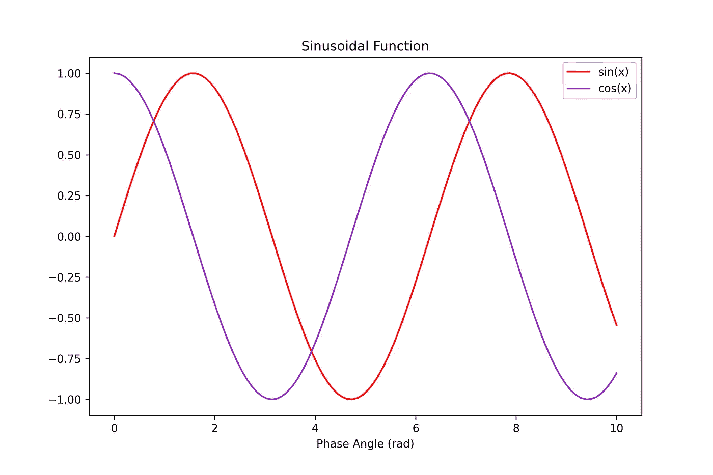
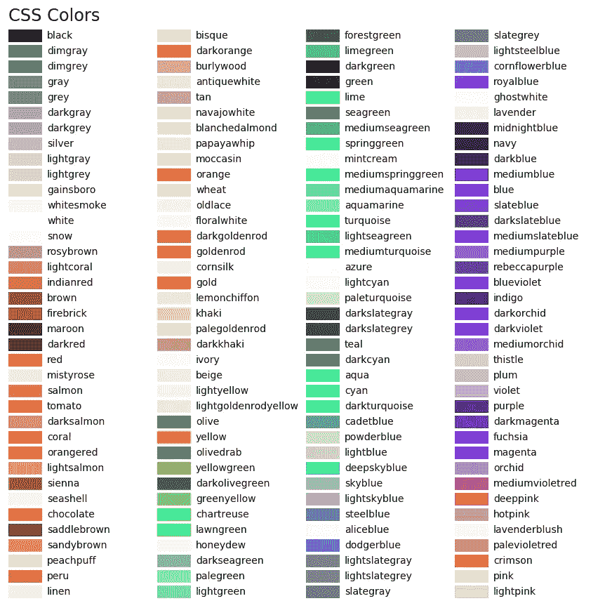
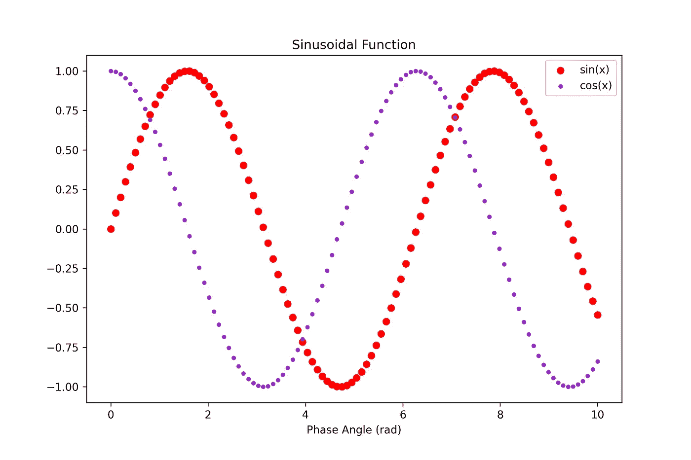
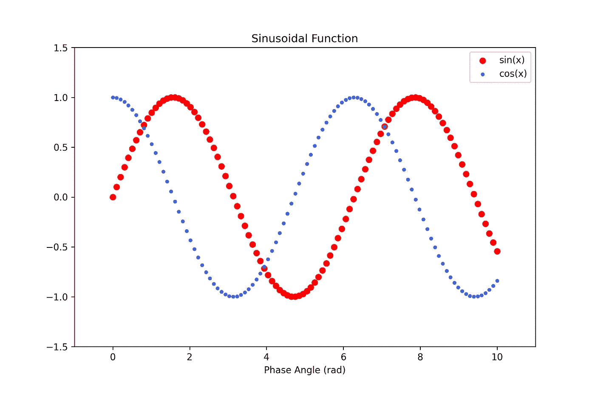
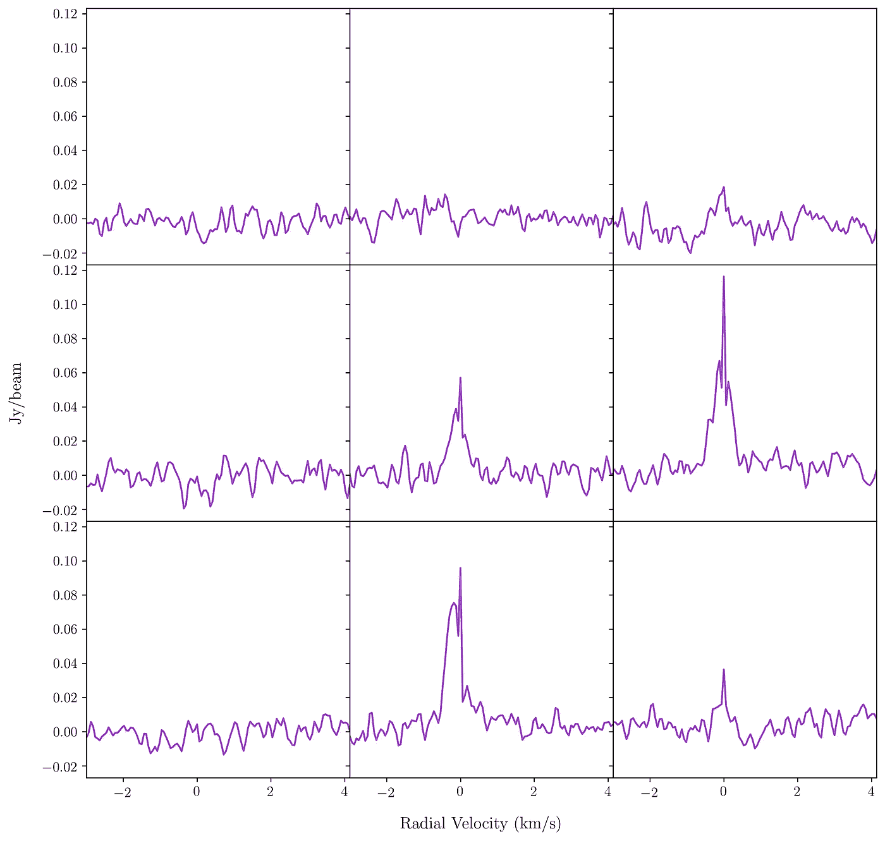
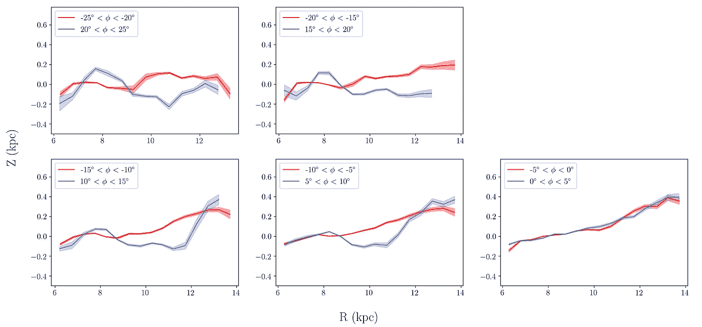

# 用 Matplotlib 实现 Python 数据可视化——绝对初学者第二部分

> 原文：<https://medium.datadriveninvestor.com/python-data-visualization-with-matplotlib-for-absolute-beginner-python-part-ii-65818b4d96ce?source=collection_archive---------3----------------------->

## 使用 MATPLOTLIB 设计

## 在 Matplotlib 中调整绘图的指南


Photo by [Adeolu Eletu](https://unsplash.com/@adeolueletu?utm_source=medium&utm_medium=referral) on [Unsplash](https://unsplash.com?utm_source=medium&utm_medium=referral)

我们将学习使用 Jupyter Notebook 在 matplotlib 中调整颜色、轴限制和制作网格。如果你还没有阅读最后一部分，你可以通过这个链接阅读。

[](https://medium.com/@bahrulsg/data-visualization-with-matplotlib-for-absolute-beginner-part-i-655275855ec8) [## 用 Matplotlib 实现数据可视化——绝对初学者第一部分

### 这是使用 Matplotlib 和 Jupyter Notebook(一个强大的 phyton 模块)可视化我们的数据的教程。

medium.com](https://medium.com/@bahrulsg/data-visualization-with-matplotlib-for-absolute-beginner-part-i-655275855ec8) 

# **1。调整颜色**

谈到 matplotlib 中使用的颜色，如果你没有调整颜色，matplotlib 会生成你的蓝色。您可以使用下面的代码来调整我们在第一部分中创建的线图的颜色。

```
plt.plot(x, np.sin(x), label = 'sin(x)', c = 'red')
plt.plot(x, np.cos(x), label = 'cos(x)', c = 'darkorchid')
```

Matplotlib 会给你一个这样的情节。



红线图代表 sin(x ),而 cos(x)由“暗兰”线表示。如果你不知道 matplotlib 中的颜色，我在这里附上它。



List of named colors from [matplotlib](https://matplotlib.org/3.1.0/gallery/color/named_colors.html)

如果您想创建散点图，您可以使用

```
plt.scatter(x, np.sin(x), label = 'sin(x)', c = 'red')
plt.scatter(x, np.cos(x), label = 'cos(x)', c = 'darkorchid', s = 10)
```

其中代码“s”表示散点图的大小。情节是这样的



点数是 100，和 x 数一样，可以在第一部分查一下。

# 2.调整轴极限

您可以使用此代码来限制您的轴。

```
plt.xlim(-1, 11)
plt.ylim(-1.5, 1.5)
```

这是结果。试着和之前的剧情对比一下。



# 3.使用网格的复杂绘图

我将展示 matplotlib 中网格利用的例子


创建网格的代码如下所示

```
plt.figure(figsize=(9, 6))
plt.suptitle('Data Visualization with Matplotlib and Jupyter Notebook') # title for all plotsplt.subplot(2, 1, 1) # number of rows, columns, and the panel number
plt.plot(x, np.sin(x), label = 'sin(x)', c = 'red')
plt.legend(loc = 'best')
plt.xlim(-1, 12)
plt.ylim(-1.5, 1.5)plt.subplot(2, 1, 2)
plt.scatter(x, np.cos(x), label = 'cos(x)', c = 'royalblue', s = 5)
plt.legend(loc = 'best')
plt.xlabel('Phase Angle (rad)')
plt.xlim(-1, 11)
plt.ylim(-1.5, 1.5)plt.savefig('grids_matplotlib.png', dpi = 300)
```

首先，作为一个标准过程，我们需要创建一个容器。然后，我们需要为所有的情节添加标题，如第 2 行所示。之后，我们应该为每个图定义行数、列数和面板数。
我们将在相似的行中创建两个地块。因此，我们定义行数为 2，列数为 1。sin 图将绘制在面板 1 中，cos 图绘制在面板 2 中。检查代码！

仅此而已。如果你需要一个更复杂情节的教程，请通知我。

**奖金**

我会给你我生成的复杂情节。



谢谢！