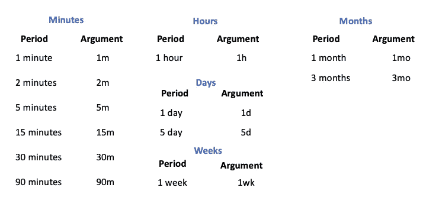
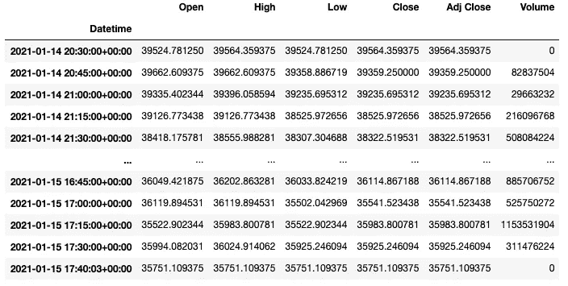
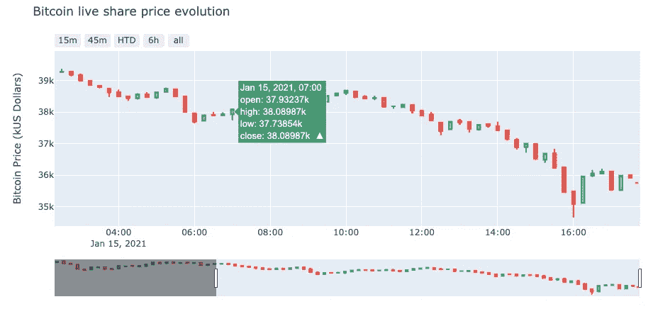

# Python:如何获取实时比特币数据(滞后小于 0.1 秒)。

> 原文：<https://medium.datadriveninvestor.com/python-how-to-get-live-cryptocurrency-data-less-than-0-1-second-lag-7f23d854314a?source=collection_archive---------4----------------------->

## 用于算法交易的 Python

## 这篇文章会有点特别。我将测试 Yahoo Finance API for Python 的最新版本，它提供了免费获得实时加密货币数据的可能性，延迟不到一秒钟。


Photo by [Kevin Rajaram](https://unsplash.com/@kevinrajaram?utm_source=medium&utm_medium=referral) on [Unsplash](https://unsplash.com?utm_source=medium&utm_medium=referral)

根据谷歌趋势，比特币正式成为 2021 年最时髦的搜索词之一。在 2020 年 10 月至 2021 年 1 月期间，针对“比特币”的研究数量增长了 11 倍。而使用搜索词“*比特币金库*”的人数增加了**3500%**。([来源](https://trends.google.com/trends/explore?q=bitcoin&geo=US))

作为一个热衷于数据的人，我们必须跟上时代的步伐。这就是为什么我一直在研究一种简单的方法来每秒更新加密货币的基本面数据。

在本文中，我们将发现如何使用 Yahoo Finance API 实时下载加密货币数据( **+/- 0.1 秒滞后**)。**我帮你测试过了。那有用吗？让我们看看。**

> 如果你现在热衷于自己动手，你可以在最后得到我为你录制的完整 Python 代码和教程视频。

通过本文，您将能够使用 Python 包获得加密货币市场数据，如价格、交易量和基本面数据。(*滞后小于 0.1 秒*)。

如果你想在使用 Python 进行算法交易方面更进一步，我强烈推荐这篇文章:

[](https://medium.com/analytics-vidhya/python-i-have-tested-a-trading-mathematical-technic-in-realtime-658a80381151) [## Python:我已经测试了实时交易数学技术。

### 我用 Python 实时测试了一个著名的预测市场的数学技术的实现…

medium.com](https://medium.com/analytics-vidhya/python-i-have-tested-a-trading-mathematical-technic-in-realtime-658a80381151) 

好，我们开始吧。

# 开始前

首先，如果你想跟踪我的进度，在开始之前，你需要在你的机器上安装一个 **Python 3** 版本和下面的包:

*   **熊猫**
*   NumPy
*   **y 金融**
*   **plottly**(*非强制，但对绘图*有用)

如果这些软件包中的任何一个尚未安装，您可以使用 pip 命令，如下所示。

```
pip install yfinance
pip install plotly
```

一旦您确保安装了以下软件包，我们就可以开始了。

> ***如果你已经有了使用 Python 的经验，可以跳到第二步。第一步包括导入包。***

# 第一步:导入包。

第一步将包括导入必要的包。

首先，您将使用以下代码行导入先前安装的软件包:

Lines above are querying numpy, pandas, yfinance & plotly to be imported.

一旦我们成立了，让我们进行下一步。

既然库已经导入，我们现在可以导入我们的加密数据了。

# 第二步:与市场接轨。

既然已经上传了所需的不同包。我们将使用对**BTC-美元**作为例子，通过 Yahoo Finance API 设置我们的导入。

加密货币的选择列表可以像货币一样扩展。

例如，如果你来自**印度**或**加拿大**，你可以使用 **INR** 或 **CAD** 两者都可以正常工作，如果你想要波纹或以太坊数据。

> 为了获得关于如何获得正确报价器的完整解释，我邀请您看一看本文末尾的代码解释视频。

让我们回到我们的 API 结构。

Yahoo Finance API 将需要三个强制参数，顺序如下:

*   跑马灯 *(1)*
*   *开始日期+结束日期*或期间 *(2)*
*   音程 *(3)*

对于我们的例子，股票代号 *(* ***自变量 1*** *)* 将是对**BTC-美元**。此外，对于此示例，我们将选择**最后 22 小时**作为时间段 *(* ***参数 2*** *)* 。并设置了间隔 *(* ***自变量 3****)***15 分钟**。

要调用您的数据，您必须使用以下结构:


Above described the structure to get data which interest us.

在继续之前，我将带来第三个参数( ***区间*** )的一些细节。

## 区间快速查找

我想给你一个快速拍摄不同的间隔，你可以使用雅虎财经 API 设置。

下面详细列出了可能需要的间隔的完整列表:



Above are listed the different intervals which can be chosen.

现在我们已经定义了三个参数，让我们执行查询并检查输出。

让我们进行一次现场测试。

# 第三步:现场测试

当我执行下面的行时，我们是 2021 年 1 月 15 日，伦敦时间下午 5:40。让我们看看 API 如何响应，雅虎财经是否能给我们带来最新的价值。

仅供参考:英国时间下午 5 点 40 分相当于纽约时间下午 12 点 47 分。

现在，我们已经定义了三个参数，让我们执行下面的代码行:

The following line of code is calling Yahoo finance API

简单回顾一下，上面的代码行调用 Yahoo finance API 并请求获得过去 22 小时的数据，间隔为 15 分钟。

这里是**的输出:**



Output released using the code above.

价格已经即时更新；我比较了官方网站和 we matching 上的数据和当前值。

**轰！**

如您所见，每秒钟都有一个更新发布。例如，如果您查看上面的输出，所提供的最新数据是下午 5:40 和 03 秒。**如果您重新运行您的内核，数据将再次更新。**

**任务完成。**

下面，您可以观看一个 10 分钟的视频教程，了解如何获取加密货币数据，以及进一步的解释，并在家中自行测试:

Full Python Tutorial

这里是使用 Python 和 Plotly 的最终输出:



Final output: Live graph being updated over time.

我希望你喜欢这些内容，如果你有任何意见或想要更多的细节，请随时在评论区告诉我。

感谢您的关注

快乐编码

# 完整的 Python 代码:

[](https://www.datadriveninvestor.com/2020/12/07/name-matching-techniques-with-python/) [## 使用 Python |数据驱动投资者的名称匹配技术

### 我们确实面临很多情况，我们必须匹配一个有很多变体的单词。这可能是因为错别字…

www.datadriveninvestor.com](https://www.datadriveninvestor.com/2020/12/07/name-matching-techniques-with-python/) 

获得专家视图— [**订阅 DDI 英特尔**](https://datadriveninvestor.com/ddi-intel)