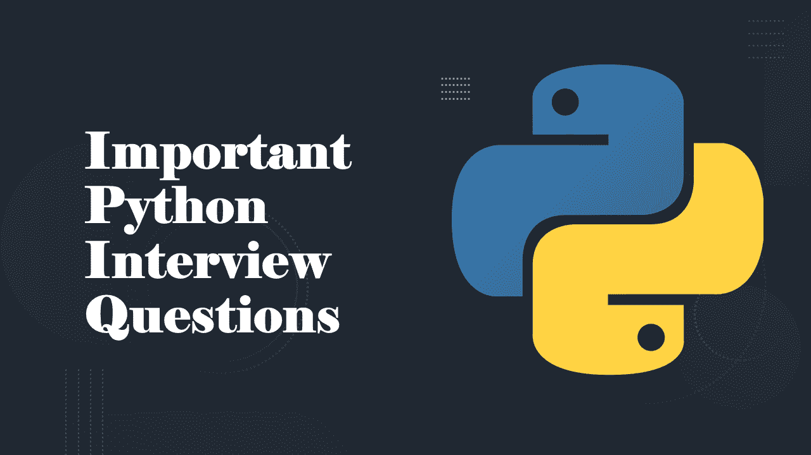

# Python 面试问题

> 原文：<https://medium.datadriveninvestor.com/python-interview-questions-94ff190ca1d7?source=collection_archive---------17----------------------->

## 常见的 Python 面试问题

[**Python**](https://www.python.org/) 是目前编程领域最流行、最熟练的语言之一。在本文中，我将带您了解一些您需要知道的最重要的 Python 面试问题。要参加面试，你必须熟悉 Python 的大部分基础知识。

如果您已经了解了一些 python 项目的基础知识，那么您必须寻找 python 面试问题。但是在我深入 python 面试问题之前，如果你还没有从事过任何 Python 项目，那么我建议你尽快开始，因为这将有助于你在面试中产生影响。

可以在这里 获得一些 python 项目 [**。现在我们来看看一些常见的 python 面试问题。**](https://thecleverprogrammer.com/2020/08/25/python-projects-for-beginners/)

 [## 数据科学项目

### 通过学习和尝试所有这些动手操作、互动的方式，用 Python 实践您的数据科学项目技能

thecleverprogrammer.com](https://thecleverprogrammer.com/2020/06/01/work-on-data-science-projects/) 

# 常见 Python 面试问题:

## 你为什么不想在应用程序中使用 Python？

Python 的主要缺点是性能——它不会像 C 和 C ++等完全编译的语言那样快速运行。另一方面，对于大多数应用程序来说，它非常快，而且典型的 Python 代码无论如何都以接近 C 的速度运行，因为它在解释器中调用链接的 C 代码。

## CPython、Jython 和 IronPython 有何不同？

CPython 是该语言的标准实现。Jython 和 IronPython 实现了用于 Java 和。NET 环境；它们是 Python 的替代编译器。

## 什么是命名空间，它与模块文件有什么关系？

名称空间只是一个变量包。在 Python 中，它采用带有属性的对象的形式。每个模块文件自动成为一个名称空间，也就是说，一组变量反映了在文件顶层所做的赋值。名称空间有助于避免 Python 程序中的名称冲突:因为每个模块文件都是一个独立的名称空间，所以文件必须显式导入其他文件来使用它们的名称。

## “映射”是什么意思，什么样的内核是映射？

术语“映射”是指将键映射到相关值的对象。Python 字典是基本类型集中唯一的映射类型。映射不保持任何从左到右的位置顺序；它们支持通过键访问存储的数据，以及特定于类型的方法调用。

## 如何将八进制、十六进制或二进制字符串转换成整数？

int (S，base)函数可用于将八进制和十六进制字符串转换为普通整数(传递 8、16 或 2 作为基数)。eval (S)函数也可用于此目的，但它的运行成本更高，并且可能存在安全问题。

## 为什么可以用字符串模块代替字符串方法调用？

现在，您永远不应该使用字符串模块来代替字符串对象方法调用，它已被弃用，并且它的调用在 Python 3.X 中已被完全删除。现在使用字符串模块的唯一有效原因是它的其他工具，如内置常量。你也可以看到它出现在现在非常古老和布满灰尘的 Python 代码中。

## 为什么你会使用字典而不是列表？

当数据被标记时，字典通常是最好的(例如，带有字段名的记录)；列表最适合未标记项目的集合(例如目录中的所有文件)。搜索字典通常也比搜索列表快，尽管这可能因程序而异。

## Python 什么时候认为一个对象是真的？

如果一个对象为非零数字或非空集合对象，则该对象被视为 true。内置单词 True 和 False 本质上是预定义的，分别与整数 1 和 0 具有相同的含义。

## Python 初学者最常犯的编码错误是什么？

对于初学者来说，忘记在复合词的标题行末尾键入冒号是最常见的错误。

## 如何使用打印操作将文本发送到外部文件？

要在一次打印操作中打印到一个文件，可以使用 3 的调用形式 print (X，file = F)。x，使用 2 的扩展打印文件> >。X，form X 声明或在打印前手动将 sys.stdout 分配给一个打开的文件，并在打印后恢复原来的。您还可以在系统 shell 中使用特殊语法将程序中的所有打印文本重定向到一个文件中，但这超出了 Python 的范围。

## 如何用 Python 编写多路分支代码？

具有多个 elif 子句的 if 语句通常是编写多路径分支的最简单方法，但不一定是最简洁或最灵活的。对字典进行索引通常可以达到相同的结果，尤其是如果字典包含用 def 语句或 lambda 表达式编码的可调用函数。

## 如何用 Python 编写基于计数器的循环？

计数器循环可以用手动跟踪索引的 while 语句编码，也可以用使用内置 range 函数生成连续整数偏移量的 for 循环编码。如果只需遍历序列中的所有元素，Python 中的首选工作方式也不是这样。相反，如果可能的话，使用简单的 for 循环，没有范围或计数器；它将更容易编码，并且通常执行起来更快。

## 如何获得对象中可用属性的列表？

内置的 dir(X)函数返回附加到任何对象的所有属性的列表。形式为[a for a in dir(X)if not a . starts with(' _ _ ')]的列表理解可用于过滤出带有下划线的内部名称。

## 如果函数中没有 return 语句，它会返回什么？

如果控制流没有运行到 return 语句中就从函数体的末尾落下，则函数默认返回 None 对象。这种函数通常用表达式语句调用，因为将它们的 None 结果赋给变量通常是没有意义的。没有表达式的 return 语句也返回 None。

这些是一些最常见的 Python 面试问题。我希望你喜欢这篇关于一些常见 Python 面试问题的文章。欢迎在下面的评论区提出你有价值的问题。