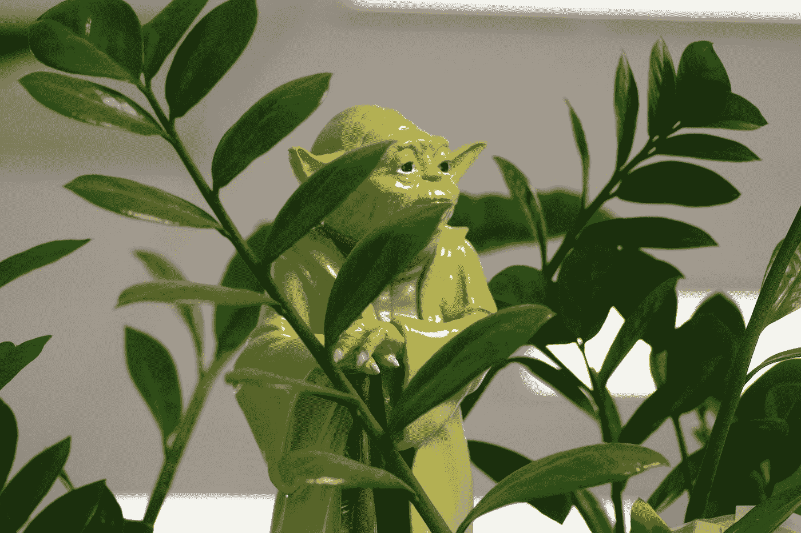

# 面向初学者的 Python 奥秘

> 原文：<https://medium.datadriveninvestor.com/python-mysteries-for-beginner-b95791c4f94b?source=collection_archive---------19----------------------->

我 t(相对)容易[上手 Python](https://medium.com/@guglielmofeis/getting-started-with-python-anaconda-google-colab-and-virtual-environments-1ce8fc3286f9) 。有很多教程，视频等。我猜这篇文章也是其中之一。

尽管如此，在设置了环境并学习了语法之后，Python 仍然存在一些初学者难以面对的障碍和神秘的机制，而专业编码人员也无法意识到这一点。似乎一旦你进入一种新的思维模式，你就无法回到你曾经奋斗的时候。(也有例外，比如[诺维格很少回答的 Python 问题](https://norvig.com/python-iaq.html))

弥合从“我知道句法”到“实际上”的差距的困难可以比作知道语法和实际说话，或者知道“吕底亚调式”有一个#4 度并实际表演一个动人的吕底亚即兴表演。

这种技能很难获得，一旦你掌握了，就很难帮助别人达到类似的流利程度。一旦某样东西花了你一些时间去学习，你每天都在练习，直到你最终掌握它，很难记得无知是什么样子。

(我不能回到单一监听设置，我的吉他老师肯定知道世界是如何变化的，你越了解音阶和琶音在吉他上的位置以及它们听起来如何，但它需要时间来正确地猜测我需要多少时间才能到达那里并对某事感到舒适)。

[Corey Doctorow](https://www.theguardian.com/technology/2012/dec/04/ict-teach-kids-regular-expressions) 引用了一句很好的话来解释这一点，引用了[正则表达式，或者 regex 或 regexp](https://medium.com/analytics-vidhya/getting-started-with-regular-expressions-1ccdb8a6ca98) :

> *“了解 regexp 可能意味着用三个步骤解决问题和用 3000 个步骤解决问题之间的差别。当你是一个书呆子时，你会忘记，你用几个按键就能解决的问题，可能会让其他人花上几天冗长乏味、容易出错的工作去费力完成。”*

(我想我们不必责怪我们的老师。我们问的问题就像“当你看不懂英语的时候感觉如何？”或者“你是怎么学会 5 的乘法表的？”。)

你花在编码和学习上的时间越多，似乎**尤达就越会反击**:

*“Aspiring or great programmers. There is no in-between” (*Photo by [Nadir sYzYgY](https://unsplash.com/@nadir_syzygy?utm_source=medium&utm_medium=referral) on [Unsplash](https://unsplash.com?utm_source=medium&utm_medium=referral)).

所以让我们来探索一下这种感觉和这个"**好的，我知道我的语法，我做了一些项目，接下来去哪里？**”。

我着手探索和报道这些巨蟒之谜，认为 2000 字足够了。**失败**。我意识到这份文件太长了，不得不把其中的奥秘和困难分成几部分。

让我们大声思考这个过程，并确定神秘事物的来源。完成额外的部分要复杂得多，但是画一个草图，并有一张我们需要征服的地图是很好的。

# 词汇

Python 有其*特有的行话*，当我们第一次开始研究它时，这可能很神秘。这可以通过发展一个词汇表或寻找一个词汇表很容易地解决。这就是为什么书有索引、摘要、定义或关键术语列表的原因。

 [## 2019 年最值得学习的编码语言|数据驱动的投资者

### 在我读大学的那几年，我跳过了很多次夜游去学习 Java，希望有一天它能帮助我在…

www.datadriveninvestor.com](https://www.datadriveninvestor.com/2019/02/21/best-coding-languages-to-learn-in-2019/) 

使用首字母缩写词或 Python 行话太容易了。它让我们听起来很熟练，很酷，让我们节省时间。但在我们开始之前，这会让我们分心。“克隆”和“分支”可能会让 git 新用户感到害怕。

Python 有相当多的‘PEPs’、‘BDFL’、‘邓德’、‘禅’、‘REPL’等等。这可能是最容易填补的空白。你可以通过建立一个参考字典来解决这个问题。github 上有一个不错的学习者词汇表；

# 为他人编码

与他人共享代码是一个复杂的过程，但这是业务的一部分。正如我们多次阅读"*代码比运行*代码更常被阅读"。

进入为他人(或心里想着他人)编码的思维模式是复杂的。首先，它要求我们对自己正在做的事情有信心。然后，它迫使我们探索许多其他问题，如:

*   如何为*可读性*适当编码；
*   如何遵循标准；
*   如果我们将一个脚本传递给我们的非技术朋友(他们怎么会是我们的朋友呢？)，它让我们陷入冻结代码或构建应用的境地。

这不是太复杂了吗？我的意思是，*我们已经在努力学习如何编码*。

你越关注可读性，我们需要关心的东西就越多。以下是一些与可读性和共享代码相关的神秘来源:

*   *编码风格*:类似 [PEP 8](https://www.python.org/dev/peps/pep-0008/) 等格式建议。我们缩进什么以及如何缩进，如何提示可读性，CamelCase vs. snake_case 等。已经有了标准，一个好的集成开发环境(行话叫 IDE，即 PyCharm 或 Spyder)可能会有所帮助；
*   编写**注释**或*类型注释*或断言语句*来检查我们代码的健全性*:这些事情需要一些时间来消化。你学了这本书，会想“嘿，很明显我能读懂我的程序。我知道语法，我知道我在做什么。得到这份印刷品(Hello world！)真是太难了)。然后你会在两天后看到你的代码……那是什么？

*闪退*。这种情况发生得越多:从过程到函数，从函数到类，从一个框架到另一个框架，再到“嘿，这个技巧工作得更好”。这就是为什么你需要评论和某种测试。

**精彩部分**:类型注释将教会你更多关于数据结构的知识。写支票可以训练你作为测试人员的能力。

*   *将军中的测试*:测试本身就是一个野兽。自动化和测试，代码覆盖率。除了版本控制系统(比如 **Git** )之外，还有很多东西需要学习；
*   *python 式的做事方式*:这是编码风格和惯例开始不仅对读者，而且对我们程序的运行时产生影响的时候。例如，我们正在检查运行两个 For 循环的两个列表，并检查列表一中的项目==列表二中的项目，而不是在第一个列表中使用单个 for 循环，并检查我们正在迭代的项目是否是列表二中的。另一个例子是使用更容易出错的不良导入实践，比如在名称空间中产生冲突。

这些都很难弄清楚，因为一旦你解开了一些谜团，你就可以实现“成为蟒蛇 T21”的目标。它意味着你:

1.  了解事物是如何运作的；
2.  能以不同的方式解决任务；
3.  知道成为蟒蛇是什么感觉(本身就是一个谜)；
4.  能够评估 2 中的哪个实现是最 Pythonic 化的。

这就引出了另一个大话题。

# Python 细节和内部

这些想法很难学。好了，一本介绍书会告诉我们**导入这个**和 Python 的*禅。这肯定是 Python 的精髓和“精神”的一部分，就像其他一些对初学者友好的东西一样，比如空白很重要。*

我们正在谈论的具体和内部因素是那些将对性能产生影响的因素。或者也许我们在讨论是什么让你正在学习的语言(这里是 Python)不同于另一种语言(你对此一无所知)。我们需要意识到并发现“代码气味”(另一种行话)。那很棘手。

我的意思是，我们已经在研究特征和语言。也许，取决于你的书和资料来源，其中的一部分不会呈现给你，因为它们可能会打乱一个更方便用户的学习曲线。

尽管如此，这在一个介绍或一本书的安全环境中工作。然后我们去野外，其中一些事情真的开始产生影响。我们没有向导。

以下是一些可能的问题来源:命名、范围、流程逻辑、python 设计(GIL、线程)、函数和类、python 数据结构和数据操作、理解。其他事情，如 shebangs 线或主呼叫。

# 成为蟒蛇

我们已经看过(两次)了，但是它可能值得一个单独的条目。

Pythonistas 使用他们自己的语言，他们的代码是酷和 Pythonic 式的。不过，如果我们从 Python 开始，并且没有接触过其他编程语言，那么理解代码的“Python 化”是很困难的。

事实上，一个完美的解释是这样的:“这太 Java 了，你看，你初始化循环的计数器，然后更新它。这闻起来像爪哇咖啡。Python 有一个内置的 enumerate()函数来完成这项工作。更不用说理解……”如果我们对比较语言没有足够的经验，就很难理解。

我们可以尝试从其他语言中学习一些东西来解决这个问题。当你在那里的时候，试着用你的新语言(比如 Java)在你的旧语言(Python)中实现一些东西。

这是开始比较事物、感受 Pythonic 方式以及替代解决方案和实现的好方法。

# 黑盒

黑盒是另一个问题。Python 的所有模块和函数都非常好。这导致了另一个问题:信任 Python 模块或内部来完成我们的工作。我们信任 stackoverflow 或类似程序上的一些代码。

我们正在做一些我们知道有效，但无法解释原因的事情。这个比较难解决。这需要阅读文档，看看内部情况。但是当我们成功时，知识就建立起来了。

这有趣吗？随意在 Linkedin 上联系或者在 Twitter 上加入更广泛的对话(期待一些 fantavolley 的斗争)。

这项工作是作为 **CAS 奖学金**的一部分作为 *CAS-SEE Rijeka* 进行的。点击查看更多关于团契[的内容。](http://cas.uniri.hr/cas-see-fellowship-application/)