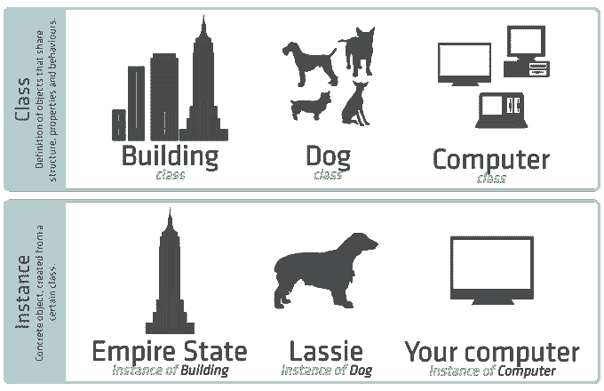
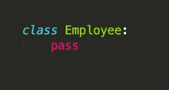
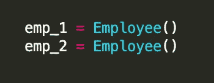
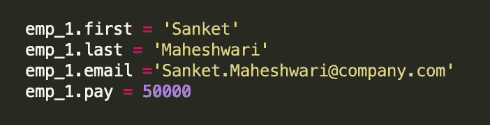
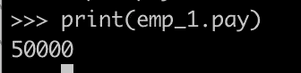
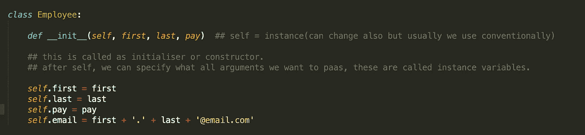
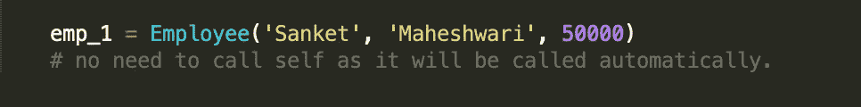
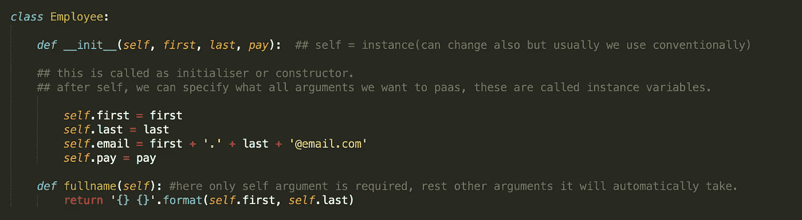
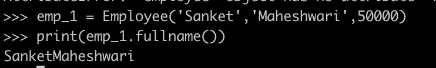

# 面向数据科学家的 Python 面向对象编程概念(第 1 部分)

> 原文：<https://medium.datadriveninvestor.com/python-object-oriented-programming-concepts-for-every-data-scientist-part-1-7fdfa551486e?source=collection_archive---------4----------------------->

面向对象编程(OOP)概念对每个数据科学家来说都非常重要。当我们进入数据科学领域时，这是最容易被忽视的概念。在创建模型之后，大部分时间都需要以 API 的形式部署到生产中，在那里我们才知道这些概念的重要性。

在这个系列教程中，我将在 6 个教程中解释整个概念。我将尝试在教程中详细解释单个主题，这对分析专家很有用。我会尽量让事情变得简单，这样初学者也能轻松理解基本原理。以下是我将解释的六个教程:

1.  类别和实例
2.  类别变量
3.  类方法和静态方法
4.  继承—创建子类
5.  特殊(魔法/邓德)方法
6.  属性装饰器—getter、Setters 和 Deleter

因此，在本教程中，我们将学习关于**类和**实例的细节

Visual explanation of Classes and Instances (image courtsey : Sencha docs)

让我们先借助上图了解一下类和实例的基本区别:—

通常，一个类定义了它的实例的基本结构、属性和行为。例如，使用上述相同的类:

*   “建筑”是一个类，而帝国大厦是“建筑”的一个实例。
*   “Building”的所有实例都有给定的楼层数(结构)、地址和营业时间(属性)。还有，假设这些是“智能建筑”，他们可以根据需要关闭和锁定他们的主入口(行为)。
*   “Dog”是一个类，而 Lassie 是“Dog”的一个实例。
*   “Dog”的所有实例都有 4 条腿和一条尾巴(结构)。它们也有名字(属性)，能够吠叫(行为)。
*   “计算机”是一个类，而您正在使用的计算机是“计算机”的一个实例，如 MacBook。
*   “计算机”的所有实例都有一个 CPU 和某种形式的内存(结构)，一个模型名称(属性)，并且能够被打开和关闭(行为)。

上面定义的理论足以获得关于类和实例的基本知识。现在，我们将创建一个接受雇员的雇员类。它将作为一个基本的蓝图。

定义类别:

Defining a empty employee class

最初，我们不知道在这里写什么，因此我们将它留空。但是，我们不会留下空白，而是写 pass。意思是，现在，我们想跳过。

Defining instances/ objects

这两个是唯一的实例/对象，即在内存中有不同的位置。

让我们首先手动存储员工的详细信息:

manually filling the details

printing pay

上述技术的缺点:

1.  非常乏味。
2.  易犯错误。
3.  没有准确地使用类。

让我们在课堂上做上面的工作，然后直接调用它:—

从上图我们可以理解 __init__，是一个构造函数或者初始化函数，可以在从类中创建一个对象的时候调用，需要访问来初始化类的属性。

现在，让我们创建对象:—

在 object 中，所有参数必须按照实例中定义的正确顺序传递，这一点非常重要。当 emp_1 对象被调用时，会击中“__init__( **self** ，…”中的自我..)”并将初始化第一个、最后一个、支付和电子邮件。现在，让我们再次打印 emp_1 的工资。

因此，这里我们可以说雇员类的**属性**是——名、姓和工资。

现在，我们希望我们的 Employee 类能够执行一些操作。因此，为了实现这一点，我们可以在我们的类中添加一些方法。

全班要采取的行动:能够显示员工的全名。

让我们首先手动操作—

现在，用类来完成上面的任务—

这里，我们将定义一个名为 fullname 的方法来完成上述任务。下图更清楚地显示了这一点

直接在课堂上打印全文

在 fullname()之后，这个大括号非常重要，因为 fullname 是一个方法而不是属性，如果在没有大括号的情况下使用，它将抛出一个错误。

最后，我们有两种方法来调用这个类

1.  emp_1.fullname()
2.  雇员全名(雇员 _1)

因此，在本教程中，我们通过一个实际的例子学习了**类和实例**的细节。我分享了一个 github 链接，你可以在那里找到上面的代码。仔细阅读上面的代码，这将有助于你更好地理解它。如果你喜欢这篇文章，请给它鼓掌，如果有任何问题，请发表评论。让我们一起努力传播知识，让世界变得更美好。

Github 链接:[https://github.com/Sanket-DataEnt/Object-Oriented](https://github.com/Sanket-DataEnt/Object-Oriented)