# Python 熊猫初学者库:入门和抛弃电子表格的简化指南

> 原文：<https://medium.datadriveninvestor.com/python-pandas-library-for-beginners-a-simplified-guide-for-getting-started-and-ditching-20992b7cd4da?source=collection_archive---------1----------------------->


Photo by [Jay Wennington](https://unsplash.com/@jaywennington?utm_source=medium&utm_medium=referral) on [Unsplash](https://unsplash.com?utm_source=medium&utm_medium=referral)

# 介绍

在本指南结束时，您将使用 pandas 创建数据透视表，就像在电子表格中一样，并且您将具备使用 Python 探索数据的基础！我首先介绍基础知识，然后在本文的后面介绍更高级的概念和例子。**所有代码可在文末**找到。

为什么是熊猫
什么是熊猫
安装
数据结构
读取数据
探索数据框架简介
处理数据
选择数据
常见操作和功能
创建新列
排序、分组和透视数据

# 为什么是熊猫？

当我开始为期六个月的项目来学习数据分析时，毫不奇怪我们从 Excel 中的电子表格开始。Excel 和 GoogleSheets 是强大的工具，我建议每个人都学习一些基础知识，比如条件格式、简单的聚合函数、数据透视表和可视化。虽然电子表格是强大的工具，但在处理大型数据集时，它们开始失效或变得难以使用。在分析课程中，一旦我们开始查看有数百万行的数据集，我们就开始学习 Python 和 SQL。

[](https://www.datadriveninvestor.com/2019/03/25/a-programmers-guide-to-creating-an-eclectic-bookshelf/) [## 创建折衷书架的程序员指南|数据驱动的投资者

### 每个开发者都应该有一个书架。他的内阁中可能的文本集合是无数的，但不是每一个集合…

www.datadriveninvestor.com](https://www.datadriveninvestor.com/2019/03/25/a-programmers-guide-to-creating-an-eclectic-bookshelf/) 

当我们开始学习 python，从 Excel 过渡时，pandas 是我们探索的第一批库之一。这是因为它的一个关键数据结构使得处理表格数据很容易，这意味着数据像电子表格一样有行和列。由于熊猫 1.0 正式发布，我将回归基础，并提醒自己我经历了什么来建立我今天的基础。

 [## pandas 文档- pandas 1.0.1 文档

### API 参考参考指南包含了熊猫 API 的详细描述。该参考资料描述了如何…

pandas.pydata.org](https://pandas.pydata.org/docs/index.html) 

# 熊猫是什么？

感谢创始开发者 Wes McKinney，熊猫图书馆是开源的，并且有一个坚实的社区支持它。它在数据分析和数据科学中被用作数据操作工具……可以肯定地说，它处理大量数据。在韦斯离开他在开发熊猫时工作的对冲基金之前，他说服公司允许他开放这个库的源代码。多好的一招！

在引擎盖下，pandas 使用 [Cython 或 C](https://cython.org/) ，使其功能非常强大，并针对性能进行了优化。随着对 Python 的了解越来越多，出现的一个抱怨是，与 C 之类的编译代码相比，它的速度很慢。Cython 试图通过结合 Python 和 C 的强大功能来弥合这一差距。它旨在简化为 Python 编写 C 扩展的过程。

# 安装和依赖关系

安装熊猫很简单。文档建议使用 pip 或 conda 来安装 pandas 包。进口熊猫时，通常给它起个别名 ***pd*** 。

```
pip install pandasORconda install pandasimport pandas as pd
```

# 数据结构

[Pandas 有两种数据结构:](https://pandas.pydata.org/docs/getting_started/dsintro.html)

*   [系列](https://pandas.pydata.org/docs/getting_started/dsintro.html#series)
*   [数据帧](https://pandas.pydata.org/docs/getting_started/dsintro.html#dataframe)

虽然我将主要关注数据帧的操作，但理解什么是序列也很重要。熊猫系列是一维的。它是一个可以保存任何数据类型的数组，它有一个带标签的轴，称为索引。虽然相似，但系列与 numpy 数组有所不同。[参考文档，了解更多关于熊猫系列](https://pandas.pydata.org/docs/getting_started/dsintro.html#series)的信息。

```
import pandas as pd
example_series = pd.Series(data, index = your_index)
```

pandas 数据框架以表格格式存储数据，并集成了索引。这意味着每一列都有一个列名，每一行都有一个行索引。所有的例子将使用熊猫数据帧。

```
import pandas as pd
example_DataFrame = pd.DataFrame(data, index)
```

# 读取数据

pandas I/O API 简化了文件的打开和写入。有些读取器函数通常返回 pandas 对象，如 dataframes。有一些写函数，它们是对象方法，用于从 pandas 导出数据。在这个例子中，我将使用 reader 函数 pandas.read_csv()来打开一个. csv 文件。[该文件可以在 kaggle](https://www.kaggle.com/bendgame/beef-jerky) 上找到。

逗号分隔值文件，简称 csv，是处理数据时常用的文件类型，因为它很容易转换成表格形式。它们包含这样的数据:

第 1 列，第 2 列，第 3 列
，1，2，3
，2，3，4
，…

```
#import dependencies
import pandas as pd#set the file path
filepath = r'Data\beef-jerky\jerky.csv'
```

使用 read_csv 将 csv 文件打开到 pandas 数据帧中

```
#open the csv data into a dataframe named df
df = pd.read_csv(filepath)
```

现在数据已经在 DataFrame 对象中，是时候探索数据了！

# 探索数据框架简介

以下是探索数据帧中的数据的基础知识:

*   使用显示列。列
*   使用显示索引。指数
*   使用显示前 5 行。头部()
*   使用显示最后 5 行。尾部()
*   使用显示汇总统计信息。描述()
*   使用显示数据类型。信息()

请注意。头()和。tail()允许 ***n*** 传入其中:

```
#Example of n values
dataframe.head(1) #returns top 1 row
datafrare.tail(10) #returns last 10 rows#display the columns
df.columns#display the index
df.index#Display the first 5 rows using .head()
df.head()#Display the last 5 rows using .tail()
df.tail()#generate statistics 
df.describe()
```

使用 DataFrame.describe()返回有关 DataFrame 中数字列的一些基本描述性统计信息。

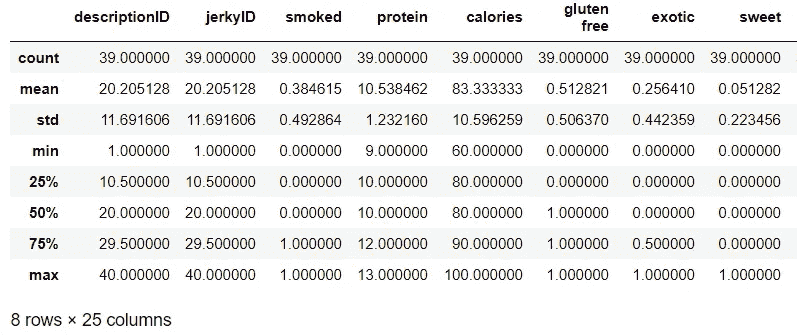

df.describe()

```
#display the columns and data types
df.info()
```

使用 DataFrame.info()返回每一列的数据类型，以及关于 DataFrame 的大小和形状的一般信息。

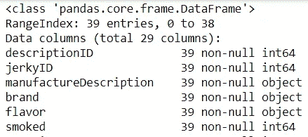

df.info()

# 使用数据

可以选择一列或多列并对它们执行操作。例如，我可能想创建一个只使用数字列的 dataframe，删除任何包含文本的列。我将展示四个例子:

*   从数据帧中选择一列(两种不同的语法示例)
*   从数据帧中选择两列
*   使用从列中选择唯一值。唯一()
*   使用从列中选择唯一值的计数。努尼克

```
#only select the brand column
df['brand'].head()ORdf.head()['brand']
```

我更喜欢使用第一种方法，因为这是我学习的方式，但不管它是如何写的，两者都会返回相同的结果。

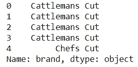

df.head()[‘brand’]

使用一对括号从数据框架中选择多个列，如下所示:**数据框架[[]]**

```
#selcet the brand and flavor column. Notice the double bracket [[]]
df[['brand', 'flavor']].head()
```


df[[‘brand’, ‘flavor’]].head()

使用 DataFrame['column']。unique()返回列中唯一值的数组。这在处理分类数据时非常有用！

使用 DataFrame['column']。nunique()返回列中唯一值的非重复计数。

```
#return unique values
print(df['brand'].unique())
print(df['brand'].nunique())
```

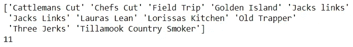

print(df[‘brand’].unique()) AND print(df[‘brand’].nunique())

如果使用时间序列，特征[**data frame[‘列’]。pct_change()** 派上用场](https://pandas.pydata.org/pandas-docs/stable/reference/api/pandas.DataFrame.pct_change.html)。默认情况下，它计算前一行的百分比变化。有关完整的解释，请参考文档。

# 选择数据

在 pandas 中有三种选择数据的基本方法。可以使用括号 **[ ]** 或使用**在切片中选择数据。loc[ ]** 属性。也可以使用**通过整数选择。iloc[ ]** 。[我建议查看文档，了解更高级的数据选择技术](https://pandas.pydata.org/docs/user_guide/indexing.html#selection-by-label)。我将展示这些例子:

*使用切片选择第 5 行和第 6 行
*使用选择原味。loc[ ]
*使用 iloc 选择

```
#slicing the dataframe
df[['brand','flavor']][5:7]
```

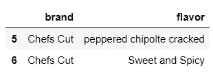

df[[‘brand’,’flavor’]][5:7]

当您需要操作数据时，注意不要过度使用这种方法。稍后我将讨论复制数据。关于切片和使用之间区别的完整分类，请参考文档。**锁定**方法。

另外，请注意第 5 行和第 6 行返回。这是因为数据帧的索引从 0 开始，切片不包括最后一个值。

```
#return the rows with a value Original in column flavor
df[['brand','flavor']].loc[df['flavor'] == 'Original']
```

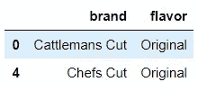

使用 DataFrame.iloc[]传递索引值，而不是列。例如，这将返回原始风味的两条记录:

```
#return the rows with a value Original in column flavor
df[['brand','flavor']].iloc[[0,4]]
```

# 常见操作和功能

Pandas 使得使用像均值和计数这样的操作来生成一些描述性统计数据变得很容易。[在文档中可以找到函数的快速参考](https://pandas.pydata.org/docs/getting_started/basics.html#descriptive-statistics)

*   使用。count()计算行数
*   使用。mean()求出平均钠值
*   使用。median()来计算钠值的中值
*   使用。mode()查找模式钠值
*   使用。min()求出最小钠值
*   使用。max()找到最大钠值

```
#Use .Count() to find the number of rows
df[['brand', 'flavor']].count()
```

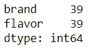

```
#Use .mean() to find the mean sodium value
df['sodium'].mean()
#438.3333333333333# Use .median() to find the median sodium value
df['sodium'].median()
#470.0# Use .mode() to find the mode sodium value
df['sodium'].mode()
#520# Use .min() to find the minimum sodium value
df['sodium'].min()
#140# Use .max() to find the maximum sodium value
df['sodium'].max()
#650
```

# 创建新列

添加新列很容易。这是我使用的基本语法:

**DataFrame['列名'] =某物**

在修改数据帧之前，我认为*复制*它是个好主意。这样，如果我犯了错误，我可以随时查阅原文。使用 **DataFrame.copy()** 创建一个副本

*   创建名为 df_copy 的数据帧的新拷贝。
*   创建一个新列，并将每行的值设置为 1。
*   显示品牌、风味和新列的前 3 行。

```
#make a copy
df_copy = df.copy()#add a new column
df_copy['My_New_Column'] = 1#display the new column
df_copy[['brand','flavor','My_New_Column']].head(3)
```

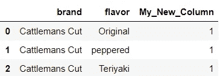

df_copy[[‘brand’,’flavor’,’My_New_Column’]].head(3)

添加新列非常有用。例如，假设我想比较钠和平均值。我可以把平均值加成一列。

```
#create a new column displaying the mean value of sodium
df_copy['sodium_mean'] = df['sodium'].mean()
df_copy[['brand','flavor','sodium','sodium_mean']].head(3)
```

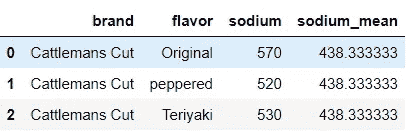

df_copy[[‘brand’,’flavor’,’sodium’,’sodium_mean’]].head(3)

## 更多高级列

这里有几个高级例子来展示添加列或工程特征的不同方法。

*   创建一个 Above_average_cost 列，如果成本大于平均值，则输出 1。否则 0。
*   创建一个 word_count 列，输出 manufactureDescription 列中的字数。

解决这些问题可能有多种方法，但我将向您展示两种。首先，我将展示如何使用一个简单的 for 循环来实现这一点。

```
#use a for loop to create a new column
average_calories = df_copy['calories'].mean()above_average = []for calories in df_copy['calories']:
    if calories > average_calories:
        above_average.append(1)
    else:
        above_average.append(0)df_copy['above_average_calories'] = above_average
```

for 循环不是最佳的；看看这些代码！如果可读性至关重要，我可以想象使用 for 循环，但大多数情况下我会走 pythonic 化的路线，尝试使用列表理解。

```
#Use list comprehensions to create new columns#Create a new column that outputs a 1 if the cost is greater than #the average. Else 0
df_copy['above_average_calories'] = [1  if n > average_calories else 0 for n in df_copy['calories']]#Create a word_count column that outputs the number of words in the #manufactureDescription
df_copy['word_count'] = [len(str(words).split(" ")) for words in df_copy['manufactureDescription']]#Display the top 3 rows
df_copy[['brand','flavor','above_average_calories','word_count']].head(3)
```

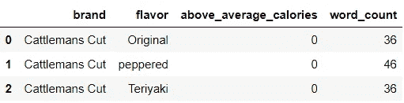

top 3 rows with new columns

创建字数统计列的另一种方法是使用 pandas **DataFrame['column']。apply()** 。一开始可能感觉有点棘手，但是 apply 让我沿着数据帧的轴应用一个函数。这意味着我可以对每一列或每一行应用一个函数。在下面的例子中，我使用。apply()将 lambda 函数应用于 dataframe 的每一列(默认情况下 axis = 0)。

```
#Create a new column that outputs the number of words in the manufactureDescription
df_copy['word_count']= df_copy['manufactureDescription'].apply(lambda x: len(str(x).split(" ")))
```

# 对数据进行排序、分组和透视

数据旋转、分组和排序背后的概念和科学可能很难解释，老实说，一篇文章本身就是如此。虽然排序相当简单(升序和降序)，但分组通常用于拆分数据、对分组数据应用函数或将结果组合到一个数据结构中。这里有几个如何申请的例子。 **sort_values()** 与。 **groupby()** 。

*   按卡路里降序排列数据
*   计算按品牌分组的平均蛋白质和卡路里。

```
#sort the data 
df_copy[['brand','protein', 'calories','flavor']].sort_values('calories', ascending = False)#group by brand and calc mean
df_copy[['brand','protein', 'calories','gluten free']].groupby('brand').mean()
```

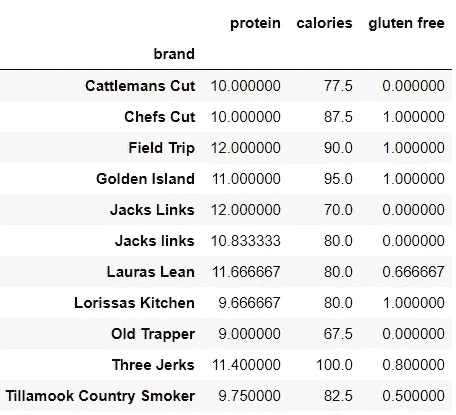

.groupby(‘brand’).mean()

对于数据透视表示例，导入 numpy 以使用聚合函数。数据透视表也可以用几行代码创建！使用 **pandas.pivot_table()** 创建一个类似电子表格的数据透视表。

```
import numpy as np
pd.pivot_table(df_copy, index = ['brand'], values = ['calories'], aggfunc = np.mean)
```

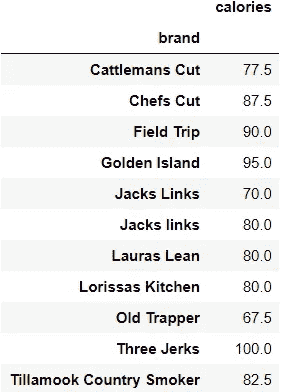

pivot_table

# 包扎

祝贺你到达熊猫入门指南的末尾。我讲述了大量的概念，这些概念将为任何人探索数据集奠定基础。将文件加载到数据框架中很简单，pandas 使生成统计数据和设计新列变得很容易。以下是完整的示例集！

```
#import dependencies
import pandas as pd
#set the file path
filepath = r'Data\beef-jerky\jerky.csv'#open the csv data into a dataframe named df
df = pd.read_csv(filepath)#Example of n values
dataframe.head(1) #returns top 1 row
datafrare.tail(10) #returns last 10 rows
#display the columns
df.columns
#display the index
df.index
#Display the first 5 rows using .head()
df.head()
#Display the last 5 rows using .tail()
df.tail()
#generate statistics 
df.describe()#display the columns and data types
df.info()#only select the brand column
df['brand'].head()
OR
df.head()['brand']#selcet the brand and flavor column. Notice the double bracket [[]]
df[['brand', 'flavor']].head()#return unique values
print(df['brand'].unique())
print(df['brand'].nunique())#slicing the dataframe
df[['brand','flavor']][5:7]#return the rows with a value Original in column flavor
df[['brand','flavor']].loc[df['flavor'] == 'Original']#return the rows with a value Original in column flavor
df[['brand','flavor']].iloc[[0,4]]#Use .Count() to find the number of rows
df[['brand', 'flavor']].count()#Use .mean() to find the mean sodium value
df['sodium'].mean()
#438.3333333333333
# Use .median() to find the median sodium value
df['sodium'].median()
#470.0
# Use .mode() to find the mode sodium value
df['sodium'].mode()
#520
# Use .min() to find the minimum sodium value
df['sodium'].min()
#140
# Use .max() to find the maximum sodium value
df['sodium'].max()
#650#make a copy
df_copy = df.copy()
#add a new column
df_copy['My_New_Column'] = 1
#display the new column
df_copy[['brand','flavor','My_New_Column']].head(3)#create a new column displaying the mean value of sodium
df_copy['sodium_mean'] = df['sodium'].mean()
df_copy[['brand','flavor','sodium','sodium_mean']].head(3)#use a for loop to create a new column
average_calories = df_copy['calories'].mean()
above_average = []
for calories in df_copy['calories']:
    if calories > average_calories:
        above_average.append(1)
    else:
        above_average.append(0)
df_copy['above_average_calories'] = above_average#Use list comprehensions to create new columns
#Create a new column that outputs a 1 if the cost is greater than #the average. Else 0
df_copy['above_average_calories'] = [1  if n > average_calories else 0 for n in df_copy['calories']]
#Create a word_count column that outputs the number of words in the #manufactureDescription
df_copy['word_count'] = [len(str(words).split(" ")) for words in df_copy['manufactureDescription']]
#Display the top 3 rows
df_copy[['brand','flavor','above_average_calories','word_count']].head(3)#Create a new column that outputs the number of words in the manufactureDescription
df_copy['word_count']= df_copy['manufactureDescription'].apply(lambda x: len(str(x).split(" ")))#sort the data 
df_copy[['brand','protein', 'calories','flavor']].sort_values('calories', ascending = False)
#group by brand and calc mean
df_copy[['brand','protein', 'calories','gluten free']].groupby('brand').mean()import numpy as np
pd.pivot_table(df_copy, index = ['brand'], values = ['calories'], aggfunc = np.mean)
```

# 谢谢大家！

*   *如果你喜欢这个，* [*跟我上 Medium*](https://medium.com/@erickleppen) *了解更多*
*   [*通过订阅*](https://erickleppen.medium.com/membership) 获得完全访问权限并帮助支持我的内容
*   *我们来连线一下*[*LinkedIn*](https://www.linkedin.com/in/erickleppen01/)
*   *用 Python 分析数据？查看我的* [*网站*](https://pythondashboards.com/)

[**—埃里克·克莱本**](http://pythondashboards.com/)

查看我的其他教程，了解熊猫的更多高级用途:

[](https://medium.com/swlh/dashboards-in-python-for-beginners-and-everyone-else-using-dash-f0a045a86644) [## Python 中的仪表盘，适用于初学者和使用 Dash 的其他人

### 使用 Python 中的 Dash 初学者教程构建一个基本的和高级的仪表板

medium.com](https://medium.com/swlh/dashboards-in-python-for-beginners-and-everyone-else-using-dash-f0a045a86644) [](https://towardsdatascience.com/my-trick-to-learning-list-comprehensions-in-python-8a54e66d98b) [## 我在 Python 中学习列表理解的技巧

### 在 Python 中使用列表理解时，是什么触发了我的灵感

towardsdatascience.com](https://towardsdatascience.com/my-trick-to-learning-list-comprehensions-in-python-8a54e66d98b) [](https://towardsdatascience.com/web-scraping-board-game-descriptions-with-python-7b8f6a5be1f3) [## 用 Python 编写的网页刮痧板游戏描述

### 我是如何从网上搜集棋盘游戏描述的。

towardsdatascience.com](https://towardsdatascience.com/web-scraping-board-game-descriptions-with-python-7b8f6a5be1f3)