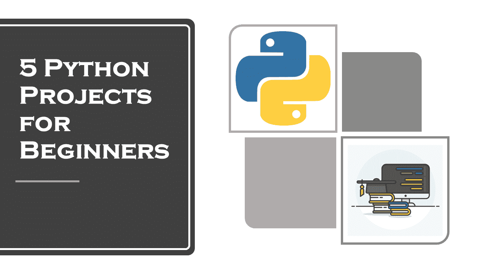

# 面向初学者的 Python 项目

> 原文：<https://medium.datadriveninvestor.com/python-projects-for-beginners-9d3dfc69dd32?source=collection_archive---------5----------------------->

## 为初学者解决和解释了 5 个惊人的 Python 项目。

如果你已经完成了 Python 的大部分基础知识，并且可能正在思考下一步该做什么？然后是时候使用你的技能或者通过为初学者做一些 python 项目来分析你的技能了。在本文中，我将带您浏览五个面向初学者的 python 项目。在完成这些小项目后，你要么能够充分利用你的技能，要么学会为未来做准备。

如果你发现这些 python 项目对初学者来说很难，那么不要担心你只是一个初学者，只要运行代码并尝试理解发生了什么。

# 面向初学者的五个 Python 项目

这里是五个 python 项目，你应该开始测试你的知识，所有的项目都有代码:

## 使用 Python 的 OTP 验证 GUI

在本项目结束时，您将能够发送 OTP，验证您的 OTP，并且您还将了解如何使用 Python 在 GUI 应用程序中提供 OTP 验证程序。使用 python 的 OTP 验证 GUI 应用程序的过程将包括三个步骤:初始屏幕，我们将在其中写入我们的电子邮件地址，然后我们将得到一个屏幕，我们将在其中写入我们的 OTP，最后，我们将得到一个提示，显示我们的 OTP 验证成功。

这可能是你将在本文中经历的所有其他 python 初学者项目中最难的一个，所以如果你作为初学者觉得它很难，那么不要担心，接下来的项目很容易。

 [## 使用 Python 的 OTP 验证 GUI

### 在本文中，我将带您浏览一个使用 Python 的 OTP 验证 GUI。在这篇文章的结尾，你将…

thecleverprogrammer.com](https://thecleverprogrammer.com/2020/08/24/otp-verification-gui-with-python/) 

## 使用 Python 的电报机器人

机器人是一种被编程来执行特定任务的软件应用程序。机器人是自动化的，这意味着它们根据指令运行，不需要人类用户启动它们。机器人经常模仿或取代人类用户的行为。在这个项目中，您将通过使用 telegram API，用 Python 创建一个 Telegram bot。

对于初学者来说，这将是一个非常互动的项目，因为你将能够通过 telegram 应用程序与机器人聊天。

 [## 使用 Python 的电报机器人

### 机器人是一种被编程来执行特定任务的软件应用程序。机器人是自动化的，这意味着它们…

thecleverprogrammer.com](https://thecleverprogrammer.com/2020/08/18/telegram-bot-with-python/) 

## 使用 Python 的密码生成器

在这个项目中，您将学习如何通过几个简单的步骤使用 python 创建一个独特的密码生成器应用程序。您需要首先创建一个程序来生成唯一的密码。

接下来，您将需要使用 Tkinter 模块，这样您就可以将这个简单的程序变成一个 GUI，用于使用 Python 和 Tkinter 的独特密码生成器。

 [## 使用 Python 的密码生成器

### 在本文中，您将学习如何通过几个简单的步骤使用 python 创建一个独特的密码生成器应用程序。我…

thecleverprogrammer.com](https://thecleverprogrammer.com/2020/08/17/password-generator-with-python/) 

## 使用 Python 进行文本到语音转换

文本到语音是从文本合成的语音的生成。当阅读屏幕不可能或不切实际时，该技术用于与用户交流。这不仅打开了应用程序和信息的新用途，还可以让无法阅读屏幕上文本的人更容易进入这个世界。

TTS 背后的技术已经发展了几十年。使用自然语言处理，现在可以产生非常自然的语音，包括音高、速度、发音和屈折的变化。

 [## 使用 Python 进行文本到语音转换

### 文本到语音是从文本合成的语音的生成。该技术用于与用户交流…

thecleverprogrammer.com](https://thecleverprogrammer.com/2020/08/16/text-to-speech-with-python/) 

## 使用 Python 翻译

你曾经尝试过用谷歌翻译任何文本吗？当我过去学习德语时，谷歌在我的作业中给了我很大的帮助，这样做既简单又有帮助。你知道谷歌是怎么做到的吗？谷歌开发人员已经创建了一个 API 来完成这一切。

现在，如果你想用 Python 翻译呢？Python 是一种简单明了的通用编程语言，它为几乎所有的任务提供了包。在这个项目中，你将学习如何将印地语翻译成英语。

 [## 使用 Python 翻译

### 你曾经尝试过用谷歌翻译任何文本吗，当我过去学习的时候，这样做既简单又有帮助…

thecleverprogrammer.com](https://thecleverprogrammer.com/2020/08/10/translate-using-python/) 

这五个面向初学者的 Python 项目应该可以让你开始学习 Python，并推动你以实用的方式学习更多关于 Python 的知识。当试图使用 Python 研究一个问题并提供该问题的解决方案时，这将非常方便和有用。