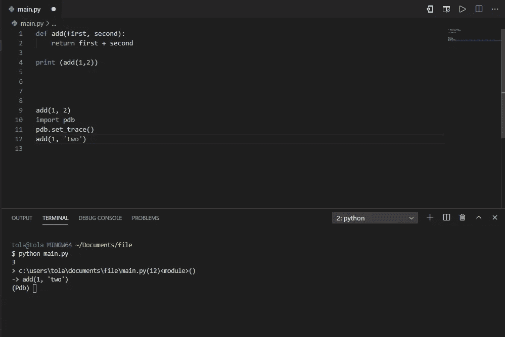

# 将提高您工作效率的 Python 技巧

> 原文：<https://medium.datadriveninvestor.com/python-tips-that-will-improve-your-productivity-c5ce9270e0b3?source=collection_archive---------18----------------------->

Photo by krisna iv on Unsplash

我已经使用 python 实现和工作了一段时间，我决定分享一些技巧和提示，它们将改善你使用 python 的编程体验。

1.  **交互 Shell:** 例如，如果你有一个加两个数的 Python 文件。

Python code that adds two numbers

*   使用 print 调用该函数，然后使用 python 关键字运行文件。
*   我还可以通过另一种方式来运行这个功能，那就是使用交互式 shell。现在我可以像这样在 shell 中调用这个函数，而不是添加`-i flag for interactive`。

adding the -i flag for interactive in your terminal

*   运行命令后，您可以开始在交互式 shell 中实现和键入命令

Python Interactive shell

> 这对于开发像机器人这样的东西非常有用。这将加载您的 python 文件，而不是在运行代码后关闭。这是进行开发测试的好方法。交互外壳真的很神奇，因为你可以随意发出命令。

**2。python 调试器:** Python -i 将运行你的整个文件，然后给你一个进入那个环境的接口。Python 调试器可以在文件执行完毕之前停止它，这样您就可以进行调试了。

 [## 用 Python |数据驱动投资者进行股票价格时间序列预测简介

### 在这个简单的教程中，我们将看看如何将时间序列模型应用于股票价格。更具体地说，一个…

www.datadriveninvestor.com](https://www.datadriveninvestor.com/2020/07/07/introduction-to-time-series-forecasting-of-stock-prices-with-python/) 

例如，如果我在第一行添加了两个数字，并在第二行添加了一个数字和一个不应该在那里的字符，当我试图运行该文件时，我会得到一个错误。
在文件非常大而你不知道错误发生在哪里的情况下，我可以`import pdb (the python debugger)`python 中内置的，然后调用 set trace 方法来暂停我的代码的执行

Run the command to start working with the Python Debugger

*   界面现已显示，您可以打印变量的当前值或使用 **n** 进入下一行进行下一步。

> 这可以帮助我识别我的代码哪里出错了。最棒的是，你可以在你不需要做的行中导入 pdb，在文件的顶部，你可以在完成后删除它。

**3。Lambda 函数:** Lambda 是一个语法不同的函数。Lambda 函数是通常不超过一行的小函数。就像一个普通的函数一样，它可以有任意数量的参数，当你在短时间内需要一个函数时，可以使用这些参数。lambda 函数的威力只有在作为另一个函数的一部分使用时才能实现，lambda 函数的优势在与 python 函数 map、filter 和 reduce 一起使用时很容易看到。

比如说；

*   编写一个函数来添加数字，创建另一个函数作为 lambda 函数来添加数字。

*   用交互外壳打开它，两个功能完全是一回事。

## 我想知道你是否有任何你使用的技巧和诀窍，如果你分享它们，我会很高兴。

*   你也可以在 Twitter 上联系我，或者在 T2 的 ithub 上找到我。

**如果这篇文章有帮助，请点击拍手👏按钮下面几下，以示你对作者的支持！⬇**

**访问专家视图—** [**订阅 DDI 英特尔**](https://datadriveninvestor.com/ddi-intel)