# 完全初学者的 Python 教程。从“Hello World”到函数。

> 原文：<https://medium.datadriveninvestor.com/python-tutorial-for-complete-beginners-from-hello-world-to-functions-47ceb8b96555?source=collection_archive---------13----------------------->

## 本教程是我的大项目——“从零到机器学习(ML)从业者”的起点。主要想法是教每个人 Python 和 ML，不管他们的教育背景。


Photo by [rishi](https://unsplash.com/@beingabstrac?utm_source=unsplash&utm_medium=referral&utm_content=creditCopyText) on [Unsplash](https://unsplash.com/s/photos/beginner-pro?utm_source=unsplash&utm_medium=referral&utm_content=creditCopyText)

本教程面向所有对 Python 感兴趣的人。尤其是对于那些刚刚起步，无法从 ***意向到*** 行动的人。你在这里意味着你对学习 Python 是认真的，我很感激。

我在工作中经常使用 Python。一些应用是科学计算、统计和高级可视化。但是在我的空闲时间，由于各种原因，我喜欢创建迷你应用程序。有些是为了解决某个特定的问题(个人的，或者世界大范围的问题)，有些只是为了好玩，或者只是为了挑战自己。

这一课是我给我的一个朋友的教程的扩展，他碰巧刚刚开始他的博士研究。我们开始讨论各种话题:变量类型，函数，可视化，甚至接触到机器学习。我告诉他，学习新的东西永远不会太晚，尤其是在我们的数字时代，像 Python 这样的东西。

> *因为 Python 是一种强大而流行的通用编程语言。最棒的是，Python 是在 OSI 批准的开源许可下开发的，这使得它可以自由使用和分发，甚至可以用于商业用途。*

简而言之，我们可以使用 Python 从基础到高级计算和统计，到可视化和绘图，到数据分析和机器学习。

我知道列表中的最后一部分听起来最有趣，但如果没有适当的准备和前期工作，它将很难处理，而且听起来可能只不过是魔术！

我已经可以开始向你们展示很酷的机器学习算法，但我想确保我们都在同一页上理解在引擎盖下正在发生的事情。所以，让我们多一点耐心，我们很快就会到达那里:

> 我很想与你分享我的 Python 之旅，并向你展示从一个完全的初学者到机器学习实践者的道路。

同时，我将与你分享我的一些 Python 项目——比如分析[新冠肺炎科学论文](https://medium.com/swlh/analyzing-covid-19-papers-with-python-part-1-22706eb92270)，创建[生产力应用](https://medium.com/datadriveninvestor/create-productivity-app-in-python-from-scratch-part-1-d715d1f393db)，以及用 Python 从头开始跟踪你的体重等等。我相信他们每个人都有一些有趣的和新的东西提供。

但是在我们深入研究这些项目之前，我们希望了解以下主题:

*   **第 0 部分:标准数学运算(** `**+**` **，** `**-**` **，** `*****` **，** `**/**` **)**
*   第一部分:你好，世界！
*   第二部分:变量及其类型
*   **第三部分:注释和如何写注释**
*   第四部分:列表和一些有用的操作
*   **第五部分:循环(** `**for**` **，** `**while**` **)**
*   **第 6 部分:功能**

在这里，我们开始我们的 Python 之旅…

# **第 0 部分:标准数学运算**

无论您是直接在 python 脚本中工作(。py)或交互式 Jupyter 笔记本(。ipynb)，你同样可以很好地使用代码。

我将使用 Jupyter 笔记本。以下是如何安装 Jupyter 笔记本的快速指南:

1.  下载[蟒蛇](https://www.anaconda.com/download)。建议下载 Anaconda 最新的 Python 3 版本(目前是 Python 3.7)。
2.  按照下载页面上的说明安装您下载的 Anaconda 版本。
3.  恭喜你，你已经安装了 Jupyter 笔记本！要运行笔记本，只需输入终端:

```
jupyter notebook
```

现在，您可以看到基于 Web 的应用程序，您可以在其中创建新的笔记本。本教程的其余部分将在这些笔记本之一。

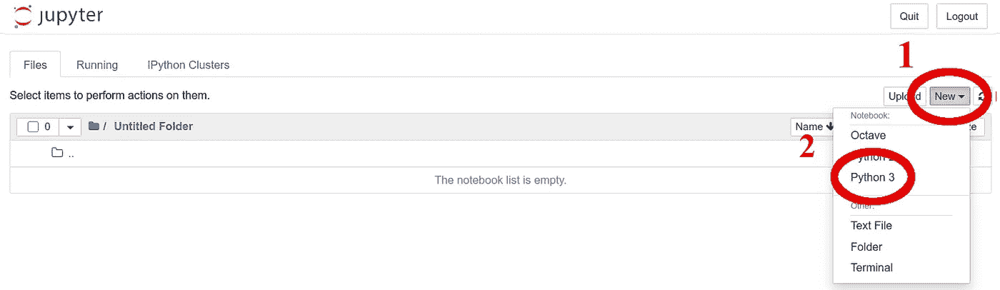

Made by Author. Creating our first Jupyter Notebook.

接下来，我将展示如何在 Python 中执行标准的数学运算。它就像获取两个数字或变量并执行所需的操作一样简单，如下所示

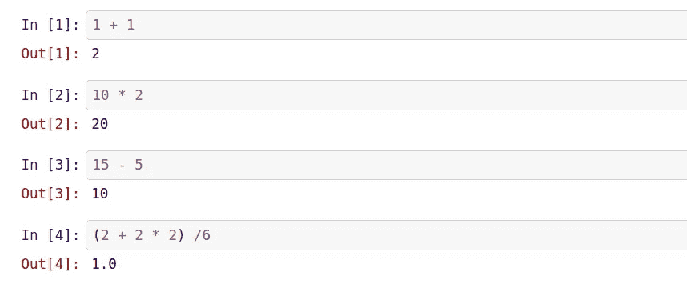

Made by Author. Standard Mathematical Operations.

> **注:** *在笔记本里，你有* **单元格** *。你在里面输入，然后运行一个代码(按下顶部的箭头按钮)。*
> 
> *显示* `*In [x]*` *和* `*Out [x]*` *对给定数字的输入和输出的指示。*
> 
> **Pro 提示:** *不用按那个按钮，可以按****SHIFT+ENTER****(一个热键)来执行一个给定的单元格。这将使你今后的生活更容易。*

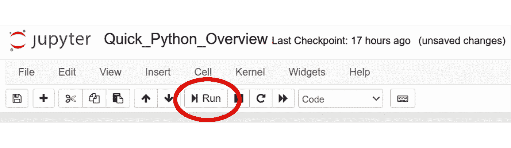

Running Notebook cells.

# 第一部分:你好，世界！

现在我们知道如何执行这些基本操作。下一步将是推出一些东西。最自然的一句话就是 *Hello World！*

众所周知，要成为一名程序员，就必须编写一个程序来迎接这个世界，也就是 T1 程序。在 python 中要做到这一点，我们可以使用命令`print(object)`。

对象可以是任何东西，在这个特殊的例子中，它是短语或所谓的*字符串*。我们将在第 2 部分讨论不同的变量及其类型，所以不要担心引号，这只是字符串的定义方式。在 Python 中，打印非常容易:

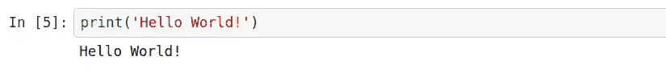

Print out “Hello World!”

**恭喜你！现在，你正式成为一名程序员了！**

我们进展很快，对吧？我们已经知道如何操作数字和打印输出。我们来说一个很重要的话题——变量。因为变量是任何编程语言的基础。

# **第二部分:变量及其类型**

一般来说，我们可以定义一个**变量**作为保留的内存位置来存储值。在我看来，编程的本质就是以一种巧妙的方式对不同的变量进行赋值、重新赋值和操作，从而创造出想要的结果。

让我们来谈谈 Python 中变量的标准类型:

*   **数字** ( **Integer** 为 5， **Float** 为 3.1415——类似整数但有小数部分的数字)。也有长而复杂的数字，但据我所知，他们使用频率较低。
*   字符串(一个例子是‘Hello World！’—字符串是字符的序列/集合。一个句子由字母组成，所以一个字符串由字符组成。字符串值是单引号或双引号之间的任何值)
*   **列表**(包含用逗号分隔的项目的类型，括在方括号`[ ]`中，项目可以是*各种类型*！这与 C 语言中的数组有很大的不同。例如:`[1, ‘2’, 3]`，列表可以修改/更改)
*   **元组**(类似于列表，括在括号`( )`中，不能更新。例:`(1, ‘2’, 3)`)
*   **Dictionary** (类似于 list，但不使用索引，而是使用键-值对，用花括号`{ }`括起来，键通常是数字或字符串，但对应的值可以是任何 Python 对象。例子:`{'name': 'Harry Potter', 'profession':'magician', 'dept': 'Gryffindor'}`)
*   我还会添加一个**布尔值**，它可以是**真**或**假**。这种类型的变量在检查给定条件时非常方便。例如，如果`a`大于`b`，或者给定的文件夹/目录中存在给定的文件。

## 我们如何检查变量的类型？

要检查任何变量的类型，我们只需以如下方式使用命令`type()`:

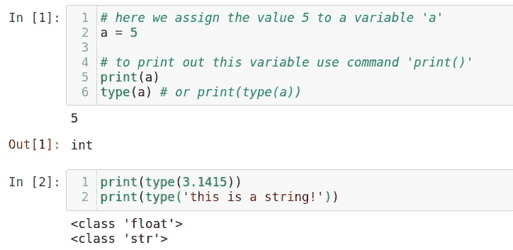

Checking the integer, float, and string variable types.

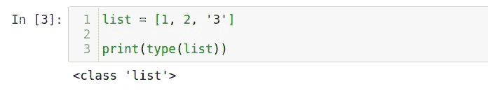

Checking the list variable type.

例如，输出可以是分别用于整数、浮点、字符串或列表的`int`、`float`、`str`或`list`。

## 我们如何将一种类型转换成另一种类型？

我们可能想改变变量的类型。为此，我们必须使用相应的类型名进行转换。例如，如果我们想要转换 **float → int** ，我们可以使用`int()`如下:


Transforming float to integer.

请记住，将浮点数改为整数可能会完全去掉小数部分，因此我们可能会丢失重要信息，例如:

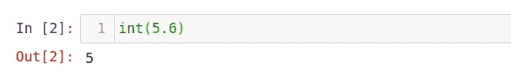

Float → int transformation might crop decimal part. Be careful!

我们还可以使用`str()`将数字转换成字符串，或者将字符串转换成数字，如下所示:

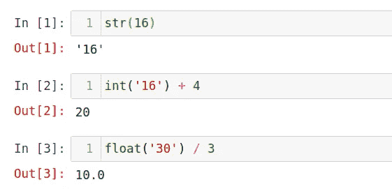

Converting numbers to strings and vice versa.

但是，如果字符串不是数字，则不能将其转换为数字:

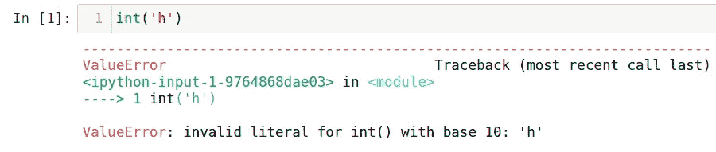

It is impossible to convert a non-number string to a number.

然而，有可能得到对应于给定符号的数字。

> **注意:** *使用命令* `*ord()*` *可以将一个字符转换成一个数字——这将给出一个给定字符的数字。*

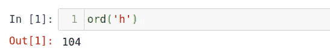

Symbol to number transformation.

计算机以数字的形式储存数据。甚至像`a`、`b`、`k`、`s`等人物。以数字的形式存储。所以，每个字符都有自己对应的数字。感兴趣的读者可能想看看 [ASCII 表](https://en.wikipedia.org/wiki/ASCII)，一种用于电子通信的字符编码标准。

## 关于列表、元组和字典的一些话

列表可以更新，而元组不能更新。例如，让我们创建两个虚拟变量(list & tuple ),并尝试修改它们——看看什么是有效的语法。

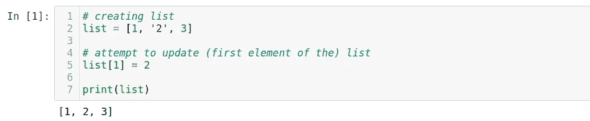

Editing a list is allowed.

结果会是`[1, 2, 3]`。

> **注意:** *Python 使用 0-引用索引，意为数组/列表/元组等的第一个元素。是第零个元素。*

使用 tuple 的完全相同的过程将导致错误，因为不允许我们更新 tuple。


Editing a tuple is not allowed.

输出给出如下异常:
`TypeError: ‘tuple’ object does not support item assignment`。

那么，字典呢？？字典是一组键值对。它没有按照任何特定的顺序/索引进行排序。我想对 Python 能提供什么有一个大致的概述，但是当我开始学习 Python 的时候，字典是我自己很长时间不用的东西。例如，它看起来比一个简单的列表要复杂一些，所以我认为没有必要使用它。那么，字典为什么有用呢？

当您有一组映射到值的唯一键时，使用字典很有用，而对于有序的项目集合，最好使用列表。例如，在数据科学中，我们必须处理数据库。它们可以是字典的形式:列是一个键，相应的行元素是一个值。这里有一个键值对！

# **第 3 部分:注释以及如何编写注释**

有时会发生这样的情况，一个人正在做一个代码，然后离开一个星期。回到完全相同的代码后，人们无法理解里面发生了什么！有时会非常令人沮丧。我是根据我的经验来说的:

> 在代码中做注释以明确地告诉代码的哪一部分在做什么是非常重要的。

所以，评论是这样写的:

1.  为了注释单行代码，我们使用`#`(哈希)。它后面的所有内容将以不同于代码的颜色显示，并且在执行过程中会被忽略。
2.  为了注释多行，我们使用三引号`''' … many comments … '''`或三双引号`""" … many comments … """`。

让我们看看每种情况下的几个直观例子:


An example of the single-line comments.

这段代码不会给出任何输出，因为没有要运行的任务。

> **亲提示:** *要注释掉多行每一行作为单行注释，选择这些行并使用****CTRL+/****组合。*

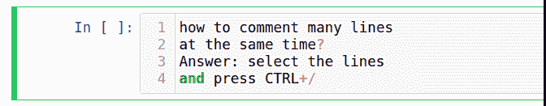

Animation showing how to comment out multiple lines each as a single-line comment.

## 单引号对双引号？

毕竟，这没多大关系。

对于多字符串注释，您可能想知道单引号和双引号之间的区别是什么？一点区别都没有。唯一不同的是使用字符串时！比如，你会如何用一对单引号打印出这个句子:`It’s me, Ruslan`？

使用撇号将结束字符串，因此一种方法是使用双引号将整个字符串括起来，或者使用反斜杠`\`来表示下一个字符是特殊字符。

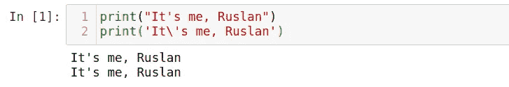

An example of printing out a string containing an apostrophe sign.

类似的还有多行注释——使用两种类型的引号使我们的注释更加灵活。

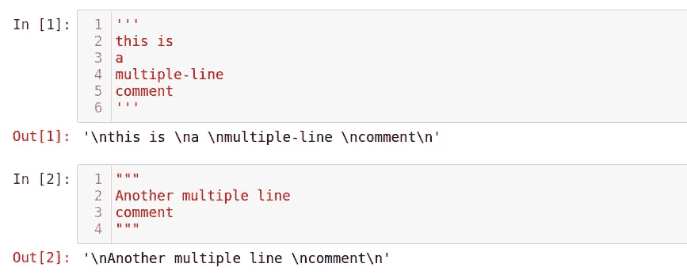

Multi-line comments with single and double-quotes.

您可能会注意到，上面代码单元的输出给出了注释部分中的字符串。可以忽略。请注意，`\n`也是一个特殊字符，表示*是一个新行*。

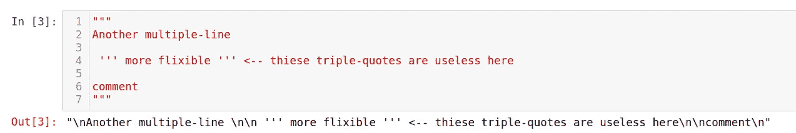

Multi-line comment combining single and double-quotes.

# **第 4 部分:列表和一些有用的操作**

到目前为止，我们已经学习了如何执行基本的数学运算、打印输出、进行注释以保持对程序的良好跟踪，并学习了 Python 中不同类型的变量。

在这里，我们将更多地讨论列表，以及对它们的两个特别有用和有趣的操作——**扩展**和**追加**。

首先，让我们回忆一下*列表是*的项目集合。它可以是任何类型，并且可以包含另一个列表:

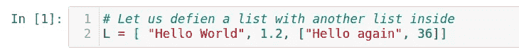

Creating a list containing another list inside.

使用命令`len()`获得列表长度

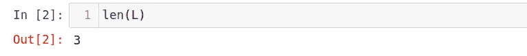

Getting a length of the list.

要访问列表中的任何元素，我们使用`L[index]`

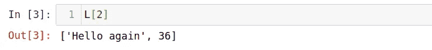

Getting a 2nd element of the list.

> **注:***Python 中的索引是从 0 开始的，不是从 1 开始的。因此，第一个元素将作为* `*L[0]*` *被访问，并在我们的例子中等于“Hello World”字符串。*

也有可能从列表的末尾访问列表元素。为此，我们可以使用负索引，如`L[-index]`

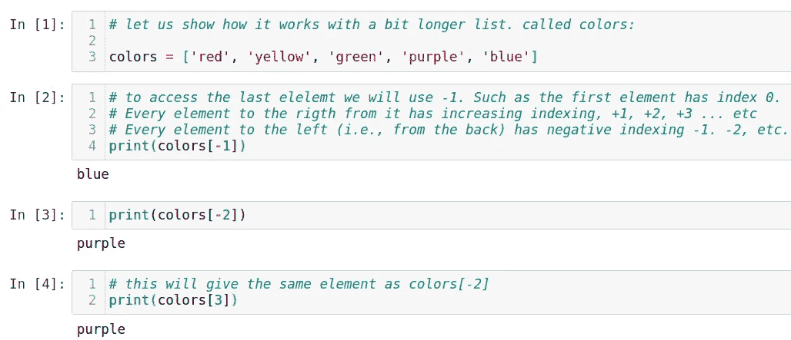

Accessing the list elements from the back.

现在，让我们来讨论两个有趣的列表操作，以及它们之间的区别——扩展和追加:

*   **Extend** 用于将一个列表的元素扩展(插入)到另一个列表中。
*   **追加**用于将整个列表原样插入另一个列表。

例如，让我们定义两个列表`L1`和`L2`

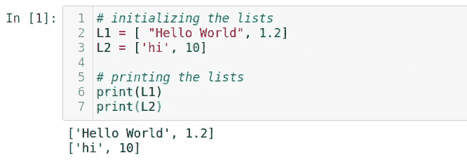

Initializing two lists for the subsequent operations.

为了将一个列表的元素扩展到另一个列表中，我们使用了列表的属性

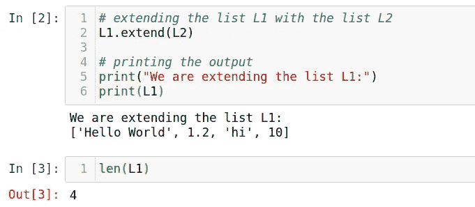

Extending one list with the elements from another one.

因此，我们的列表有 4 个元素。

向**追加**同一个列表 L1 和整个列表 L2，正如你所猜测的，我们称之为`.append`属性

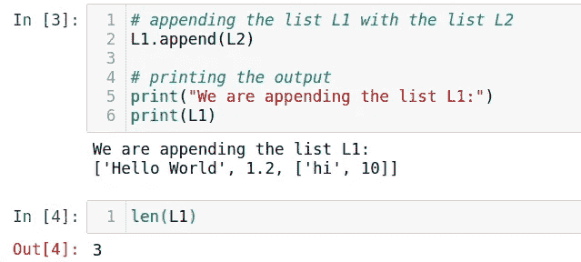

Appending one list with the elements from another one.

因此，我们的列表只有 3 个元素，第 2 个元素是一个包含两个元素的列表。

# **第 5 部分:循环(** `**for**` **，** `**while**` **)**

循环有两种类型，即`for`和`while`。循环非常有用，尤其是在处理列表和数组时，例如数据库。

*   `For`循环运行一定的次数/迭代。
*   `While`当条件为真时，循环无限期运行。注意不要编写无限循环的程序！

让我们分别考虑这两种情况。

## For 循环

当我们想要迭代特定次数或者迭代数组的特定元素时，我们可以使用`for`循环。

对于循环，它由关键字`for`、索引变量、关键字`in`、一些迭代列表和冒号`:`定义。冒号后面的所有内容都在一个循环中，应该用适当的缩进来书写(为此使用空格或 Tab 键)


Iterating a for a loop.

> **注意** : *记住，Python 索引是从 0 开始的，不是 1，* `*range*` *表示两个给定数字之间的数字范围。*
> 
> **注意** : *迭代变量(index)可以随心所欲的调用，甚至是一个* `*pineapple*` *。只是作为一个经验法则，它被称为* `*i*` *表示一个索引。*


Iterating a for loop with an arbitrary variable name.

正如我前面提到的，我们也可以迭代数组的元素。我们简单地使用数组本身来代替`range()`:

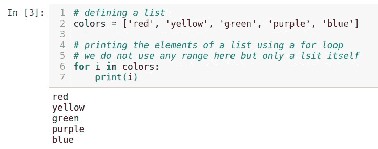

Iterating a for loop from an array.

在每次迭代中，我们的索引变量被分配给特定的数组元素，而不是来自`range`的数字。我们也可以通过迭代数组/列表长度来使用范围:

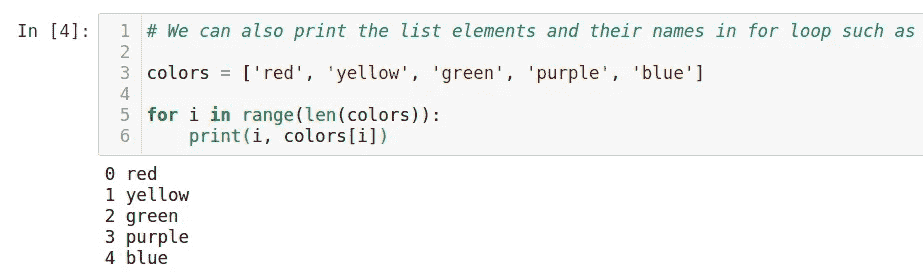

Iterating a for loop in a range of array elements.

> **Pro 提示:** *对* `*for*` *循环的一个奇特添加是使用* `***enumerate***` *方法，而不是使用* `*range*` *方法。它会自动确定元素索引，而不是在列表长度范围内循环。*

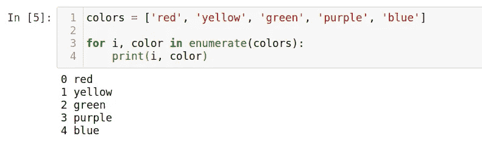

Iterating with a for loop and enumerate method.

当我们使用 enumerate 时，给索引变量和实际值赋值是很重要的，比如`i, color`。我认为这个选项有点超前，并不总是必要的。

当我开始使用 Python 时，我并不知道它的存在。绝对没有必要在每个`for`循环中都使用这个方法，但有时它可能会使代码看起来更干净、更好。

## While 循环

我们可以主要在某事依赖于特定条件时使用`while`循环，例如，be `True/False`，或者 if `i < 10`。

While-loop 由关键字`while`、一个条件和冒号定义。举个例子，

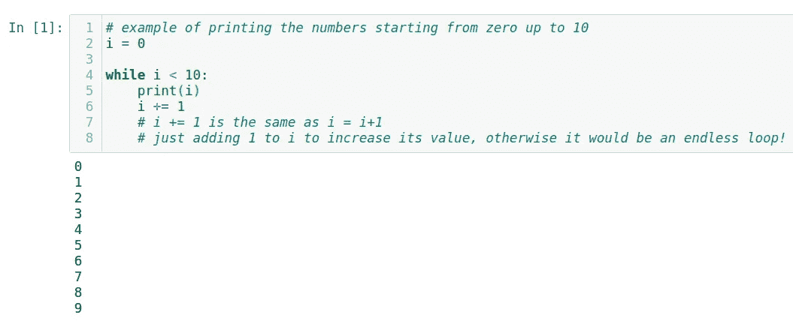

Iterating with a while loop.

> 再次提醒，记住不要无限循环。这样的循环永远不会停止，因为条件总是满足的。

# **第 6 部分:功能**

本教程的最后一点也很重要，函数的主题。让我们从定义开始，然后展示如何编写我们自己的函数。

功能是一个块或一组有组织的可重用代码。它用于执行单个相关的操作。使用函数不仅有助于保持代码整洁，还能提高计算速度。

我们已经看到了几个内置的 Python 函数，比如`len()`、`print()`、`type()`等。这些都非常有用，但是在我看来，为了充分利用 Python，我们需要为特定的任务创建自己的函数。

## 如何定义一个函数？

以下是在 Python 中定义函数的简单规则:

*   类似于`for`或`while`循环，功能块以关键字`**def**`开始，后跟功能名和括号`( )`
*   函数可以有(可选的)输入参数。它们应该放在这些括号内。我们甚至可以在这些括号中定义一些参数。
*   冒号`:`分隔函数头和函数体。
*   函数体可以有文档字符串( *docstring* )。这是指示函数信息的可选语句。在我之前的[教程](https://medium.com/swlh/track-your-weight-with-python-4bf0cae42ef3)中，我提到了 docstrings。如果你想了解更多，请参考那里。
*   要退出一个函数，我们可以提供一个带有(可选)表达式的`return`语句。不带参数的 return 语句与`return None`相同

简单函数的示例:

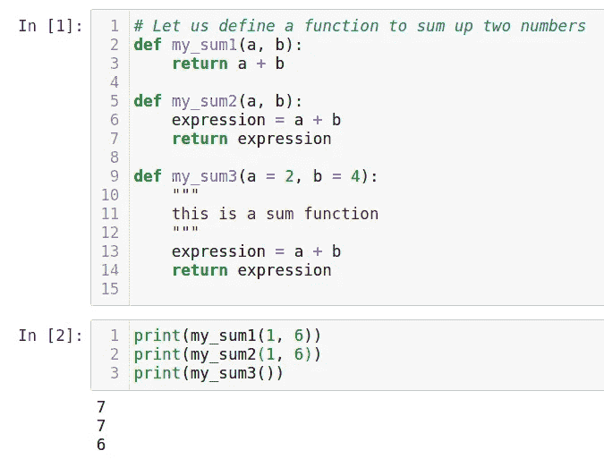

Several examples to define a function.

> **注意:**如果我们为函数头内部的参数指定默认值，我们可以不提供任何参数，直接调用这个函数。这是 `*my_sum3()*` *案例*

让我们再来看另一个简单的例子:

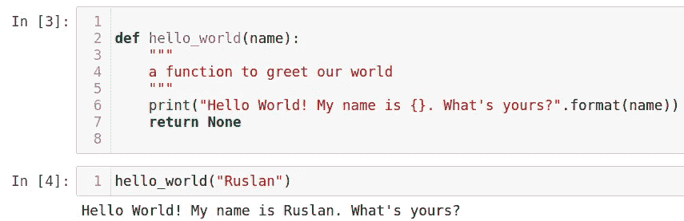

Greeting our World from a function.

这些简单的例子说明了在 Python 中使用函数的原理。程序越大，越复杂，最好使用越多的功能来保持有序。

在这里，我想提一个重要的话题:全局变量和局部变量的区别。

## 全局变量与局部变量

**全局**变量在 any **function** 之外被声明为*，因此它们可以在程序中的任何函数上使用(访问)。*

**局部**变量在函数中声明*，并且只能在该特定函数中使用。*

当我们对这两个变量使用相同的变量名时，让我们来看看它们之间的区别:

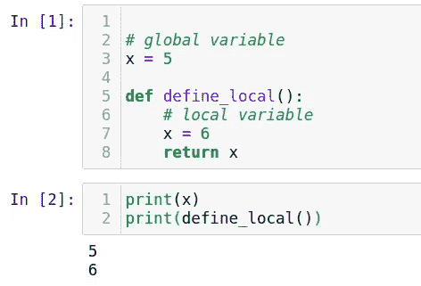

Local VS. Global variables.

现在可能有点混乱，但是当你习惯了这个想法，它会变得更好。

这也说明了为什么使用函数可以加快代码的速度。定义函数意味着有更多的局部变量。它们中的每一个在内存中占据更少的空间。这意味着程序不需要在全局范围内存储大量信息，而是只在需要使用时才存储(内部函数)。

# 结论

关于函数，我们结束本教程。同样，主要思想是教每个人 Python 和机器学习(ML)。在我们进入 ML 部分之前，我希望每个人都在同一页上。我们已经讨论了一系列主题。只要有点耐心，我们很快就会到达那里。

> 记住，练习才能进步。

正如我之前提到的，这里是我从头到尾解释的几个我的项目。这是一个很好的机会，可以尝试实践你在本教程中学到的一些技能，以增强你的经验:

*   [用 Python 从头开始追踪你的体重](https://medium.com/swlh/track-your-weight-with-python-4bf0cae42ef3)
*   解析[新冠肺炎科技论文](https://medium.com/swlh/analyzing-covid-19-papers-with-python-part-1-22706eb92270)
*   从头开始创建一个[生产力应用](https://medium.com/datadriveninvestor/create-productivity-app-in-python-from-scratch-part-1-d715d1f393db)(番茄)

谢谢你一直读到最后。我希望你学到了新的东西。如果你想连接，有任何问题，建议，和/或发现任何错误，请不要犹豫通过 [LinkedIn](https://www.linkedin.com/in/ruslan-brilenkov/) 联系我。

*附:如果你喜欢 Medium.com 这个美丽平台上这种不间断的阅读体验，可以考虑通过注册成为会员来支持这个社区的作家，* [*这里*](https://ruslan-brilenkov.medium.com/membership) *。它每月只需 5 美元，支持所有的作家。*