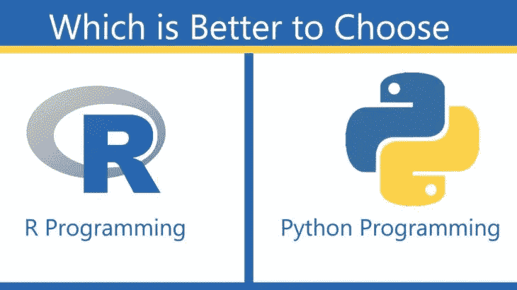
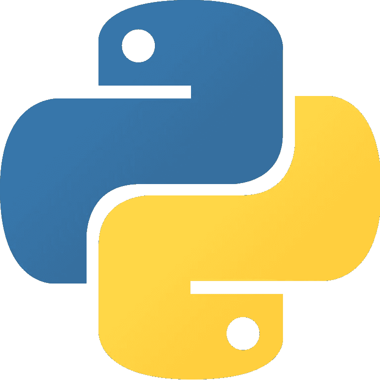

# Python vs R？2021 年你该学哪个？

> 原文：<https://medium.datadriveninvestor.com/python-vs-r-which-one-should-you-learn-in-2021-c000f544559d?source=collection_archive---------6----------------------->

R vs Python 对比。

## R 是什么？

R 是由 R 统计计算基金会支持的用于统计分析和图形的编程语言统计学家和数据挖掘者。R 还提供高质量的图形，并且它还有一些流行的库来帮助分析部分，比如 R markdown 和 shiny。

## Python 是什么？

另一方面，python 是一种成熟的、面向对象的高级编程语言，由程序员和开发人员为通用编程而开发。Python 广泛用于基于 GUI 的应用程序，如游戏、图形设计、Web 应用程序等等。

如果你们想了解更多关于 python 的知识，可以看看我的 python [博客](https://medium.com/nerd-for-tech/why-python-is-popular-336809dd4aba)。

因此，我们可以说，R 功能是由统计学家的头脑开发的，从而提供了特定领域的优势。而 python 通常被誉为语法易于理解的通用语言。

R vs Python

## 速度

就速度而言，python 仅在 1000 次迭代之前比 R 快，但在 1000 次迭代之后，R 开始应用提高其速度的函数，在这种情况下，R 变得比 Python 快，两者各有优势。

## 代码和语法

变量声明

让我们以一根绳子为例。r 的实现类似于 S 编程语言，它使用箭头符号来初始化变量，这在 S 编程中也出现过。这些箭头可以从右到左或从左到右使用，指示谁给变量赋值，而 python 使用赋值操作符来初始化变量。所以基本上 R 开发人员认为告诉赋值的方向比使用赋值操作符更好，后者实际上会让任何新程序员搞不清哪个变量被赋值了。

数据处理能力

这里我将向你们展示散点图的例子。运行这些代码后，您将在两种情况下获得非常相似的绘图结果。R 有一个数据科学生态系统，其中有许多像 GGally 这样的较小的包，它基本上是一个帮助 ggplots2 的包，也是最常用的 R 绘图包。而在 python 中，mathplotlibs 是主要的绘图包，seaborn 是广泛使用的层。r 有许多包和不同的做事方法，而在 Python 中通常只有一种方法。

## 深度学习

深度学习是当今的趋势。几乎你们都知道大多数公司都在从事人工智能和深度学习。深度学习是人工智能的主要部分。所以当谈到深度学习时，python 比 R 更通用，因为它为深度学习提供了更多的功能，而 R 对深度学习来说是新的。R 新增了一些 API，比如用 python 编写的 Keras 和 Keras R。在你脑海中的某个地方，这个问题可能会浮现为什么是 Keras？实际上，python 中的 Keras 有能力运行 python 的强大 API，如 Tensorflow 或 Theano，或微软的 CNTK。所以我们可以说 python 在这里有更大的优势。

## 转换百分比

python 从 R 转换到 Python 的百分比比 Python 转换到 R 的百分比更高。假设 10%的人从 Python 转换到 R，那么 20%的人从 R 转换到 Python，这是场景之前的两倍。

# 别忘了留下你的回答。✌

大家敬请关注！！为了把我的故事发到你的邮箱里，请订阅我的时事通讯。

感谢您的阅读！不要忘记给你的掌声，分享你的回答，并与朋友分享！