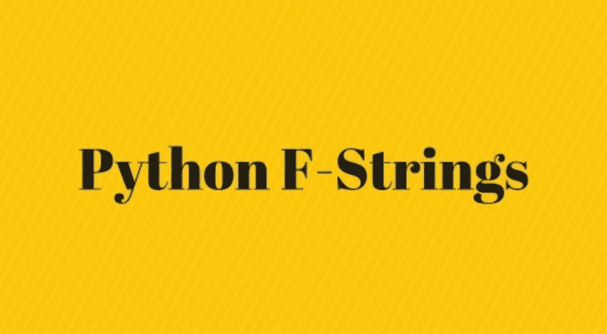

# Python 的 F 字符串

> 原文：<https://medium.datadriveninvestor.com/pythons-f-strings-d7dc11c30d1c?source=collection_archive---------5----------------------->

## 包含代码的完整实施指南…



Pic credits : Pinterest

Python F-String 用于使用最少的语法将 Python 表达式嵌入到字符串文字中进行格式化。这是一个在运行时计算的表达式。它们带有 f 前缀，并使用{}括号来计算值。f 字符串比% formatting 和 str.format()要快。

与 Python 中的其他字符串格式化方法相比，F-strings 有几个优点，比如`str.format`方法或`%`操作符。例如:

*   *与字符串连接或* `*%*` *操作符相比，它们可读性更强，更不容易出错。*
*   它们允许你直接在字符串中嵌入表达式，这对在字符串中执行计算很有用。
*   *它们比* `*str.format*` *方法更快，在速度上与* `*%*` *操作符相当。*

# 其他一些最好的系列—

> [**30 天的机器学习 Ops**](https://medium.com/coders-mojo/day-1-of-30-days-of-machine-learning-ops-7c299e4b09be?sk=4ab48350a5c359fc157109e48b1d738f)
> 
> [**30 天自然语言处理系列**](https://medium.com/coders-mojo/quick-recap-30-days-of-natural-language-processing-nlp-with-projects-series-ceb674e3c09b?sk=ca09b27b3d5867f23ab4dc367b6c0c32)
> 
> [**30 天数据工程与项目系列**](https://medium.com/coders-mojo/day-1-of-30-days-of-data-engineering-894822fcb128?sk=76ba558bfe2d9f85cbe741e505295531)
> 
> [**数据科学与机器学习研究(论文)简体**](https://medium.com/coders-mojo/day-1-data-science-and-ml-research-papers-simplified-a68b00a3b1c4?sk=56136229ff738bd734f19d2b6953f78c) ******
> 
> [**60 天数据科学与 ML 系列带项目**](https://medium.com/coders-mojo/day-1-day-60-quick-recap-of-60-days-of-data-science-and-ml-6fc021643d1?sk=4e75e043b7630a9f963562ebac94e129)
> 
> [**100 天:你的数据科学与机器学习学位系列与项目**](https://medium.com/coders-mojo/100-days-your-data-science-and-ml-degree-part-3-c621ecfdf711?sk=1a8c7b0c204d73432d56b7d1a3a26474)
> 
> [**你应该知道的 23 个数据科学技巧**](https://ai.plainenglish.io/23-data-science-techniques-you-should-know-61bc2c9d1b3a?sk=1680c36193eb22198974c9008d62a33c)
> 
> [**科技面试系列—编码问题精选清单**](https://medium.com/coders-mojo/mega-post-tech-interview-the-only-list-of-questions-you-need-to-practice-ee349ea197bb?sk=fac3614684daff4b50a70c0a71e4d528)
> 
> [**完成系统设计与最热门问题系列**](https://medium.com/coders-mojo/system-design-made-easy-quick-recap-of-complete-system-design-34af7e3aedfb?sk=bdd6a19edc1f3ce4a5064923f5b68721)
> 
> [**完成数据可视化及预处理系列与项目**](https://medium.com/coders-mojo/complete-data-preprocessing-and-data-visualization-with-projects-mega-compilation-part-2-41584ef0920e?sk=842390da51689b8d43148c3980570db0)
> 
> [**完整的 Python 系列与项目**](https://medium.com/coders-mojo/complete-python-and-projects-mega-compilation-7ec8f7adfe71?sk=ee0ecf43f23c6dd44dd35d984b3e5df4)
> 
> [**完成高级 Python 系列与项目**](https://medium.com/coders-mojo/complete-advanced-python-with-projects-mega-compilation-part-6-729c1826032b?sk=7faffe20f8039fa57099f7a372b6d665)
> 
> [**Kaggle 最会教你的笔记本**](https://medium.com/coders-mojo/my-list-of-kaggle-best-notebooks-topic-wise-data-science-and-machine-learning-part-2-84772863e9ae?sk=5ed02e419854a6c11add3ddc1e52947f)
> 
> [**Git**](/the-complete-developers-guide-to-git-6a23125996e1?sk=e30479bbe713930ea93018e1a46d9185)完全开发者指南
> 
> [**打赏 Github Repos**](https://medium.com/coders-mojo/6-exceptional-github-repos-for-all-developers-part-1-21e8fa04e150?sk=9140b249af6fe73d45717185fad48962) **—第一部**
> 
> [**打赏 Github Repos**](https://medium.com/coders-mojo/6-exceptional-github-repos-for-all-developers-part-2-3eec9a68c31c?sk=8e31d0eb7eb1d2d0bbbcecaa66bd4e7e) **—第二部**
> 
> [**所有数据科学和机器学习资源**](/best-resources-for-data-science-and-machine-learning-full-list-5ceb9a2791bf?sk=cf85b2cef95560c58509877a794577ff)
> 
> [**210 机器学习项目**](/210-machine-learning-projects-with-source-code-that-you-can-build-today-721b035649e0?sk=da5f593572a0261a6314afad99a0356c)

## 科技时事通讯—

> 如果你感兴趣，你可以加入我的时事通讯，通过它我向超过 30，000 名读者发送技术面试技巧，技术，模式，黑客——软件开发，ML，数据科学，创业公司和技术项目。可以订阅**科技 Brew :**

[](https://naina0405.substack.com/) [## 点火器

### 数据科学，人工智能，人工智能和更多…点击阅读由 Naina Chaturvedi 撰写的 Ignito，子堆栈出版物。推出 7 个月…

naina0405.substack.com](https://naina0405.substack.com/) 

## Github —

[](https://github.com/Coder-World04) [## 编码器-world 04-概述

### 此时您不能执行该操作。您已使用另一个标签页或窗口登录。您已在另一个选项卡中注销，或者…

github.com](https://github.com/Coder-World04) [](https://medium.com/datadriveninvestor/hacker-earth-surveyed-16000-developers-from-76-countries-heres-what-i-found-dbd5d7c422b0) [## 黑客地球调查了来自 76 个国家的 16000 名开发者——以下是我的发现

### 惊人的洞察力…

medium.com](https://medium.com/datadriveninvestor/hacker-earth-surveyed-16000-developers-from-76-countries-heres-what-i-found-dbd5d7c422b0) 

## 语法—

*f "字符串变量"*

[](https://naina0412.medium.com/read-and-process-large-datasets-in-seconds-part-1-1ce12ed95c71) [## 在几秒钟内读取和处理大型数据集—第 1 部分

### 在几秒钟内处理十亿行..

naina0412.medium.com](https://naina0412.medium.com/read-and-process-large-datasets-in-seconds-part-1-1ce12ed95c71) 

# 1.f 字符串表达式

为了以格式化的方式格式化和输出表达式，您应该使用花括号{}

## 实施—

```
sacks = 3
no_of_balls= 20print(f'There are total of {sacks * no_of_balls} balls')
```

输出—

```
There are total of 60 balls
```

[](https://naina0412.medium.com/analyzing-video-using-python-opencv-and-numpy-5471cab200c4) [## 使用 Python、OpenCV 和 NumPy 分析视频

### 通过代码实现…

naina0412.medium.com](https://naina0412.medium.com/analyzing-video-using-python-opencv-and-numpy-5471cab200c4) 

## 使用 f 字符串对象实现——

```
class Person:def __init__(self, name, age):
        self.name = name
        self.age = agedef __str__(self):
        return f'{self.name} is {self.age} years old.'p1 = Person("Adam", 26)print(f"{p1}")
```

输出—

```
Adam is 26 years old.
```

# 2.f 字符串调试

为了更好地调试，您可以在 f 字符串中使用赋值表达式。

[](https://naina0412.medium.com/holidays-alert-top-5-free-data-science-ai-ml-courses-you-can-finish-8067ecff7c1d) [## 【假期提醒】:你可以完成的前 5 名免费数据科学、AI & ML 课程

### 令人惊叹的课程…

naina0412.medium.com](https://naina0412.medium.com/holidays-alert-top-5-free-data-science-ai-ml-courses-you-can-finish-8067ecff7c1d) 

## 实施—

```
import math
r = 5.2print f"Diameter {(diam = 2 * r)} gives circumference {math.pi * diam:.2f}"
```

[](/introduction-to-statistics-in-python-part-1-14e69ef05abe) [## Python 中的统计简介—第 1 部分

### 统计很容易…真的吗？

medium.datadriveninvestor.com](/introduction-to-statistics-in-python-part-1-14e69ef05abe) 

## 实施—

```
name = 'ADAM'
print (f"{name.lower()[::-1] = }")
```

[](https://medium.com/datadriveninvestor/coding-sins-hilarious-developer-confessions-f55eb342454e) [## 编码原罪:令人捧腹的开发者自白

### “白板”是如何被嘲笑的

medium.com](https://medium.com/datadriveninvestor/coding-sins-hilarious-developer-confessions-f55eb342454e) [](https://medium.com/python-in-plain-english/python-iterators-generators-and-decorators-made-easy-659cae26054f) [## Python 迭代器、生成器和装饰器变得简单

### 快速实施指南

medium.com](https://medium.com/python-in-plain-english/python-iterators-generators-and-decorators-made-easy-659cae26054f) [](https://medium.com/ai-in-plain-english/23-data-science-techniques-you-should-know-61bc2c9d1b3a) [## 你应该知道的 23 种数据科学技术！

### 使用这些技巧来节省你的宝贵时间

medium.com](https://medium.com/ai-in-plain-english/23-data-science-techniques-you-should-know-61bc2c9d1b3a) 

# 3.调用函数— fstrings

您可以调用 fstrings 中的函数，如下所示—

## 实施—

```
def max_no(x, y):return x if x > y else yf_no = 3
s_no = 4print(f'Max of {f_no} and {s_no} is {max_no(f_no, s_no)}')
```

## 输出—

```
Max of 12 and 25 is 25
```

# 4.格式规范

格式说明符非常好用。

## **实施—**

```
from decimal import Decimal
width = 4
round_point = 2
value = Decimal('52.676547')
print(f'result: {value:{width}.{round_point}}')
```

## **输出—**

```
result:   53
```

[](https://medium.com/datadriveninvestor/programming-humor-part-2-f92cf5a26f2b) [## 编程幽默第 2 部分

### 继续笑，因为太搞笑了…

medium.com](https://medium.com/datadriveninvestor/programming-humor-part-2-f92cf5a26f2b) 

# 5.带字典的 f 字符串

你可以用字典 f-string，如下所示

## 实施—

```
person = {"name": "Adam", "age": 26, 'occupation': 'Software Engineer'}
print(f"{person['name']}, a {person['occupation']} is {person['age']} years old.")
```

## 输出—

```
Adam, a Software Engineer is 26 years old.
```

# 6.f-字符串格式宽度

宽度说明符用于设置值的宽度，如下所示。

## 实施—

```
num=[1,2,3,4,5,6,7,8,9,10,11]
for i in range(1,len(num)):
    print(f'{i:3} {i*i:4} {i*i*i:5}')
```

## 输出—

```
 1    1     1
  2    4     8
  3    9    27
  4   16    64
  5   25   125
  6   36   216
  7   49   343
  8   64   512
  9   81   729
 10  100  1000
```

[](https://naina0412.medium.com/6-exceptional-github-repos-for-all-developers-part-2-3eec9a68c31c) [## 6 面向所有开发者的特殊 GitHub 回购—第二部分

### 把它加入书签…它会给你很大的帮助

naina0412.medium.com](https://naina0412.medium.com/6-exceptional-github-repos-for-all-developers-part-2-3eec9a68c31c) 

# 7.f 弦多线

您需要在多行字符串的每一行放置 f，如下所示。

## 实施—

```
name = "Adam"
occupation = "Software Engineer"person = (
     f"Hi {name}. "
     f"You are a {occupation}. "
 )
print(person)
```

## 输出—

```
Hi Adam. You are a Software Engineer.
```

# 所有完整的系统设计系列零件—

> [***1。系统设计基础***](https://medium.com/coders-mojo/complete-system-design-series-part-1-45bf9c8654bc)
> 
> [***2。水平和垂直缩放***](https://medium.com/coders-mojo/complete-system-design-series-part-2-922f45f2faaf)
> 
> [***3。负载平衡和消息队列***](https://medium.com/coders-mojo/part-3-complete-system-design-series-e1362baa8a4c)
> 
> [***4。高层设计和低层设计，一致散列，单片和微服务架构***](https://medium.com/coders-mojo/part-4-complete-system-design-series-138bc9fbcfc0)
> 
> [***5。缓存、索引、代理***](https://medium.com/coders-mojo/part-5-complete-system-design-series-4b9b04f23608)
> 
> [***6。联网、浏览器如何工作、内容网络交付(CDN)***](https://medium.com/coders-mojo/part-6-complete-system-design-series-59a2d8bbf1ed)
> 
> [***7。数据库分片、CAP 定理、数据库模式设计***](https://medium.com/coders-mojo/part-7-complete-system-design-series-1bef528923d6)
> 
> [***8。并发、API、组件+ OOP +抽象***](https://medium.com/coders-mojo/part-8-complete-system-design-series-57bc88433c8e)
> 
> [***9。***](https://medium.com/coders-mojo/part-9-complete-system-design-series-df975c85ec51) 估算与规划、绩效
> 
> **10*。*** [***地图缩小，图案和微服务***](https://medium.com/coders-mojo/part-10-complete-system-design-series-523b4dd978bf?sk=741f92929c8639a2e4cf218521e8cc4a)
> 
> ***11。***[***SQL vs NoSQL 和云***](https://naina0412.medium.com/part-11-complete-system-design-series-9c8efbc0237a?sk=5bddf2adc78ea4947ae88ab21c94af1c)
> 
> [***12。最受欢迎的系统设计问题***](https://medium.com/coders-mojo/most-popular-system-design-questions-mega-compilation-45218129fe26)

# Github —

 [## Complete-System-Design/readme . MD at main Coder-world 04/Complete-System-Design

### 这个存储库包含了精通系统设计主题所需的一切，您应该了解系统…

github.com](https://github.com/Coder-World04/Complete-System-Design/blob/main/README.md) 

# 推荐文章-

[](https://medium.com/python-in-plain-english/python-iterators-generators-and-decorators-made-easy-659cae26054f) [## Python 迭代器、生成器和装饰器变得简单

### 快速实施指南

medium.com](https://medium.com/python-in-plain-english/python-iterators-generators-and-decorators-made-easy-659cae26054f) [](https://medium.com/ai-in-plain-english/23-data-science-techniques-you-should-know-61bc2c9d1b3a) [## 你应该知道的 23 种数据科学技术！

### 使用这些技巧来节省你的宝贵时间

medium.com](https://medium.com/ai-in-plain-english/23-data-science-techniques-you-should-know-61bc2c9d1b3a) [](https://medium.com/datadriveninvestor/coding-sins-hilarious-developer-confessions-f55eb342454e) [## 编码原罪:令人捧腹的开发者自白

### “白板”是如何被嘲笑的

medium.com](https://medium.com/datadriveninvestor/coding-sins-hilarious-developer-confessions-f55eb342454e) [](https://medium.com/datadriveninvestor/5-cool-advanced-pandas-techniques-for-data-scientists-c5a59ae0625d) [## 面向数据科学家的 5 项酷炫先进熊猫技术

### 使用这些技巧…

medium.com](https://medium.com/datadriveninvestor/5-cool-advanced-pandas-techniques-for-data-scientists-c5a59ae0625d) [](https://medium.com/datadriveninvestor/stack-overflow-analyzed-data-from-60-000-software-developers-hours-they-work-languages-they-476ac6ca0197) [## Stack Overflow 分析了来自 60，000 多名软件开发人员的数据，包括他们的工作时间、语言…

### 以下是他们的发现…

medium.com](https://medium.com/datadriveninvestor/stack-overflow-analyzed-data-from-60-000-software-developers-hours-they-work-languages-they-476ac6ca0197) [](https://medium.com/datadriveninvestor/advanced-python-made-easy-part-4-a4996ba9fe19) [## 高级 Python 变得简单—第 4 部分

### 使用这些技巧和技术…

medium.com](https://medium.com/datadriveninvestor/advanced-python-made-easy-part-4-a4996ba9fe19) [](https://medium.com/datadriveninvestor/advanced-python-made-easy-part-1-ce1e2f17431e) [## 高级 Python 变得简单—第 1 部分

### 使用这些技巧和技术…

medium.com](https://medium.com/datadriveninvestor/advanced-python-made-easy-part-1-ce1e2f17431e) 

## 访问专家视图— [订阅 DDI 英特尔](https://datadriveninvestor.com/ddi-intel)