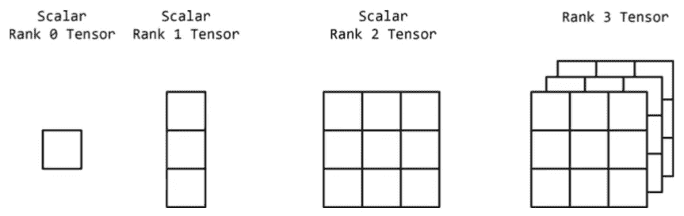

# 面向 NLP 的 Pytorch:第 1 部分

> 原文：<https://medium.datadriveninvestor.com/pytorch-for-nlp-part-1-32000fedcae4?source=collection_archive---------9----------------------->

以下系列文章将介绍 Pytorch 的基础知识、基本文本分析、用于自然语言处理的神经网络(NLP)等等！


“Torch” — Photo by [Mateus Maia](https://unsplash.com/@mateusmaia?utm_source=medium&utm_medium=referral) on [Unsplash](https://unsplash.com?utm_source=medium&utm_medium=referral)

# 路标

*   **py torch 简介**
*   **张量介绍**
*   **py torch**中的张量基础(实例化张量，随机张量，Python-NumPy 桥)
*   **张量运算**(加、减、除、乘、点积、转置)
*   **张量操作**(切片、索引、连接)
*   **杂项**(类型、大小、形状、尺寸)

# PyTorch

> *py torch:Python 中的张量和动态神经网络，具有强大的 GPU 加速*

PyTorch 是深度学习和张量操纵库。它类似于 Tensorflow，Keras 是一个深度学习库，同时也提供像 NumPy 这样的库的功能。与 NumPy 的主要区别是它提供了强大的 GPU 加速，这对数据/计算密集型任务至关重要。

[](https://www.datadriveninvestor.com/2019/01/23/which-is-more-promising-data-science-or-software-engineering/) [## 数据科学和软件工程哪个更有前途？数据驱动的投资者

### 大约一个月前，当我坐在咖啡馆里为一个客户开发网站时，我发现了这个女人…

www.datadriveninvestor.com](https://www.datadriveninvestor.com/2019/01/23/which-is-more-promising-data-science-or-software-engineering/) 

# 安装 PyTorch

要安装 PyTorch，请访问[官方网站](https://pytorch.org/)并根据您的机器、环境和 CUDA 规范构建查询。例如，下面是我用来在 Linux 系统上安装 PyTorch 的查询，使用的是 pip 和 CUDA 10.1。

```
pip install torch torchvision
```

# 张量介绍

张量是保存一些维度数据的数学对象。零阶张量只是一个数字或一个标量。一阶张量(秩一张量)是一组数字或一个*向量*。类似地，秩为 2 的张量是一个矩阵。



Different types of tensors. [Source](https://www.amazon.in/Natural-Language-Processing-PyTorch-Applications-ebook/dp/B07N17TMFH).

# PyTorch 中张量的基础知识

为了在 Pytorch 中创建张量，我们使用了 ***torch。张量*命令。**

这就产生了一个 ***n * m*** 的量纲张量。这里，“n”是指行数，“m”是指列数。

我们使用 **torch.rand()** 命令用均匀分布的随机值初始化一个张量，即在区间[0，1]上。 **torch.randn** 命令用正态分布[-1，1]的随机值初始化张量。

为了创建具有特定值的张量，我们使用了 **fill_()** 方法。我们也可以用全 0 或全 1 初始化张量。

Pytorch 还使用函数 **from_numpy** 处理 NumPy 数组。

# 张量运算

PyTorch 具有用于所有基本操作和高级操作的内置函数。下面的要点告诉你如何加，减，乘，除，并采取张量转置。

# **基础知识**

# 先进的

# 张量操作

在使用张量时，对张量进行切片和索引是至关重要的。PyTorch 张量切片/索引类似于 Python 中的列表。

在 PyTorch 中连接两个张量可以通过多种方式完成:垂直、水平和堆叠两个张量。

# 多方面的

# 结论

在帖子里，我们看到了 PyTorch 和处理张量的基础知识。在下一篇文章中，我们将进一步探讨如何使用 Pytorch 进行 NLP！

你可以关注我 [@Abhijith](https://twitter.com/Obhijith) 或者在这里找到更多。