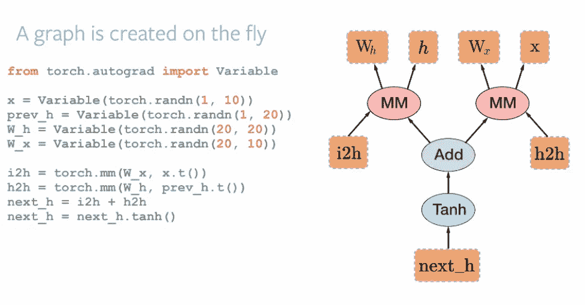
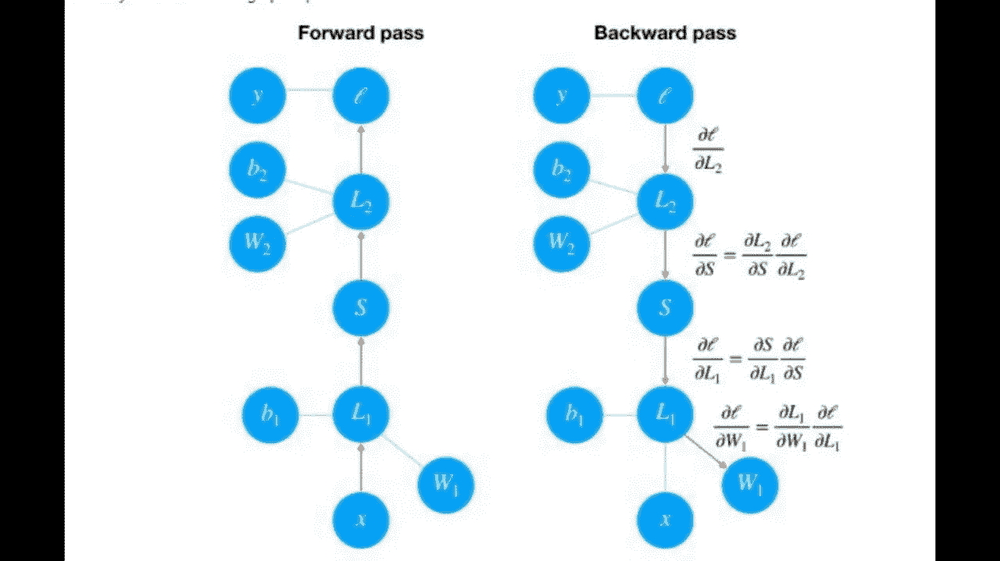

# 掌握 PyTorch:基础知识综合指南

> 原文：<https://medium.datadriveninvestor.com/pytorch-the-basics-7005e71cdb83?source=collection_archive---------5----------------------->


如果你对机器学习感兴趣或者正在阅读这篇文章，那么你很可能以前就听说过 PyTorch。它在机器学习开发者中是一个非常著名的框架，其原因我们将在本文中讨论。此外，如果你刚刚开始学习神经网络，并且有基本的知识，这是一个完美的初学者工具。

好吧，让我们进入 PyTorch 的本质，好吗？

# Pytorch 的历史

Torch 最初是用 Lua 编写的，这种语言相当罕见，很难掌握，而且它没有 python 提供的一半功能。

因此，在 2017 年，脸书的人工智能研究实验室决定建立一个与 torch 库功能相同的库，但要不是 python，因此命名为 **Py** Torch。这在开发人员中一炮而红，使得编写代码变得更加容易和高效。

[](https://www.datadriveninvestor.com/2020/02/19/cognitive-computing-a-skill-set-widely-considered-to-be-the-most-vital-manifestation-of-artificial-intelligence/) [## 认知计算——一套被广泛认为是……

### 作为它的用户，我们已经习惯了科技。这些天几乎没有什么是司空见惯的…

www.datadriveninvestor.com](https://www.datadriveninvestor.com/2020/02/19/cognitive-computing-a-skill-set-widely-considered-to-be-the-most-vital-manifestation-of-artificial-intelligence/) 

***趣闻:****py torch Soumith Chintala 的开发者之一，是我目前就读的大学 VIT 的校友！*

# Pytorch vs Tensorflow

PyTorch 和 Tensorflow 之间总是有比较，我觉得这是不必要的，因为它们处理问题的方法非常不同，并且取决于数据集和算法，一个比另一个更好。然而，如果你仍然好奇，你可以在这里查看这篇非常整洁的文章。


# Pytorch 是如何成为一个好框架的？

1.  **命令式编程**:在 PyTorch 中，计算会立即运行，这意味着用户无需等待编写完整的代码，就可以检查它是否工作。这对于像我这样不耐烦的程序员来说是个好兆头，他们想在每行代码后看到结果。这也允许在 python 中有更灵活的编码体验，并且它更受性能驱动。


Source:[https://medium.com/@vincentbacalso/imperative-vs-declarative-programming](https://medium.com/@vincentbacalso/imperative-vs-declarative-programming-f886d3b65595)

**2。动态计算图形:**动态计算图形框架是一个由库、接口和组件组成的系统，它提供了一个灵活的、可编程的运行时接口，通过连接一组有限但可能可扩展的操作来简化系统的构建和修改。所以基本上，PyTorch 的工作原理是按游程定义，这对于像 RNN 这样规模不固定的网络来说非常有用。



Source: Hackernoon.com

3.**亲笔签名:**这个类是一个计算导数(更精确地说是雅可比向量积)的引擎。它记录了在梯度张量上执行的所有操作的图形，并创建了一个称为动态计算图的非循环图形。这个图的叶子是输入张量，根是输出张量。梯度的计算方法是从根到叶追踪图形，并使用链式法则将每个梯度相乘。

```
*torch.nn.Autograd.Function*
```



Source: Udacity.com

# Pytorch 的常用功能

1.  **torch.sum()** :加法

```
(a*b).sum()
```

2. **torch.mm():** 点积**。**

```
#torch.nm(a,b)
```

**3。torch.randn():** 生成矩阵随机数

```
torch.manual_seed(7)# Set the random seed so things are predictable
x = torch.randn(2,2)
```

**4。torch.exp():计算指数**

```
Sigmoid=1/(1+torch.exp(-x))
```

**5。PyTorch 提供了一个模块** `**nn**` **，使得构建网络更加简单。**

```
from torch import nn
```

**-nn。Linear()** :这一行创建了一个线性变换的模块，𝑥𝐖+𝑏.

类似地，以下函数可用于计算相应的激活函数。

**-nn。乙状结肠()**

**-nn。Softmax()**

```
self.output **=** nn.Linear
self.sigmoid **=** nn.Sigmoid()
self.softmax **=** nn.Softmax(dim**=**1)#columnwise
```

6. **nn。使用这种方法，我们可以通过操作顺序传递一个张量。**

```
model = nn.Sequential(nn.Linear(input_size, hidden_sizes[0]),
                      nn.ReLU(),
                      nn.Linear(hidden_sizes[0], hidden_sizes[1]),
                      nn.ReLU(),
                      nn.Linear(hidden_sizes[1], output_size),
                      nn.Softmax(dim=1))
```

7。损失计算

```
criterion = nn.CrossEntropyLoss()
criterion = nn.NLLLoss()
criterion = nn.LogSoftmax()
```

8。亲笔签名:亲笔签名的工作方式是跟踪对张量执行的操作，然后通过这些操作返回，计算沿途的梯度。

**-loss.backward()** 计算用于参数计算的梯度。这些梯度用于通过梯度下降来更新权重。

```
loss.backward()
```

**optimizer.zero_grad()** 将每次训练过程中的梯度归零，否则将保留先前训练批次中的梯度。

```
optimizer.zero_grad()
```

# 结论

我将这篇文章的重点放在 PyTorch 的理论和语法上，在第 2 部分中，我将通过开发一个神经网络在数据集上展示 PyTorch。所以请继续关注，感谢您的阅读。干杯！

参考:[https://classroom.udacity.com/courses/ud188](https://classroom.udacity.com/courses/ud188)——py torch 简介。