# Q-Learning 解释

> 原文：<https://medium.datadriveninvestor.com/q-learning-explained-ebb544c51ba5?source=collection_archive---------2----------------------->

## 免费 RL 课程:第 3 部分

这是我的强化学习课程中的第三篇文章。上一篇文章可以在这里找到[。它涵盖了贝尔曼方程的来源，以及如何使用它来寻找最佳政策，所以如果你不熟悉这些概念，你可能应该回去读一读，然后再继续这一个。本文将介绍 Q-Learning 的过程，它允许代理随着时间的推移制定更好的策略，并最终掌握环境。](https://medium.com/@NathanWeatherly/understanding-the-bellman-equation-c711e531a2e5)

回顾一下我们上次学到的内容，价值函数用于在遵循给定政策时为每个状态-行动对分配 Q 值。贝尔曼方程是一个确定的价值函数，有助于在遵循最优政策时找到状态-行动对的价值。本文将通过三个步骤展示代理如何使用这些等式:

*   定义奖励、行动和状态
*   制作 Q 表
*   为代理使用 Q 表

第一步是选择一个环境，对于本文，我选择了井字游戏，因为它简单且受欢迎。因为井字游戏是一个双人游戏，所以我们需要一些方法来产生对代理的反应。这可以通过多种方式来实现，比如随机生成招式，与人类对战，或者与一个完美的人工智能对战，该人工智能被编码为做出所有最佳招式，如下所示。对于本例，我们将选择环境将做出的特定移动，以响应代理可能采取的某些操作。

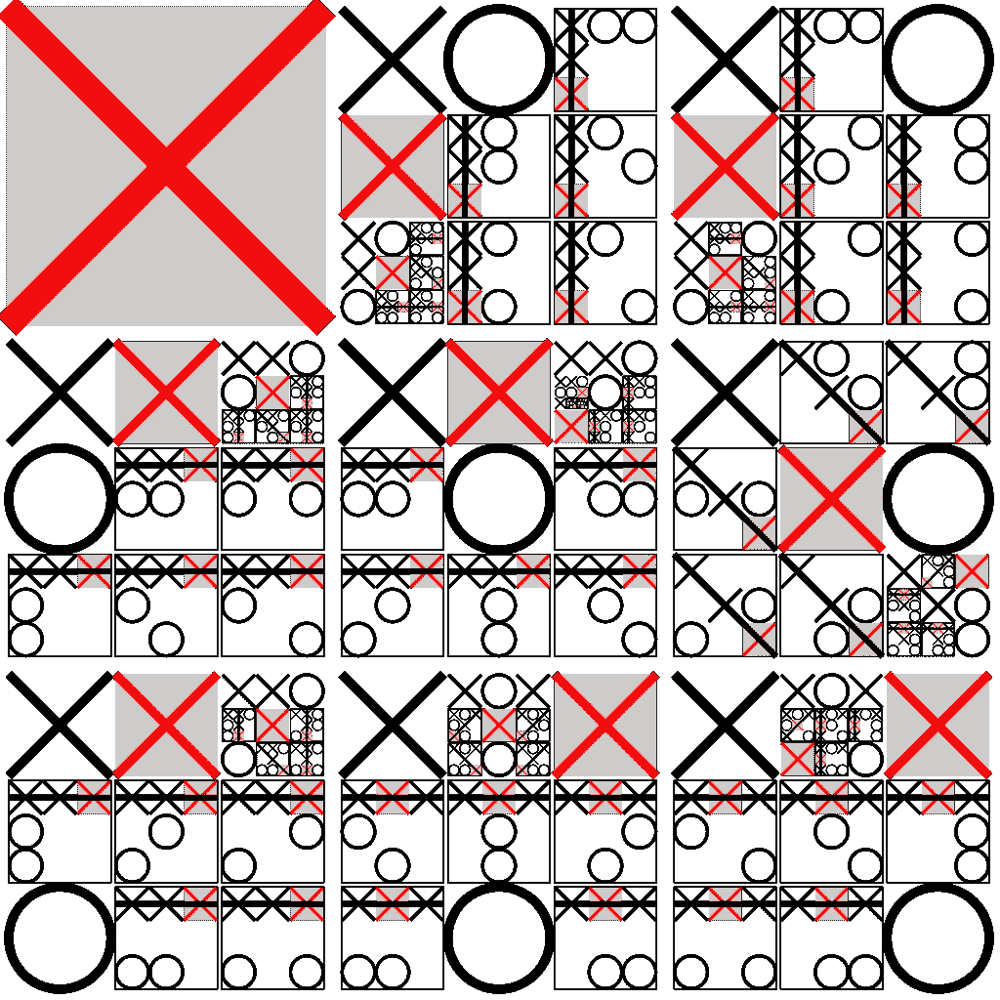

Optimal Play for player X (from [Wikipedia](https://en.wikipedia.org/wiki/Tic-tac-toe))

既然环境是井字游戏，我们可以很容易地定义状态和动作空间。这些动作只是数字 1-9，对应于棋盘上的一个方块。代理只能选择当前未被占用的方块，这些数字将对应于如下方块:

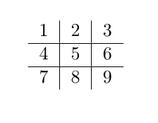

状态将只是一个数字 1–765，因为这是井字游戏中可能的有效棋盘状态的总数。我们通常需要对每一个进行编号，以便理解每一个是什么，但是因为这只是一个例子，我们可以跳过它，只关心我们在例子中使用的状态。我们还必须定义代理在某些状态下如何获得奖励。为了简单起见，我决定使用下面的函数:

*   任何非终结状态:-1 奖励
*   任何失败的州:-10 奖励
*   任何获胜状态:+25 奖励

我决定给非终结状态分配一个负奖励，因为我希望代理尽可能快地优先考虑获胜。

既然我们已经定义了 Q 学习算法的所有部分，现在我们需要制作一个 Q 表。Q 表是一种策略，它使用一个值表为每个状态-动作对单独分配一个 Q 值，而不是使用某种将状态作为输入的函数。井字游戏的 Q 表示例如下:

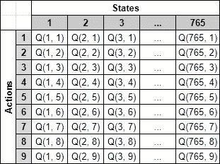

Q 值通常用代表每个动作和状态的值的数字来填充。当策略用于在给定的状态下挑选动作时，在该状态下具有最高 Q 值的动作被挑选。我们在这个例子中需要的 Q 表将只需要 3 个状态，因为我们将只遍历这些状态。初始表格将如下所示:

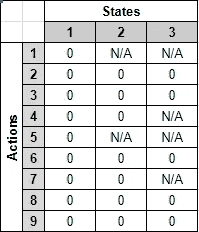

状态 2 和 3 具有 N/A 值，因为在该状态下这些移动是不可能的。状态 1 是一个空白板，所以对代理的动作没有限制。当您看到州时，这应该是有意义的:

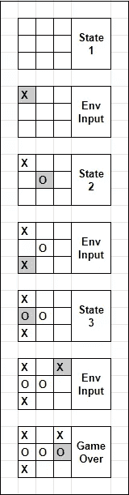

当我们想要更新 Q 表时，我们将使用通过贝尔曼方程计算的值来替换现有的 Q 值，该方程使用代理在不同状态下的不同行为所获得的奖励。我们必须适度地这样做，因为我们希望我们的代理将它的所有学习纳入计算，而不仅仅是最近的结果。这是通过设置一个学习率来实现的，***α***(α)，该学习率代表新 Q 值被合并到旧 Q 值中的比例。学习率甚至在 Q-learning 开始之前就设定好了，并且始终保持不变；然而，一些更复杂的算法可以利用动态学习率。使用和更新 Q 表的步骤如下所示:

1.  将状态 ***s*** 放入策略 q 表*，选择动作 ***a*** ，在指定状态下 q 值最大。如果多个动作达到最大 Q 值，那么随机选择其中一个。*
2.  *然后智能体采取行动， ***a*** ，环境通过给予智能体奖励、 ***Rₜ ₊*** ₁做出响应，并更新状态，*，到 ***s'*** 。**
3.  **使用贝尔曼方程计算先前状态-动作对的 Q 值。**
4.  **使用计算的 Q 值和开始 Q 学习之前选择的学习速率 ***α*** 更新 Q 表。**
5.  **重复上述步骤，但现在以***s’***为初始状态开始。**

**使用 Gamma 为 0.9，Alpha 为 0.5 的示例来执行此过程，结果如下所示:**

*   **状态 1 被放入 Q 表，最大 Q 值是平局，因此选择随机动作。假设选择的行动是行动 1。**
*   **代理采取行动 1，然后环境将状态更新为状态 2，并根据先前定义的奖励函数给予代理-1 的奖励。**
*   **上一步中的值以及 Q 表用于计算状态 1 下动作 1 的 Q 值，如下所示:**

**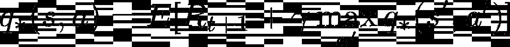****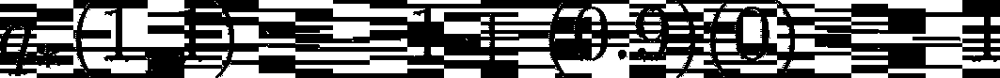**

*   **然后基于 0.5 的学习率更新 Q 表中的旧 Q 值，如下所示:**

**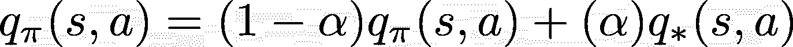****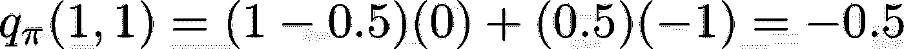****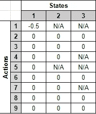**

**我们可以对上面定义的下两个状态重复这一过程，以获得如下所示的 Q 表:**

**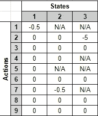**

**你可以看到代理已经学会了不玩某些导致它在示例游戏中失败的移动。这通过在某些状态下某些动作的负 Q 值来显示。你可以看到，如果代理反复与人或计算机对弈，它会越来越好，直到学会做出所有正确的动作。在下一篇文章中，我们将学习如何使用 Epsilon greedy 策略来自动化和实现这个过程。**

***Q-Learning 被认可为克里斯沃特金斯的“* [*从延迟奖励中学习*](http://www.cs.rhul.ac.uk/~chrisw/new_thesis.pdf)**