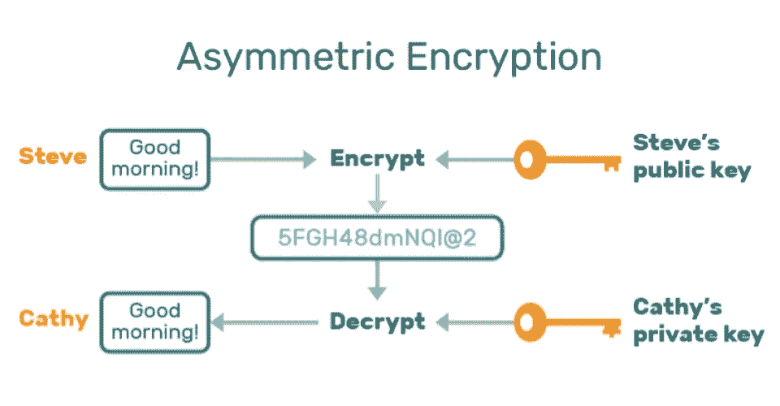
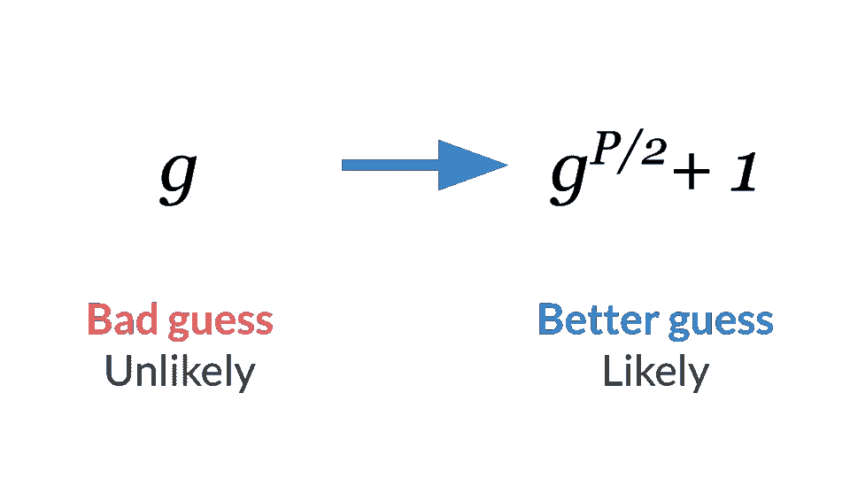
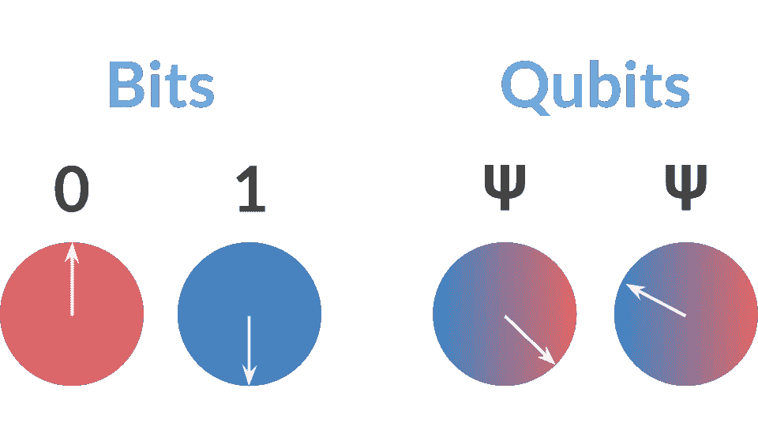
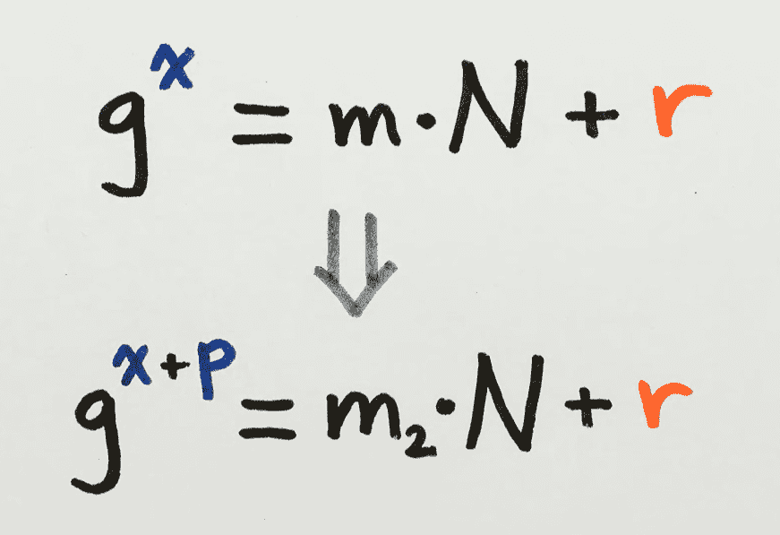

# 量子计算机:现代加密的末日

> 原文：<https://medium.datadriveninvestor.com/quantum-computers-doomsday-for-modern-encryption-950a00cd4053?source=collection_archive---------25----------------------->

## 通过了解量子计算机的独特属性和 Shor 算法，了解量子计算机如何破解 RSA 加密。

如果你在互联网上发送或处理任何种类的私人数据，如信息、电子邮件、密码等，你就利用了一种称为加密的过程。加密指的是获取任何类型的数据，并使用看似随机的数字或文本组合将其转换为加密形式。当我们向某人发送私人消息时，它被加密，然后当接收者收到消息时被解密。加密数据的方法有很多种，一种叫做 Rivest-sha mir-ad leman(**RSA**)**加密**的技术。RSA 是一种不对称算法，发送数据的人和接收数据的人拥有不同的密钥(密钥只是指帮助您加密或解密数据的一条信息)。

Credit: [GetApp](https://lab.getapp.com/common-encryption-methods/)

RSA 加密是一种流行的加密标准，适用于通过互联网传输的数据。RSA 利用了这样一个事实:将数相乘来产生一个大数要容易得多，而寻找一个大数的因子却非常困难。这是因为不存在可以优化因子分解过程的算法。因此，如果计算机必须找到一个大数的质因数，计算机将部署一种强力方法，在这种方法中，它们将一直猜测质数，直到质数的乘积与这个大数匹配。

由于试图猜测因素的过程是靠蛮力完成的，所以计算机破解代码需要很长时间。如果你是一个攻击者，试图在目标接收者收到消息之前解密消息，那么破解代码所需的时间将会非常长。让我们客观地看待这件事。在名为 RSA-768 的 RSA 标准中(768 指的是位数)，输出一个 232 位的数字。

 [## 2019 年即将改变世界的技术|数据驱动的投资者

### 很难想象一项技术会像去年的区块链一样受到如此多的关注，但是……

www.datadriveninvestor.com](https://www.datadriveninvestor.com/2019/01/17/the-technologies-poised-to-change-the-world-in-2019/) 

2009 年，一组科学家参与了一项挑战，他们通过在两年内连续运行蛮力算法获得了这些因子！即使随着处理器速度的现代进步，加密标准也在更新，以至于求解密钥所需的时间长得离谱，并且需要大量的计算。这个过程可以被认为是在你家周围安装一个围栏来保护它。虽然栅栏不能保证小偷无法闯入你的家，但它让小偷更难进入。通过增加小偷的难度，你希望没有小偷会试图闯入你的家。类似地，加密背后的核心思想是使未授权人员尽可能难以访问敏感信息。

整个加密技术以及密码学领域的许多其他技术都是基于计算机的局限性或弱点。或者更准确地说，是经典计算机。然而，一位名叫 Peter Shor 的聪明科学家在 1994 年发明了一种算法，开发了一种更快地导出一个大数的因数的变通方法( *ish* )。

在我们深入 Shor 的算法之前，我们需要了解一些更有效的获取因子的过程背后的巧妙数学。我们可以把大整数想象成字母 *N* ，由因子 *g* 和 *h* 组成。从那里我们可以用欧几里德的算法找到 *g* 和 N【GCD(*N*， *g* )】的最大公因式(GCD)，速度极快。因此，通过找到一个公因数，我们基本上可以得到 GCD 函数的输出(对于任何不为 1 的值),然后除以 *N* 得到另一个因数 *h* 。虽然这个过程看起来非常有效，但它并不比蛮力好多少，因为找到一个共享因子(而不是 1)的可能性非常小。然而，通过另一个有趣的数学性质，我们可以将 *g* 转换成一个更好的猜测，它有更高的几率与 *N* ( *p* 指任何整数)共享一个因子:

在进行从糟糕/原始猜测到更好猜测的这种转换的一个步骤时，我们有 37.5%的机会在第一次尝试中得到正确的因子，使得 *p* 不是奇数(如果 *p* 是奇数，则因子通常会以非整数结束，这是无用的)。如果这个步骤重复 10 次，我们有 99%的机会找到一个因子。那么…这都是为了肖尔的算法和破解加密吗？这难道不包含更多的量子古怪吗？你猜对了。实现这个算法说起来容易做起来难。

这种破解加密的方法有一个很大的问题，这很明显——我们如何找到这个神奇的 *p* 来帮助我们把糟糕的猜测变成正确的猜测？事实证明，获得 *p* 本身是一项相当艰巨的任务，因为 *p* 是通过反复试验得出的，比原始的强力方法花费的时间更长。那么…如果猜测 *p* 比猜测实际答案 *g* 花费的时间更长，我们为什么还要讨论这个技巧呢？问题在于，在经典的计算机上寻找 p 值需要惊人的时间，这意味着我们可以通过引入量子力学来解决这个问题。

> 对于那些不了解量子计算的人来说，看看这篇文章。

与只能接收一个输入并返回一个输出的经典计算机不同，量子计算机的行为因*量子*而有所不同(本文的大部分解释将更多地停留在表面层面，只要记住是否有古怪的事情发生是由于量子力学)。量子计算机可以接受多个输入并处理多个输出，但最终输出将根据概率从输出列表中选择。我们可以将所有输出视为各种波，获得正确或最精确输出的关键是使不正确的输出相互相消干涉(相消干涉是指两个波相互抵消)。

再一次，这个消除不太可能的答案以输出最可能的答案的过程说起来容易做起来难。然而，这正是 Shor 算法想要做的——找到 g 的 p/2 的幂*的 *p* 的值，给我们一个比 *g* 好得多的猜测。实际的算法非常复杂，涉及非常有趣的数学，从一开始就很难理解。所以，我们将把重点放在整个情况的量子方面。*

*Shor 的算法利用了这样一个事实，即我们可以通过向量子计算机输入一组叠加的数字，同时发送多个输入来执行多个计算。但是在量子计算中“数的叠加”或者任何东西的叠加到底是什么意思呢？嗯，理解叠加并不太难，但它确实需要一个开放的心态，因为它不是一个你每天都接触的概念，所以很难理解。*

*经典计算机工作在“比特”上，比特可以是 0 或 1，这可以被认为是一个完全点亮的灯泡和一个关闭的灯泡。然而，量子计算机使用的量子位可以同时为 0 或 1(两种状态的混合，0 或 1)。量子位是用非常小的粒子构建的，这些粒子表现出像电子、质子等量子力学特性。但是量子计算机怎么可能同时是 0 或者 1 呢？好吧，让我们以经典计算机的灯泡为例来考虑它。在量子状态下，灯泡不必完全点亮(最大亮度)或完全不亮。灯泡可以处于部分点亮的状态，也可以认为是部分未点亮。然而，当测量灯泡的亮度时，它会变成完全点亮状态(1)或未点亮状态(0)。我们可以想象在量子力学的世界里，灯泡由调光器控制，而在经典世界里，灯泡由开关控制。虽然这个类比不完全正确，但它解释了叠加的基本原理。*

**

> *如果你真的想更准确地进入量子世界和叠加态，我强烈推荐麻省理工学院的这个[初学者讲座:(讲座从 10 分钟开始)](https://www.youtube.com/watch?v=lZ3bPUKo5zc)*

*一旦理解了叠加，我们就能理解在特定情况下量子计算机计算能力增强背后的炒作。每一个量子位元不仅包含开启或关闭状态(1 或 0)的资讯，也包含你在任一状态下找到它的机率。如果我们必须通过量子计算机传递一个经典的信息比特，我必须为每个比特加上系数。在经典计算中，4 比特的信息被传递，而在量子计算中，2 量子比特的信息被传递到计算机中。因此，n 个量子位的等效信息量是经典位的 2 次方。随着量子位数量的增加，量子位帮助的信息量呈指数增长。因此，当我们提到“数的叠加”时，它指的是传递 *n* 个数只需要平方根或 n 次计算，这使得它在求解 Shor 算法时以指数方式更快。*

*切换回 Shor 算法，我们可以观察到以下重复特性:*

**

*Credit: [minutephysics](https://www.youtube.com/watch?v=lvTqbM5Dq4Q&t=125s)*

*在这种情况下，r 指的是余数，当 *r* = 1 时，算法是正确的。p 值是分隔产生相同 *r 值*的每个 x 值的值，可以通过量子傅立叶变换(QFT)获得。p 值也可以被认为是一个波的周期，当输入是以 *x + np* (x 被加到 *p* 的倍数)的形式时，特定值 *r* 出现。如果 p 是特定函数/波的频率，我们可以使用量子傅立叶变换获得频率(它是周期的倒数， *p* ),量子傅立叶变换提供函数的频率，从而通过破坏性地干扰所有其他答案来提供单个 *p* 值。*

**如果这最后一点关于量子傅立叶变换或任何额外的数学对你来说没有意义，我建议看看这个快速视频，它展示了肖尔的算法如何分解数字 314191:*[*https://www.youtube.com/watch?v=FRZQ-efABeQ*](https://www.youtube.com/watch?v=FRZQ-efABeQ)*

*在量子计算机上运行 Shor 的算法比使用蛮力来确定一个大数的因子要快得多。这可能会让你感到奇怪——如果量子计算机可以以惊人的速度获得这些因素，为什么量子计算机没有接管并在加密和数据保护领域造成混乱。问题在于量子计算机的讨厌。*

*目前，公开可用的最强大的量子计算机是 IBM 的 **53 量子位**量子计算机，授权人员可以通过云访问。虽然这确实令人印象深刻，但破解 RSA 等标准所需的量子位数量要大得多。据估计，要找到一个 2048 位数(RSA 2048)的因子，至少需要 4000 个量子位的量子计算机！此外，量子计算远不如经典计算稳定，导致输出中有大量噪声，从而导致高错误率。*

*虽然量子计算机很可能会打破现代密码学标准，但它肯定会引入新的标准。事实上，研究人员已经开始在量子密码术领域为量子时代制定密码标准。*

*如果你喜欢这篇文章，请随意给它一些👏并在评论中评论你的想法！如果你想了解从自我成长到机器学习和量子计算的最新文章，请关注我的媒体。*

*我喜欢结识新朋友，与他人交流和聊天。欢迎通过我的 [LinkedIn](https://www.linkedin.com/in/jatin-r-mehta/) 或电子邮件:【mehta.r.jatin@gmail.com】T4 联系我！*