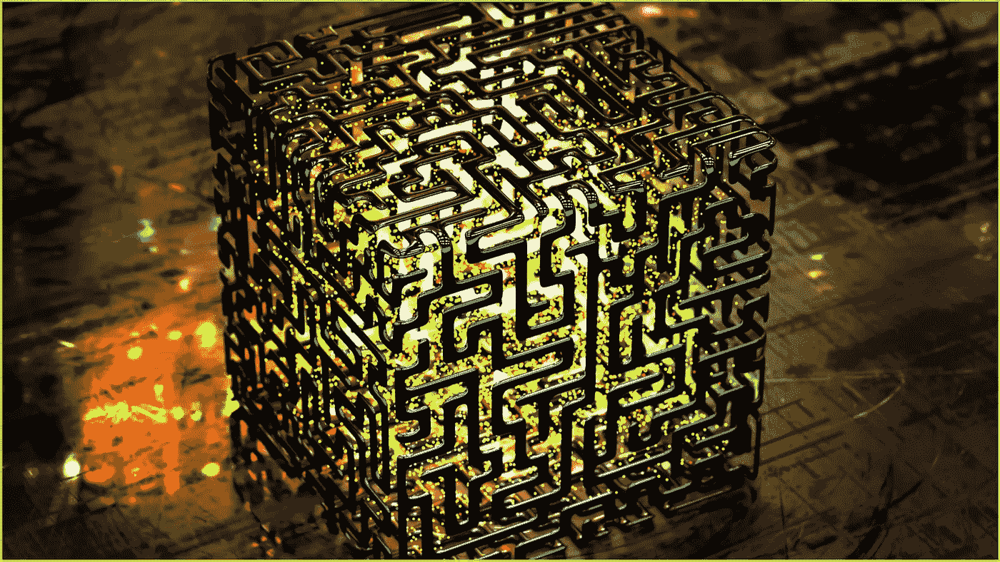
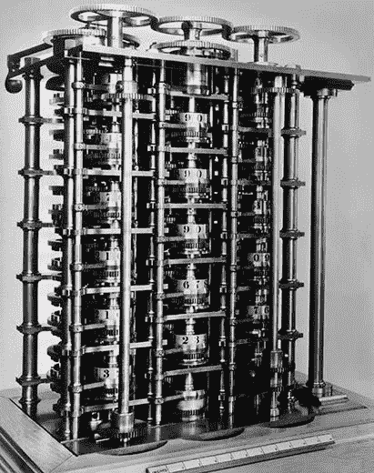
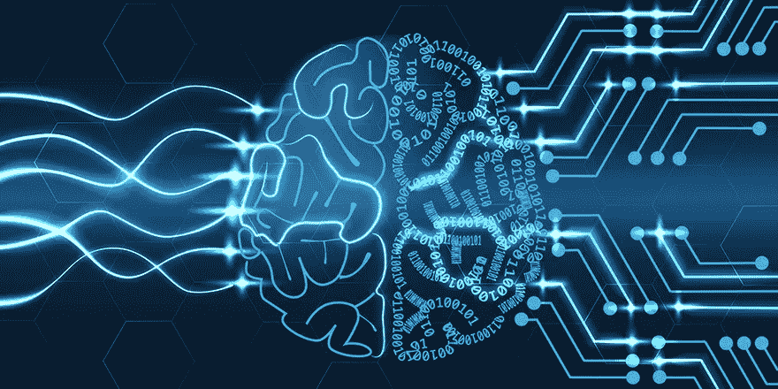
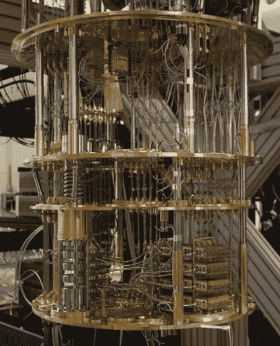
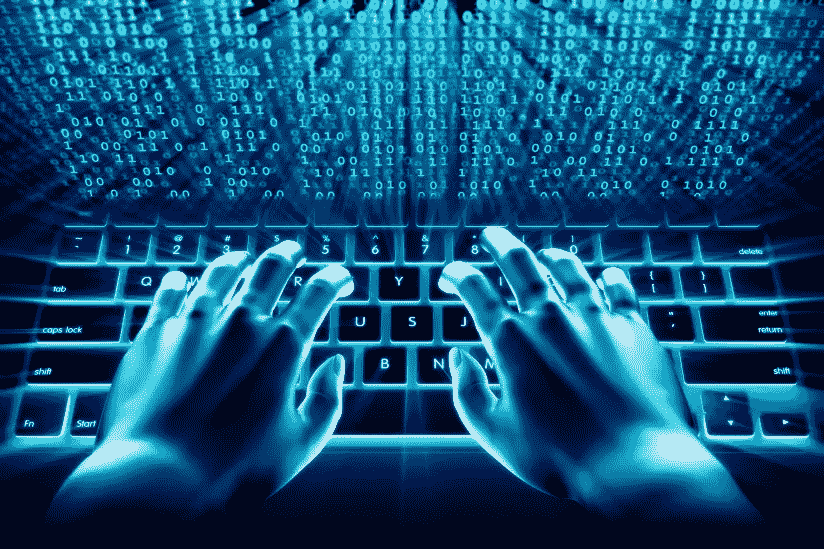

# 量子飞跃

> 原文：<https://medium.datadriveninvestor.com/quantum-leap-the-next-generation-of-computing-781e647a4c57?source=collection_archive---------6----------------------->

**下一代计算**

在 19 世纪早期，计算机之父查尔斯·巴贝奇可能无法想象近 200 年后的未来计算机会是什么样子。向前迈出一大步，计算的先驱，像 IBM 和微软这样的公司，仅举几个例子，正再次引领世界进入下一代计算；量子计算。

Charles Babbage’s First Computer

***经典计算和量子计算有什么区别？***

传统计算机仅使用 0(关)或 1(开)位系统对信息进行编码。这种类型的计算是基于电路在给定时间处于单一状态(开或关)的现象。他们操纵 1 和 0 进行运算。CMOS 晶体管是经典计算机的基本模块。虽然这种类型的计算机工作良好，但它是极其有限的。随着传统计算机开始发展，科学家们迫切需要进一步的进步，以满足弥合传统计算和复杂计算之间差距的需要。量子力学是物理学的基础，物理学是化学的基础，化学是生物学的基础。为了准确模拟这些元素，科学界需要一种更复杂的计算方法来解决不确定性。这就是我们进入量子计算时代的原因。

最初，物理学家保罗·贝尼奥夫在 20 世纪 70 年代和 80 年代对量子计算的可行性进行了研究。这是一种将力学和物理学结合起来实现最高计算的特殊用法。物理实现量子计算机的两种方法是模拟和数字。模拟进一步分为量子退火、绝热量子计算(ADQ)和量子模拟。而数字方法使用量子逻辑门来执行计算。超导量子干涉器件或 SQUID 或量子晶体管是量子计算机的基本基础模块。“叠加”是量子系统在被测量之前同时处于多个状态的能力。传统计算机使用比特。量子计算机使用量子位。量子位是量子位，是信息的基本单位。它有两种可能的状态，当它处于叠加态时，量子计算机和特别构建的算法利用这两种状态的力量。

***当今量子计算机技术的创新者有哪些？***

IBM’s Q Quantum Computer

## [亚马逊—亚马逊集市](https://aws.amazon.com/braket/)

## [Google—tensor flow Quantum(TFQ)](https://ai.googleblog.com/2020/03/announcing-tensorflow-quantum-open.html)

## [微软—蔚蓝量子](https://azure.microsoft.com/en-us/services/quantum/)

## [英特尔—“马岭”芯片](https://www.intel.com/content/www/us/en/research/quantum-computing.html)

## [IBM — IBM Q System One](https://www.ibm.com/quantum-computing/technology/systems/)

## [霍尼韦尔](https://www.honeywell.com/en-us/newsroom/news/2019/11/the-future-of-quantum-computing)

## [洛克希德·马丁](https://www.lockheedmartin.com/en-us/news/features/2017/quantum-computing-spot-checking-millions-lines-code.html)

## [D 波](https://www.dwavesys.com/quantum-computing)

***量子计算的未来。***

虽然我们很可能会继续使用经典计算机，但量子计算机将是一种不同的工具，我们将使用它来解决超越经典计算机能力的复杂问题。

量子计算通过基于量子理论的研究增加了我们对技术的理解——分析能量在原子和亚原子水平上如何工作。

与磁场相比，电场更容易处理原子的自旋，磁场很难限制在微小的空间内，因为它们的影响范围*很广*。

 [## 2019 年即将改变世界的技术|数据驱动的投资者

### 很难想象一项技术会像去年的区块链一样受到如此多的关注，但是……

www.datadriveninvestor.com](https://www.datadriveninvestor.com/2019/01/17/the-technologies-poised-to-change-the-world-in-2019/) 

科学家们已经偶然发现了革命性的发现，这些发现将改变人工智能、医学、技术和我们生活方式的未来。物理学家最近的测试表明，核电共振是一种局部微观现象，电场有效地扭曲了原子核周围的原子键，导致其移动。

核磁共振是一种用于一系列科学领域的技术，如医学、化学和采矿。用电场代替磁场可能会彻底改变核磁共振的模式。

通过量子计算的发现，科学界更接近于找到量子科学问题的答案。

Gena 瓦兹奎 2020