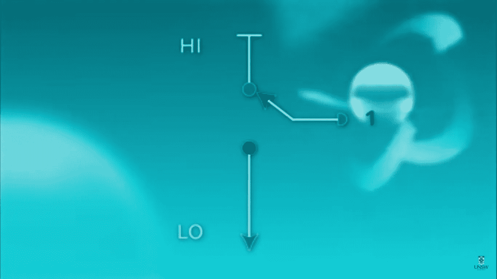
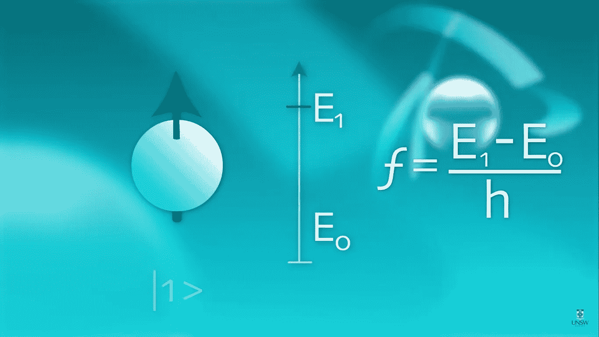

# 量子位和自旋

> 原文：<https://medium.datadriveninvestor.com/qubits-and-spin-23bc4620f704?source=collection_archive---------7----------------------->

虽然量子计算可能是一个时髦词，但量子位是这项技术背后真正隐藏的驱动力。我们大多数人都能够理解这个事实，但是我们并不真正理解用一个我们已经理解的概念来表示量子位的物理意义。

因此，正如我们大多数人所知，传统的比特只是计算机硬件上的电荷，根据它们的电荷来存储信息。

下图代表高电荷或位 1:

[Source](https://www.youtube.com/channel/UCHnyfMqiRRG1u-2MsSQLbXA)

自然界可以存在的最简单的量子比特叫做自旋。每一个微观粒子，像光子、质子、电子等等。具有磁偶极子的固有属性，其充当微观罗盘指针。之所以称之为自旋，是因为这是我们将一个电荷绕其自身的轴自旋时所得到的结果。因此，自旋是粒子的实际量子属性，不涉及任何物理自旋。

如果我们把一个电子放在磁场中，它有两个基本的量子态——自旋向下和自旋向上。

[Source](https://www.youtube.com/channel/UCHnyfMqiRRG1u-2MsSQLbXA)

因为只有两个，我们也可以称它们为 0 和 1，并用它们来编码量子信息。在磁场中，0 和 1 自旋具有不同的能量，就像指南针在指向地球磁场方向时能量最低，而在相反方向时能量最高。

如果我们有一个处于 0 态的自旋，那么为了把它变成 1 态，我们可以用一个振荡磁场照射这个自旋，这个磁场的频率正比于 0 态和 1 态之间的能量差除以普朗克常数。这被称为磁共振，用于许多设备，如医院的核磁共振仪。

在 0 状态下旋转:

[Source](https://www.youtube.com/channel/UCHnyfMqiRRG1u-2MsSQLbXA)

用磁场照射后旋转:

[Source](https://www.youtube.com/channel/UCHnyfMqiRRG1u-2MsSQLbXA)

# 然后

下周你可以看看我的下一篇文章，这篇文章利用自旋的概念来解释量子测量和量子纠缠。

如果我错过了什么，请在评论中告诉我。如果你觉得这篇文章内容丰富，一定要鼓掌欢迎。