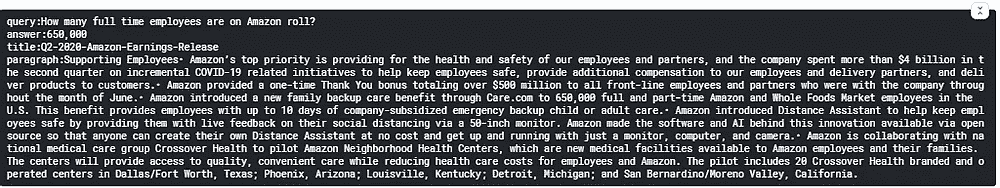

# 通过 BERT 10 步回答问题

> 原文：<https://medium.datadriveninvestor.com/question-answering-through-bert-in-10-steps-d2bc2d4a4d98?source=collection_archive---------4----------------------->


Image [Source](https://unsplash.com/photos/0CvHQ62gwY8?utm_source=unsplash&utm_medium=referral&utm_content=creditShareLink)

如果你有一大堆网站或一大堆 pdf 文件，并且你想知道你的问题的答案，这看起来是一项艰巨的任务。

如果我们能用 BERT 用几行代码就能做到呢？

BERT 是一个预先训练好的基于变压器的模型。这里我们将使用 bert-squad1.1，这个模型是在 squad(斯坦福问答数据集)数据集上预先训练的，这是问答模型的典型基准问题。它由基于维基百科片段的 10 万多个问题组成。此外，它还标注了相应的文本范围，即标记了答案的开始和结束。

还有一个名为 distilbert 的较轻版本，但它需要训练的参数要少 40%。

它会更快，但精度会更低。

现在让我们开始，首先决定输入的类型(pdf 或网站或任何东西)。

在这里，我将向你展示两种方法。

**1)第一步是安装 cdqa。**

**CDQA 软件包有将 PDF 文件转换成数据框中可搜索文本的软件包**

封闭域问答是一个端到端的开源软件套件，使用经典的信息检索方法和预训练模型 BERT 进行迁移学习来回答问题

```
pip install cdqa
```

**2) CDQA 也有 QAPipeline** ，文件将被放入其中。

```
import os
import pandas as pd
from ast import literal_eval
from cdqa.utils.converters import pdf_converter  #converts to pandas dataframe
from cdqa.pipeline import QAPipeline     #Question Answer Pipeline
from cdqa.utils.download import download_model   #to download the pre-trained model
```

**3)下载模型是下载一个我们将使用的预先训练好的模型。**

```
download_model(model='bert-squad_1.1', dir='./models')
```

**4)** **现在创建一个目录，将所有的 pdf 文件下载到这个目录中。**

```
!mkdir docs
```

**5)**将所有文件下载到此路径

```
!wget -P ./docs/ [https://s2.q4cdn.com/299287126/files/doc_financials/2020/q3/AMZN-Q3-2020-Earnings-Release.pdf](https://s2.q4cdn.com/299287126/files/doc_financials/2020/q3/AMZN-Q3-2020-Earnings-Release.pdf)
!wget -P ./docs/ [https://s2.q4cdn.com/299287126/files/doc_financials/2020/Q1/AMZN-Q1-2020-Earnings-Release.pdf](https://s2.q4cdn.com/299287126/files/doc_financials/2020/Q1/AMZN-Q1-2020-Earnings-Release.pdf)
!wget -P ./docs/ [https://s2.q4cdn.com/299287126/files/doc_financials/2020/q2/Q2-2020-Amazon-Earnings-Release.pdf](https://s2.q4cdn.com/299287126/files/doc_financials/2020/q2/Q2-2020-Amazon-Earnings-Release.pdf)
```

**6)** **使用 pdf Converter 将 pdf** 文本转换为 pandas 数据框并可视化数据集。

```
df=pdf_converter(directory_path='./docs/')
df.head()
```

**7)调用管道读取模型**

```
cdqa_pipeline=QAPipeline(reader='./models/bert_qa.joblib',max_df=1.0)
```

**8)将管道安装到创建的数据帧上**

```
cdqa_pipeline.fit_retriever(df=df)
```

**9)现在你可以开始提问，答案将会被预测**

```
query='How many full time employees are on Amazon roll?'
prediction=cdqa_pipeline.predict(query)
```

输出

```
650,000
Q2-2020-Amazon-Earnings-Release
paragraph:Supporting Employees• Amazon’s top priority is providing for the health and safety of our employees and partners, and the company ----
```

现在，为了将这个答案转换成更好的格式，我们可以写成:

```
print('query:{}'.format(query))
print('answer:{}'.format(prediction[0]))
print('title:{}'.format(prediction[1]))
print('paragraph:{}'.format(prediction[2]))
```



Image by Author

它将回答问题，甚至显示它搜索了哪个文档以及它所在的段落。

对于其他类型的数据库，您也可以通过 beautifulsoup 抓取数据并使用它，或者下载数据并将其转换为 CSV 格式，然后工作。一个例子如下:

在步骤 2 中，添加这一行。

```
from cdqa.utils.filters import filter_paragraphs
```

在步骤 4 和 5 中，这样做

```
from cdqa.utils.download import download_model, download_bnpp_data
download_bnpp_data(dir='./data/bnpp_newsroom_v1.1/')
```

代替第 6 步，你可以做如下。

```
df = pd.read_csv('./data/bnpp_newsroom_v1.1/bnpp_newsroom-v1.1.csv', converters={'paragraphs': literal_eval})
df.head()
```

**结论**

记住，如果你有很多数据，不要忘记打开你的图形处理器，伯特也可能需要一点时间来响应，虽然它的效率非常好，因为它的注意力范围和位置编码质量。你可能已经在我的博客中读到过关于变形金刚的内容。我们将很快讨论更多关于聊天机器人的有效模型，甚至是聊天机器人。

感谢阅读！

**访问专家视图—** [**订阅 DDI 英特尔**](https://datadriveninvestor.com/ddi-intel)

*最初发表于 2021 年 1 月 7 日 https://www.numpyninja.com**的* [*。*](https://www.numpyninja.com/post/question-answering-through-bert-in-10-steps)