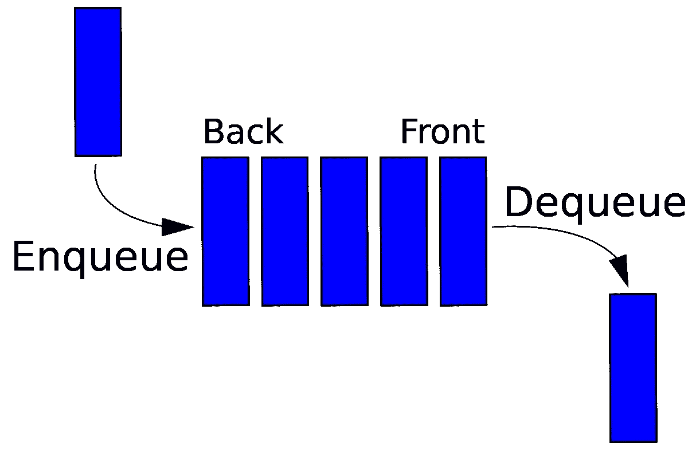
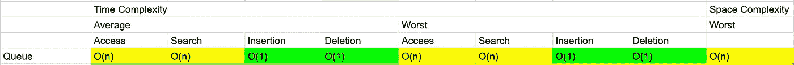

# JavaScript 中的队列

> 原文：<https://medium.datadriveninvestor.com/queue-in-javascript-e77ab51f6de0?source=collection_archive---------10----------------------->

[https://media.giphy.com/media/7SL1vhXStFVyASseb9/giphy.gif](https://media.giphy.com/media/7SL1vhXStFVyASseb9/giphy.gif)

**队列**是线性数据结构，遵循 **FIFO(先进先出)的顺序。**现实生活中排队的例子是在电影院前排队，先到先得。同样，当涉及到打印或测试处理时，我们处理第一个添加的项目。在队列中，插入(**入队**)和删除(**出队**)发生在不同的末端，插入在末端，删除在开始。



Example of Queue

JavaScript 没有队列数据结构，但是我们可以使用数组和链表类来实现它。

[](https://www.datadriveninvestor.com/2020/07/13/2020-development-choices-for-multi-platform-saas-application/) [## 多平台 SaaS 应用的 2020 年发展选择|数据驱动的投资者

### 我目前正在为公司做一个新项目。该项目包括一个移动应用程序，由一个…

www.datadriveninvestor.com](https://www.datadriveninvestor.com/2020/07/13/2020-development-choices-for-multi-platform-saas-application/) 

**阵列实现**

因为插入和删除发生在不同的末端，对于 JavaScript 中的内置数组方法，我们使用 **push() with shift()** —将元素添加到末端，移除第一个元素。和**unshift()——用 pop()——**把元素加到开头，去掉最后一个元素。为了理解数组实现，让我们将它应用于一个 leetcode 问题。

[](https://leetcode.com/problems/number-of-recent-calls/) [## 最近通话次数- LeetCode

### 写一个类 RecentCounter 来计算最近的请求。它只有一个方法:ping(int t)，其中 t 代表某个时间…

leetcode.com](https://leetcode.com/problems/number-of-recent-calls/) 

```
Write a class RecentCounter to count recent requests.It has only one method: ping(int t), where t represents some time in milliseconds.Return the number of pings that have been made from 3000 milliseconds ago until now.Any ping with time in [t - 3000, t] will count, including the current ping.It is guaranteed that every call to ping uses a strictly larger value of t than before.**Example 1:****Input:** inputs = ["RecentCounter","ping","ping","ping","ping"], inputs = [[],[1],[100],[3001],[3002]]
**Output:** [null,1,2,3,3]***Note:*** *1.Each test case will have at most 10000 calls to ping.
2.Each test case will call ping with strictly increasing values of t.
3.Each call to ping will have 1 <= t <= 10^9.*
```

这个问题的解决方案如下。

[https://gist.github.com/GAierken/e226b4033a4d90e4b7cc6a11414ecbd7](https://gist.github.com/GAierken/e226b4033a4d90e4b7cc6a11414ecbd7)

**链表实现**

为了用链表实现它，我们需要创建一个节点类和一个队列类。

[https://gist.github.com/GAierken/3cacb078eff64b43b80f052a45dd8a72](https://gist.github.com/GAierken/3cacb078eff64b43b80f052a45dd8a72)

如何才能**入队(插入)**队列？我们接受一个值并创建一个新节点。如果队列中没有节点，则将这个新节点设置为队列的第一个和最后一个属性。否则，将当前最后一个的下一个属性设置为新节点，然后将队列的最后一个属性设置为新节点。不要忘记增加队列的大小。

[https://gist.github.com/GAierken/1cacbe33c127604c87f723ed13236ad9](https://gist.github.com/GAierken/1cacbe33c127604c87f723ed13236ad9)

如何才能**出队(删除)**队列？如果没有第一个属性，就返回 null。否则，将第一个属性存储在一个变量中，查看第一个属性是否与最后一个属性相同(检查队列中是否只有一个节点)。如果是，将第一个和最后一个设置为 null。如果有多个节点，则将第一个属性设置为第一个节点的下一个属性。返回出队节点的值。不要忘记减少队列的大小。

[https://gist.github.com/GAierken/78acca706839497b3ab40f6cf04ba0fd](https://gist.github.com/GAierken/78acca706839497b3ab40f6cf04ba0fd)

**队列的大 O**



Big O of Queue Data Structure

**资源:**

[](https://www.bigocheatsheet.com/) [## 了解你的复杂性！

### 你好。这个网页涵盖了计算机科学中常用算法的空间和时间复杂性。当…

www.bigocheatsheet.com](https://www.bigocheatsheet.com/) [](https://www.udemy.com/course/js-algorithms-and-data-structures-masterclass/) [## JavaScript (JS)算法和数据结构大师班

### 嗨！我是柯尔特。我是一名热爱教学的开发人员。过去几年我一直在教人们…

www.udemy.com](https://www.udemy.com/course/js-algorithms-and-data-structures-masterclass/) [](https://www.geeksforgeeks.org/queue-data-structure/) [## 队列数据结构- GeeksforGeeks

### 队列是一种线性结构，它遵循操作执行的特定顺序。顺序是…

www.geeksforgeeks.org](https://www.geeksforgeeks.org/queue-data-structure/) 

**进入专家视角—** [**订阅 DDI 英特尔**](https://datadriveninvestor.com/ddi-intel)