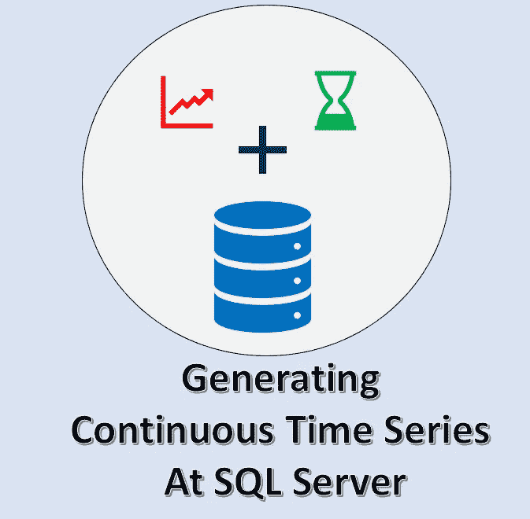
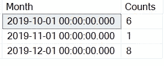
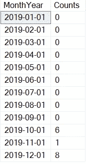

# 从 SQL Server 提取时序数据的快速修复

> 原文：<https://medium.datadriveninvestor.com/quick-fix-to-importing-time-series-data-from-sql-server-93ad77f9b3d0?source=collection_archive---------5----------------------->



随着现代预测算法和技术的出现，时间序列数据和分析变得极其重要，它适用于所有行业结构。但有时使用好的旧 SQL server 会非常麻烦，特别是准备连续的时间序列数据，按时间索引分组，处理缺失值或用 0 替换缺失值！

然而，这是非常必要的，不仅是为了生成时间序列预测，甚至是为了绘制连续的时间序列图，其中你需要有 0 值，使你的信号或图看起来像一个连续的信号，而不是一个离散的！

说了这么多，还是跳到精确解吧！

如果您有一个简单的表，并且希望获得某个特定字段的每月计数，则典型的查询如下所示:

> 选择 DATEADD(MONTH，DATEDIFF(MONTH，0，T.CreatedOn)，0)作为月份，
> 
> 将(T.CreatedOn)计为[计数]
> 
> 来自表 T
> 
> GROUP BY DATEADD(MONTH，DATEDIFF(MONTH，0，T.CreatedOn)，0)

这就是您的 SQL server 如何从您的表 T 中为您提供结果，该表将包含一些数据:



但是你要找的是这个:



那么，你到底是怎么做到的呢？

有什么魔术吗？:)

显然不是！这可以通过创建一个虚拟表和一个简单的左连接来完成！更新后的脚本应该是这样的:

```
IF OBJECT_ID('tempdb..#Results') IS NOT NULL DROP TABLE #Results

CREATE TABLE #Results ( 
MonthYear DATE,
[Month] INT, 
[Year] INT                         
)

DECLARE @Y1 INT = 2019, @Y2 INT = 2020, @M1 INT = 1, @M2 INT = 12

WHILE @Y1 <= @Y2
BEGIN
        WHILE @M1 <= @M2
        BEGIN
            INSERT INTO #Results (MonthYear, [Month], [Year])
            VALUES(DATEFROMPARTS(@Y1,@M1,1),@M1,@Y1)
            SET @M1 = @M1+1
        END
        SET @Y1 = @Y1 + 1, @M1 = 1
END

SELECT R.MonthYear,
COUNT(T.CreatedOn) AS [Counts]
FROM #Results R
LEFT JOIN MyTable T ON DATEADD(MONTH, DATEDIFF(MONTH, 0, T.CreatedOn), 0) = R.MonthYear
GROUP BY MonthYear
```

您还可以使用简单的聚合函数(如 MAX 和 MIN)动态分配系列的开始和结束年份，然后分配这些变量。

[](https://www.datadriveninvestor.com/2020/02/19/five-data-science-and-machine-learning-trends-that-will-define-job-prospects-in-2020/) [## 将定义 2020 年就业前景的五大数据科学和机器学习趋势|数据驱动…

### 数据科学和 ML 是 2019 年最受关注的趋势之一，毫无疑问，它们将继续发展…

www.datadriveninvestor.com](https://www.datadriveninvestor.com/2020/02/19/five-data-science-and-machine-learning-trends-that-will-define-job-prospects-in-2020/) 

但是为了使事情简单，这是如何，手边的问题可以很容易地解决！我们都可以继续享受和老朋友 SQL Server 在一起的时光:)

如果你想要更多关于用 SQL Server 实现奇特的机器学习和时间序列的文章，请投赞成票并给我留言！