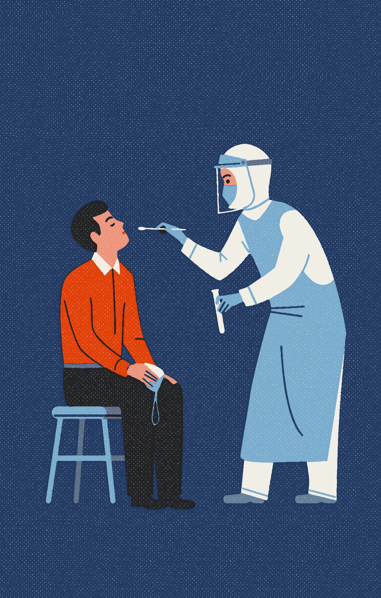

# COVID19 的最快诊断方法可以在不到一小时的时间内检测出病毒

> 原文：<https://medium.datadriveninvestor.com/quickest-diagnostic-for-covid19-can-detect-the-virus-in-less-than-an-hour-e88a3057900e?source=collection_archive---------18----------------------->

## 从 COVID19 诊断到设计定制婴儿，生物学的典型代表 CRISPR/CAS 在此拯救世界。

Photo by [United Nations COVID-19 Response](https://unsplash.com/@unitednations?utm_source=medium&utm_medium=referral) on [Unsplash](https://unsplash.com?utm_source=medium&utm_medium=referral)

在讨论实验室定制的设计婴儿和 COVID19 检测之前。

下面给大家介绍一下我们故事的主人公 CRISPR/CAS9。因此，这个被称为 CRISPR 的微小独特 DNA 片段在 30 多年前在日本的一个实验室被发现，但没有引起太多关注。几年后，人们发现了它的同伴 CAS9，它似乎编码可以切割 DNA 的酶。

但直到 2008 年，科学家们才意识到这个微小的 CRISPR/CAS9 系统有多么强大。这个系统能够编辑任何基因——在任何生物体中剪切、替换或插入任何 DNA 序列，无论是一种微小的细菌还是你患有镰状细胞贫血症的朋友。

在过去的 12 年里，CRISPR/CAS9 彻底改变了生物技术。从用于制作辛辣的西红柿、治疗老鼠的遗传性耳聋、消灭引起疟疾的蚊子、创造透明的青蛙或治疗人类的神经肌肉疾病。这是科学的个人神剪，可以剪切粘贴任何生物体内的任何东西，只要有 DNA 序列。

 [## 冠状病毒；惊慌失措；字里行间的 z |数据驱动的投资者

### 围绕冠状病毒的话题；更准确地说，新冠肺炎几乎占据了整个新闻预报的头条…

www.datadriveninvestor.com](https://www.datadriveninvestor.com/2020/03/23/coronavirus-a-to-panic-z-between-the-lines/) 

近年来，在 2018 年，中国科学家何建奎报告说，他创造了世界上第一个带有 CRISPR 编辑基因的人类婴儿:一对抗艾滋病毒的双胞胎女孩。这听起来可能是革命性的，但对于科学家、人权活动人士和政府机构来说，这是一个巨大的伦理困境。这两个女孩治愈了艾滋病毒是应该庆祝，还是应该被科学谴责这种未经适当研究的婴儿和胚胎实验？这里回答了其中的一些问题。

 [## 按照您喜欢的方式定制设计您的宝宝。

### 蓝眼睛，黑皮肤，良好的新陈代谢，乳腺癌无论你有什么问题，科学都可以帮助你改变…

medium.com](https://medium.com/@prerita.chawla/custom-design-your-babies-anyway-you-like-43c530b601aa) 

同样的技术现在正被用于检测冠状病毒。

# CRISPR/Cas9 在检测中是如何工作的？

## COVID19 检测的一个重要方面是速度。

CRISPR/CAS9 是一种极其快速的诊断工具，可以在不到一小时的时间内测试冠状病毒。

这正是世界各地的实验室正在开发的。

在美国，食品和药物管理局已经批准夏洛克的一家生物技术公司，在三月份开始推出这些廉价、高效和极其快速的诊断试剂盒，他们在向公众推出之前正在对其进行改进。

在印度的时候，这个检测工具已经在印度著名的实验室之一 CSIR 的二月底准备好了。他们打算在这个国家做一个大约花费 500 卢比(6 美元)的试纸测试，并且不需要其他昂贵的仪器。

在这两种情况下，CRISPR/CAS 由于其多功能性而被用于创建另一种疾病的诊断方法，然后被完善和测试为击败疫情的有效诊断方法。

夏洛克首席执行官 Rahul Dhanda 解释了诊断过程。

该过程始于从患者身上采集呼吸样本，通常是鼻子、肺或嘴。通过 PCR 或聚合酶链式反应(用于将患者样本中的 DNA 放大数百万倍)，使其更容易读取和检测。

然后将样品引入 CRISPR，CRISPR 在 RNA 引物的帮助下将病毒 DNA 转化为 RNA，RNA 引物是与病毒 DNA 相同的短 RNA 序列。

样本中的这种 RNA 现在被一种特殊的酶 CAS 检测到，这种酶在序列中预定的点切割病毒 RNA 序列。这种切断导致荧光分子的释放，这表明在荧光读数器下可以看到病毒已经在样品中被检测到。

最终，与传统测试相比，这一过程的效率仍有一些未解的问题。这种测试的目的是快速和广泛的。

用明尼苏达大学分子病毒学研究所教授兼主任路易斯·曼斯基博士的话说

> “是的。积极、广泛的检测将有助于识别和隔离受感染的个体，以防止进一步的社区传播。”

这正是我们所需要的。

**进入专家视角—** [**订阅 DDI 英特尔**](https://datadriveninvestor.com/ddi-intel)