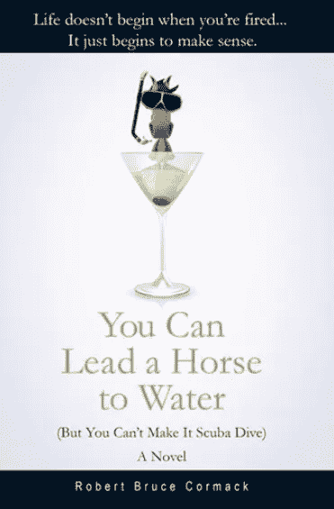

# 别太爱自己了。

> 原文：<https://medium.datadriveninvestor.com/quit-loving-yourself-so-much-988be5d28f71?source=collection_archive---------15----------------------->

## 你变得太，嗯，胖小子。

Photo by [Atikh Bana](https://unsplash.com/@tikh?utm_source=unsplash&utm_medium=referral&utm_content=creditCopyText) on [Unsplash](https://unsplash.com/s/photos/sexy-woman?utm_source=unsplash&utm_medium=referral&utm_content=creditCopyText)

“如果今晚我不得不爱自己，我会在早上恨我自己。”伍迪·艾伦

好吧，你已经经历了多年的自我厌恶，现在你好多了。你读过书，听过菲尔博士的演讲，听过詹妮弗·洛佩兹说，“你必须首先爱你自己。”没有人比詹妮弗·洛佩兹更爱自己。她的粉丝俱乐部页面上有她自己的照片，有她自己给自己拍照的照片，甚至还有其他人给她自己拍照的照片。这就像一个自我奉献的旋转木马。

这就是自我奉献或自我欣赏的问题——不管你想怎么称呼它。这并不能让你变得伟大。真正伟大的女性——像米歇尔·奥巴马——都是谦虚的伟大。珍妮弗棒得让人讨厌。

任何形式的极端自爱都是令人毛骨悚然的。一位女士写了一篇关于约会的文章，她说:“我美丽、聪明、富有冒险精神，而且有难以置信的才华，而这个家伙*鬼魂*我。我，大声哭出来。你在开玩笑吗？我不会让他舔我的马诺洛·布拉尼克。"

首先，感谢你没有让这个家伙毁掉你的魅力。第二，你很吓人。也许更好的词是 blimpy。我都不知道这是不是一个词，但应该是。那些把自己描述成不可思议的人，嗯，是在要求泄气。

> 我们都偶尔会变胖。当过度的自我成为阻碍时，问题就来了。

伙计们，这就是重点。我们都有一种天生的软皮人的感觉。这与其说是膨胀的自我。我们都偶尔会变胖。当过度的自我成为阻碍时，问题就来了。

人类飞船——像任何飞船一样——是一件棘手的事情。例如，“美丽、聪明、富有冒险精神、才华横溢”，这可能是真的。但是你越大，就像珍妮弗·洛佩兹，你最终被跟踪的可能性就越大——或者更糟，被忽视。

有一天它甚至会发生在詹妮弗·洛佩兹身上。

那么我们为什么要这么做呢？为什么我们*过度*爱自己。当我们应该停留在愉快的气球上时，为什么我们得到了 Hindenburgy？

首先，这可能是保护性逻辑，意味着我们在为自己辩护。我们膨胀，所以我们不会紧缩。

专家认为我们这样做是因为我们天生不积极。我们每天大约有 65000 个想法，令人震惊的是，其中 70%是消极的。感觉不好比感觉好更自然。这是我们原始时代生存机制的一部分。

 [## 改善之旅始于福祉|数据驱动的投资者

### 一场普遍的健康危机让人们认识到将健康融入工作文化的重要性。过去的陈词滥调已经…

www.datadriveninvestor.com](https://www.datadriveninvestor.com/2020/06/01/journey-of-improvement-starts-with-well-being/) 

我怀疑最早的穴居人认为自己是乐观主义者。古生物学家发现的所有这些画都不是出于艺术原因。外面的生活太疯狂太危险了。闲逛，在墙上画一只羚羊，比真的去猎杀一只要好。那时候，即使是一只小羚羊也能把你踩死。按兵不动，让别人冒生命危险，这是个好主意。

艺术家比猎人活得更久。

同样，我们觉得拥有内向的生活更安全。我们看《先声夺人》，感受和获胜者在一起的感觉。我们从他们的成功中建立自己的成功。

运动也是一样。任何时候你看到球迷们捣毁酒吧，那都是因为他们输了。是个人的失败。粉丝是被美化的穴居人。

> 我们只是想，管它呢，如果我认为我是詹妮弗·洛佩兹，总比认为我是 T2 好。

我们通过将他人的成功转化为自己的成功来寻找快乐的方法。我们只是在想，管它呢，如果我*认为*我是詹妮弗·洛佩兹，总比认为我是*我*要好。

换位思考和现在的文化有很大关系。我们在电视上看到的一切都是关于成就的——即使是获得笑声。笑痕是成功的标志。我们希望自己的生活中有笑声。有人可以通过制作一个笑声追踪应用程序赚很多钱。

除此之外，我们只能退而求其次。我们过度爱自己。我们采纳了那些愚蠢的自助书籍的建议，“你是你的宇宙中最重要的人。”

相对于这些事件产生的多巴胺，我们的宇宙不是“声音”的事实是次要的。我们疯狂地升华。我们膨胀，我们增长一对，我们得到所有的 Hindenburgy。

只是，像詹妮弗·洛佩兹一样，我们被冲昏了头脑。为什么只是一个“可爱、体贴、有爱心的人？”这不是卖，这是解决。

如果你每天都不沉浸在无尽的乐观中，你怎么能真正感觉良好呢？难道发出积极的共鸣不会吸引积极的共鸣吗？

> 你宁愿对自己撒谎，认为你不仅仅是抛出了共鸣，你是抛出了“明星共鸣”

当然，积极应该是它自己的奖励，但是想想你从哪里来。你已经自我厌恶多年了。仅仅“喜欢”自己是不够的。你宁愿自己对自己撒谎，认为你不仅仅是抛出了共鸣，你是抛出了“明星共鸣”

在某种程度上，我们都是“明星感应者”。我们知道本质上很多只是服装，但我们很注重外观。“成功着装”这一术语已被普遍接受。衣服也算。与其说是工作，不如说是真正的冒险精神、非凡的才华，当然还有华丽的外表。

正如一名学生在社交媒体上所说，“有时拥有合适的口红比好成绩更让我感觉良好，”这在适当的时候导致一名教育工作者问为什么这么多学生更重视衣服而不是学习成绩。“他们把衣柜放在工作之前，”他说。

这不是什么新鲜事。每个时代都有人穿得像另一个人或者表现得像另一个人。我们抽烟是为了像约翰·韦恩一样。我们穿着拖把上衣，就像披头士一样。

今天的不同之处在于，我们有如此多的出口和图像，让我们想要比实际情况更好。

我们不再接受自己，我们正在提升自己。我们遵循广告的基本原则:“*你说的越多，你卖的就越多*所以我们宣传得就像超级碗的黄金时间一样。

但是正如比尔·伯恩巴克曾经说过的，“产品本身有多好，你就有多好”，这意味着如果你*过度销售*，你就死定了。如果你告诉猪，你就死定了。如果你膨胀，夸大，迎合，你就死定了。

换句话说，当然，自我感觉良好，成为你生活的中心，释放一些积极的情绪。只是不要做所有的阻碍手术。

> 詹妮弗·洛佩兹可能从来没有被人代笔过。不过，总有一天她会的。她会像我们一样泄气。

“答应他们任何事，只要是真的，”大卫·奥格威说。一些值得思考的事情，对吗？这肯定比被鬼上身要好。詹妮弗·洛佩兹可能从来没有被人代笔过。不过，总有一天她会的。她会像我们一样泄气。

它们最终都会收缩。如果你仔细听，好莱坞除了嘶嘶声什么都没有。詹妮弗会比大多数人发出更大的嘘声。

最好是令人愉快的气球状——或者适度的巨大。

对米歇尔·奥巴马来说，这当然奏效了。谁来给她做鬼？

*如果你喜欢这篇文章，请投个掌声，或者一个赞，或者一个评论。否则，Medium 会认为我是个哑弹，这可能是真的，但算法是哑弹的地狱。不要让一个算法让我成为泄气的兴登堡。*

罗伯特·科马克是讽刺作家、小说家和博客作者。他的第一部小说[“你可以把马牵到水边(但你不能让它潜水)”](http://robertcormack.net/)在网上和大多数主要书店都有售。查看[天马出版社](http://skyhorsepublishing.com/)或[西蒙和舒斯特](http://simonandschuster.ca/)了解更多详情。

**访问专家视图—** [**订阅 DDI 英特尔**](https://datadriveninvestor.com/ddi-intel)