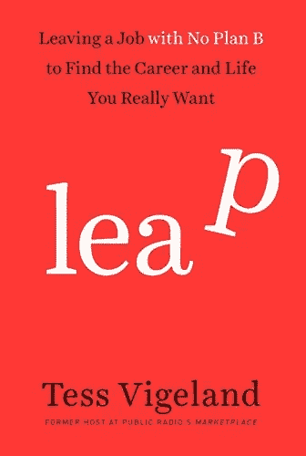

# 无网退出？辛苦但值得

> 原文：<https://medium.datadriveninvestor.com/quit-with-no-net-hard-work-but-worth-it-4975e26c2504?source=collection_archive---------27----------------------->

Copyright: Harmony

辞掉那份扼杀你灵魂的工作！这是一直存在的职场幻想之一。但是在没有网络的情况下这样做，对绝大多数人来说是令人不安的。

然而，这正是长期电台主持人苔丝·维格兰所做的。她写了一本书讲述自己的经历: [*飞跃:离开一份没有 B 计划的工作去寻找自己真正想要的事业和生活*](https://www.amazon.com/Leap-Leaving-Plan-Career-Really/dp/0804140758/ref=as_li_ss_tl?ie=UTF8&qid=1442332062&sr=8-1&keywords=leap&linkCode=sl1&tag=constabconf03-20&linkId=4ce5557346c31efe4fdbe42b98471dd1) *。*

# 没有什么好事是容易的

不像许多忏悔书，这本书不会告诉你有多容易。或者戒烟后的兴奋感持续了几个月。或者每个人都应该这样做，因为，嘿，管它呢。不，这里的情况完全不同。如果你相信维格兰，这是一项艰苦的工作，会有很多焦虑。它将以你想象不到的方式颠覆你的生活。

# 苔丝是一个可靠的消息来源

正是这样的事情使得这本书比一些敦促你在这个世界上闯出自己的路的自助书籍更可信——这就像骑自行车一样，这类书似乎承诺了这一点。只不过它们掩盖了你刮去膝盖上皮肤的时间。或者他们似乎遗漏了一些你不太清楚的东西。例如，当所有这些退出正在进行时，谁来支付抵押贷款。或者说维持每天吃饭所必需的钱都是从哪里来的？

# 诚实的力量

在某些方面，维格兰的工作是“通往幸福的捷径”书籍的解毒剂，这本书暗示你可以做任何事情(财富、和谐和放松)，只要你遵循一些简单的规则。这样的承诺是幻想。

 [## 2019 年即将改变世界的技术|数据驱动的投资者

### 很难想象一项技术会像去年的区块链一样受到如此多的关注，但是……

www.datadriveninvestor.com](https://www.datadriveninvestor.com/2019/01/17/the-technologies-poised-to-change-the-world-in-2019/) 

维格兰关注的是对金钱、职业以及离开对许多人来说似乎是梦想的工作的担忧。正是她自我意识到的缺点让这个故事变得更加真实，也更有关联。她变得不仅仅是我们从收音机里记得的声音——她变成了一个三维的个体，就像我们其他人一样。最重要的是，坦诚相见的意愿是一种巨大力量的象征。你有没有注意到那些从不承认自己失败的人其实是最软弱的？她恰恰相反。

我想说，在她的经历之后，跳跃然后写这本书，维格兰将是不可阻挡的。

*这是一个故事的编辑版本，首次发表于 2015 年 10 月 12 日的《Forbes.com》。*