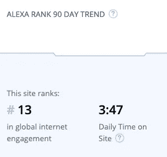
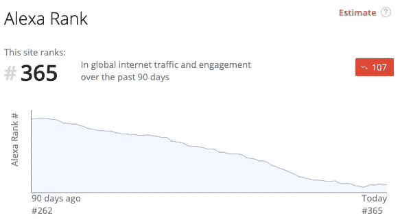
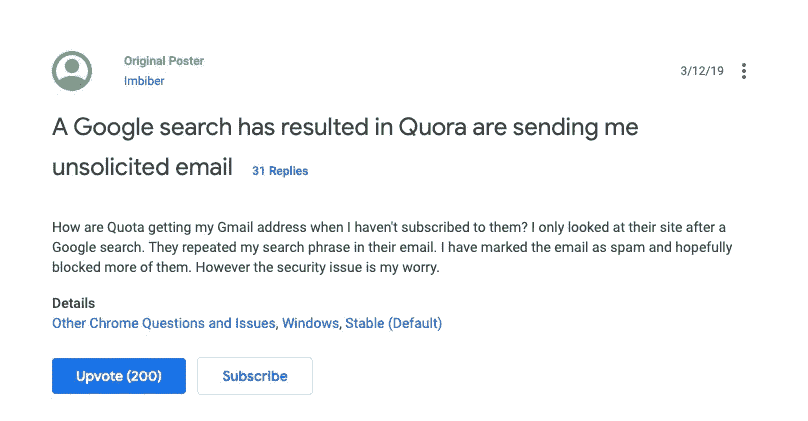
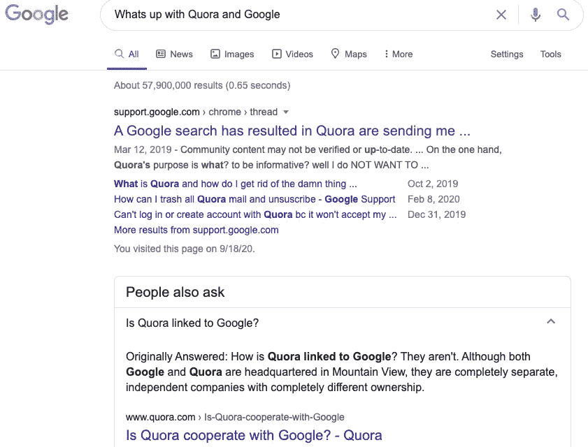

# Quora 和谷歌可能正在进行一场暗战

> 原文：<https://medium.datadriveninvestor.com/quora-and-google-might-be-in-a-hidden-war-5ed4a8e6f33b?source=collection_archive---------6----------------------->

## Quora 承受了所有的压力。

Photo by [Toni Koraza](https://unsplash.com/@tonikoraza?utm_source=unsplash&utm_medium=referral&utm_content=creditCopyText) on [Unsplash](https://unsplash.com/@tonikoraza/stats?utm_source=unsplash&utm_medium=referral&utm_content=creditCopyText)

Quora 现在是互联网上第 371 个最受欢迎的网站。这个位置将*问答*平台置于互联网的最顶端，但这绝不是值得庆祝的事情。

根据亚马逊的 Alexa，Quora 在过去的 90 天里下降了 103 位。

Alexa 从互联网上收集数据来确定每个网站的参与度，并将结果与其他搜索引擎优化工具和指标捆绑在一起。您可以获得每月 149 美元的基本套餐。

# 不久前，Quora 还主导着谷歌搜索结果。

如今，你几乎找不到共和党阴谋论之外的红 Q。我在 Quora、Medium、Vocal 和 [Substack](http://koraza.substack.com) 上写文章，无法避免注意到每个平台的参与度。

在过去的两年里，我已经在 Quora 上发表了 176 个答案。这个平台肯定正在经历一个奇怪的阶段。你可以很容易地推测 Quora 的麻烦:

*   谷歌正在积极颠覆搜索结果，以阻止 Quora 出现在首页结果中。
*   Quora 正在失去原始观众和内容创作者。
*   更邪恶的事情正在幕后发生。

猜测不一定是真的，但互联网巨头通常不会因为少数用户迁移到其他平台而一夜之间下降 103 位。

Wikipedia’s steady web engagement (90-day period)

你在互联网上的受欢迎程度越高，就越难失宠。

如果你问自己现在互联网上最受欢迎的网站是什么，你脑海中的第一个答案可能是谷歌，你是对的。

谷歌是迄今为止地球上最受欢迎的网站，在 Alexa 的参与度中排名第一。YouTube 紧随其后，位居第二，脸书稳坐第六的位置。

Quora’s engagement fell down the stairs.

# Quora 是一家价值 20 亿美元的独角兽初创公司。

第四轮风险投资通常只发生在超级特殊的情况下，比如并购。

几乎所有创业公司中的 78.73%从未成功进入 b 轮融资。成功进入 C 轮融资的公司可能再也不会获得更多风险投资。

Quora 的 4 轮风险投资创造了一家 20 亿美元的互联网公司。

在线创业公司通常在 B 轮左右开始将平台货币化，这是有机接触下降的时候，你开始看到广告。不久之后，流量变得陈旧，平台变得沉闷和重复。普通用户突然需要花钱才能接触到更广泛的受众。

# 想想脸书和 Quora，然后想想抖音。每个平台达到 5 万新增人数有多容易？

金·卡戴珊和唐纳德·特朗普可能对社交媒体的有机影响没有问题。但是对于普通人来说，在脸书和 Quora 上接触到 50，000 名新用户的唯一方法是花费 3，000 美元。

另一方面，50，000 个关于抖音的独特观点是一周的工作量。我在*斗阵(中国市场的抖音*)上发布的第一个视频已经被观看了数千次。)根据病毒唱票人 Ash Sud 的说法，100 万的浏览量在抖音形成了中等规模但病毒式的流量。

进入门槛很低，这个平台可以放大你的参与度。

完成一些挑战，找点乐子，上传 7 个视频，你已经告诉你最好的朋友，你的狗追逐回旋镖的视频在抖音有 50，000 次点击。脸书在 2011 年也是如此，Instagram 在 2016 年也有过辉煌。不久之后，新的内容创作者开始面临更大的障碍来接触观众，这是由平台本身造成的。

每个人都要赚钱，这没问题。但是大公司有时拒绝和其他公司合作，这就破坏了那些只想读书写字的普通人的游戏。

Complaint upvoted by another 200 Google users.

# 谷歌正在积极颠覆搜索结果，以保持谷歌的流量。

据报道，谷歌的母公司 Alphabet 通过将流量导向自己的位置比将空间出租给广告商多赚了 5 倍的钱。

> 2019 年 51%的谷歌搜索[从未离开谷歌](https://www.hubspot.com/marketing-statistics)。

今天，大约 41%的热门谷歌搜索主要是谷歌的产品和服务。当你搜索术语*播客时，你会在页面顶部看到*片段、答案和谷歌网站。然后，你可能会找到像维基百科、脸书或 Quora 这样的网站。

大型网站正竭尽全力阻止流量离开平台。脸书、谷歌，甚至 Medium 都试图创造一个完整的生态系统，让你很少甚至没有机会去别处寻找答案。

谷歌已经是反垄断调查的对象，并因违反欧洲公平竞争规则而被定罪。欧盟因谷歌违反欧洲反垄断法对其罚款 17 亿美元。然而，支付几十亿美元并继续营业通常是值得的。

# Quora 是 2018 年互联网上最受欢迎的网站之一。

凭借 [3 亿的月访问量](https://www.vox.com/recode/2019/5/16/18627157/quora-value-billion-question-answer)，Quora 的社区人数超过了今天的媒体。客观地看，Ev Williams(Medium 的投资者)暗示 Medium 每月的独立访问量接近 1 亿次，大约比 Quora 少 3 倍。

然而，到 2020 年末，Medium 在 Quora 排名前 200 多位。许多 Quora 用户涌向 Medium 和其他平台，抱怨红 q 有些不对劲。

我仍然喜欢在 Quora 上写作，并尝试不时地回答问题。不像媒体，你不必为人们想读什么而绞尽脑汁。你被直接问到问题，你有机会回答一篇完整的博文。

Quora 在过去几年里经历了几次变化，因此受到了谷歌的负面影响。你必须注册一个 Quora 账户，才能看到与你的谷歌搜索结果相关的全部信息。谷歌讨厌以这种方式失去流量。然后，人们开始抱怨 Quora 向谷歌用户发送未经请求的电子邮件。

*a Quora Answer used for Google’s Q&A section.*

# 《人民日报》还在谷歌上提问，这直接破坏了 Quora 作为一个平台的宗旨。

今天，当你在谷歌上问一个问题，你不会得到 Quora 的答案。即使 Quora 在搜索结果中名列前茅，它通常也在谷歌的*片段*和*答案之后。*

“谷歌[提供了一个快速回答](https://support.google.com/webmasters/answer/6229325?hl=en)或摘要，其中包含相关网站的内容片段。”

如果你的页面被压缩成一个片段，你可以忘记有机流量，即使你在谷歌上排名第一。你几乎无法在几个内容层下面找到 Quora，即使你直接搜索句子中带有 *Quora* 的问题。

# 当你不买产品时，你就成了一个产品。

互联网是一个注意力游戏，行业巨头为了自己保持你的注意力而超越。

对于 Quora 和谷歌来说，你就是产品。你花在他们平台上的时间越长，他们从你身上获得的影响力和金钱就越多。

很自然，这两个平台是相互关联的，随着谷歌成为互联网上无所不能的力量，在接下来的几年里，你可能会越来越少看到 Quora。