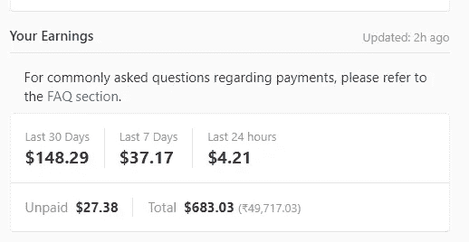
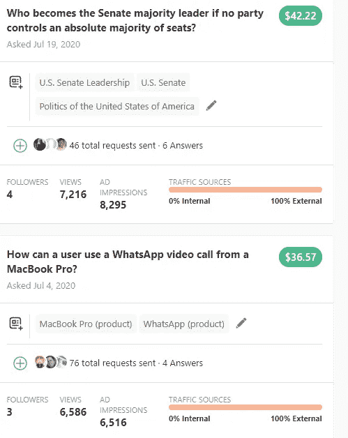

# Quora 这个月给我寄了 152.24 美元

> 原文：<https://medium.datadriveninvestor.com/quora-has-sent-me-152-24-this-month-9aca846ca0c?source=collection_archive---------3----------------------->

## 在 Quora 上只要提问就能挣钱。

Screenshot by Author

很多人觉得 Quora 的商业模式有点混乱。在媒体上，作家写作在月底为他们赚钱。当你抬头看 Quora 时，你会感到震惊，因为他们只给你提问的钱。

要在 Quora 上赚钱，你需要加入他们的合作伙伴计划。与中型合作伙伴计划一样，Quora 合作伙伴计划根据问题表现提供月度付款。Quora 合作伙伴计划从一开始就备受争议。很多人想知道为什么 Quora 还会补偿写问题。

## 为什么提问对 Quora 来说比写答案重要？

Quora 始于 2010 年，一群朋友开始提问并给出答案。作为一个在 2016 年变得流行的平台，Quora 开始通过展示广告来赚钱。

Quora 的广告模式和脸书一样。在 Quora 上，许多人准备写答案，但很少有人问独特的问题。由于问题是生成最新和有用内容的起点，Quora 启动了提问合作伙伴计划。这增加了网站流量，进而增加了广告收入。

Quora 的商业模式类似于 Reddit。它创建数据并将其用于广告程序。Quora 合作伙伴计划也是为了同样的目的而启动的。

## Quora Partners 计划与 Medium partner 计划有何不同？

Screenshot from laptop

与 Medium 不同，Quora 合作伙伴计划完全依赖 SEO 和外部流量。更多的人问一个问题，哪个获得谷歌流量更多，他赚得更多。媒体付费在订阅基础上有效，外部流量在媒体上无关紧要。由于 Quora 是一个免费平台，他们依赖广告收入。

## Quora 和 Medium 哪个赚钱比较好？

在 Quora 上，你比在 Medium 上写作更有钱。如果你要花 3 个小时写一篇精美的文章。一个月写 10 篇文章。这和你每月在 Quora 上写 1500 个问题是一样的。一年后，你将从这 1500 个问题中获得 150 美元。Quora 就像彩票一样，如果问题获得了巨大的外部流量，你就可以每题赚 1000 美元。

## 外卖食品

我在 Quora 和 Medium 上提问和写故事。两个平台都以自己的方式做到最好。问问题比写中等故事需要更少的努力。

两者都是赚取被动收入的好来源。两者都基于相同的复利原理。你付出的越多，得到的就越多。

我们从在不同的平台上工作中学到了更多。在两个不同的平台上工作对我来说总是一次很好的经历。