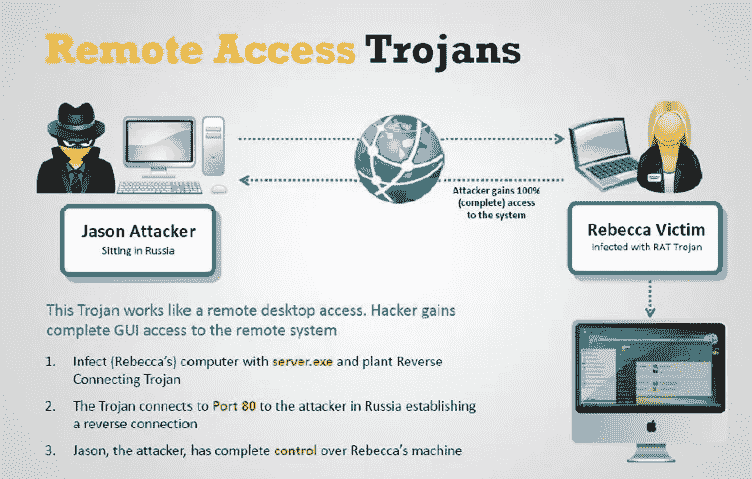

# 远程访问木马|它如何影响大型企业

> 原文：<https://medium.datadriveninvestor.com/r-a-t-remote-access-trojan-how-it-affects-to-major-enterprises-822ef3c15a35?source=collection_archive---------3----------------------->

## 企业正因此受到黑客攻击

Photo by [Jefferson Santos](https://unsplash.com/@jefflssantos?utm_source=medium&utm_medium=referral) on [Unsplash](https://unsplash.com?utm_source=medium&utm_medium=referral)

即将到来的 2020 年新年，是鼠年。在中国，他们带着喜悦和幸福庆祝农历新年，但对于一名网络安全工作者来说，“**老鼠**”意味着“**远程访问木马**”，或者换句话说，是坏人利用的肮脏工具。黑客(坏黑客)用它来入侵你的电脑并访问你的所有数据，远程控制你的电脑，进入受害者的硬件资源，如网络摄像头和麦克风，甚至关闭键盘。此外，它们还可以作为键盘记录、数据窃取和发起其他恶意软件攻击的跳板。

**什么是远程访问木马？**

Photo by [Michael Geiger](https://unsplash.com/@jackson_893?utm_source=medium&utm_medium=referral) on [Unsplash](https://unsplash.com?utm_source=medium&utm_medium=referral)

这意味着作为一种“远程管理工具”,由于它们与不同的 IT 管理工具(如 TeamViewer 和 LogMeIn)相似，RAT 是一种进入他人计算机的隐藏后门。RAT 给了一个人各种各样的功能，可以用于恶意的目的。

Simple illustration about RAT, Image Extracted from: [https://media.licdn.com/mpr/mpr/p/5/005/079/352/25ea188.jpg](https://media.licdn.com/mpr/mpr/p/5/005/079/352/25ea188.jpg)

*过去和现在最常用的 rat 包括:*

*   软毛鼠
*   扇尾鼠
*   奥喀斯鼠
*   PupyRat
*   CalypsoRAT
*   丹博特鼠
*   Adwind jRAT
*   黑斑鼠

**鼠扩散:**

rat 通常来自网络钓鱼、垃圾邮件和鱼叉式网络钓鱼活动。还有其他威胁因素，例如，黑客可以通过伪造网站发送 FlawedAmmyyRAT，以简单的在线游戏(如俄罗斯方块游戏或国际象棋)的方式隐藏 RAT。

Photo by [Nahel Abdul Hadi](https://unsplash.com/@nahelabdlhadi?utm_source=medium&utm_medium=referral) on [Unsplash](https://unsplash.com?utm_source=medium&utm_medium=referral)

**他们是如何逃避检测的？**

对于您的组织来说，rat 的主要危险是它们非法使用了您的管理员需要的合法功能。如果不能远程登录到用户的计算机进行故障排除和其他支持任务，任何现代企业都无法运行有效的 IT 支持服务。rat 与 TeamViewer 等合法工具使用相同的远程访问服务，利用 Windows 远程桌面(RDP)和 TCP 网络协议在攻击者的机器上安装后门。

**威胁者如何对企业使用老鼠？**

Photo by [Helloquence](https://unsplash.com/@helloquence?utm_source=medium&utm_medium=referral) on [Unsplash](https://unsplash.com?utm_source=medium&utm_medium=referral)

老鼠的主要目标是在目标不知道的情况下行动。虽然肯定有“独狼”行为者针对个人和组织并在十多年内未被发现的情况，但直到最近，RAT 对企业的主要威胁来自 APT 活动，包括针对最敏感设施的活动，如印度的核电站(被 DTrack RAT 瞄准)、中东的石油和天然气公司、非洲和亚洲的电信公司(DanBot RAT)、全球的政府机构(Calypso RAT)，以及最近欧洲的一个能源部门组织(PupyRAT)。

 [## 在创业之旅中，拥抱学习|数据驱动的投资者

### 好像建立一个数百万美元的公司还不够困难，企业家必须额外照顾他们的…

www.datadriveninvestor.com](https://www.datadriveninvestor.com/2018/10/16/on-the-entrepreneurial-trek-embrace-the-learning/) 

利用这些老鼠，黑客能够完全控制受害者的机器，获得对整个网络的访问权，泄露敏感的企业数据，并在实现所有目标之前避免被发现。

# 如何防范远程访问特洛伊木马？

Photo by [Clément H](https://unsplash.com/@clemhlrdt?utm_source=medium&utm_medium=referral) on [Unsplash](https://unsplash.com?utm_source=medium&utm_medium=referral)

在过去，老鼠很难发育，需要很高的熟练程度才能操作。它们绝不是“开火就忘”的工具。他们要求威胁者投入时间和精力将恶意软件插入受害者的系统，手动操作连接，然后执行他们计划的任何邪恶活动。正如我们所看到的，最近情况发生了变化，与勒索软件即服务等其他犯罪软件一样，恶意软件开发人员已经看到并抓住了机会，通过出售他人没有技能为自己制作的工具的便捷访问来获利。

Photo by [Christopher Gower](https://unsplash.com/@cgower?utm_source=medium&utm_medium=referral) on [Unsplash](https://unsplash.com?utm_source=medium&utm_medium=referral)

对于防御方来说，RAT 活动的增加意味着既需要在初始阶段阻止攻击，又需要了解整个网络，以检测任何可能逃过第一层安全保护的威胁。实施防火墙控制和网络流量策略可以帮助您监控和阻止不需要的连接和端口，这将有助于挫败攻击者。

使用来源:https:[//www . sentinel one . com/blog/ciso-essentials-how-remote-access-trojans-affect-the-enterprise/](//www.sentinelone.com/blog/ciso-essentials-how-remote-access-trojans-affect-the-enterprise/)

查看我的其他故事:

 [## 冠状病毒导致新一波网络钓鱼和恶意软件

### 随着世界对全球健康问题因为新冠肺炎或更好地称为冠状病毒的传播，与…

medium.com](https://medium.com/@diorjuraev/coronavirus-leads-to-a-new-wave-of-phishing-and-malware-799060938f41)  [## 黑暗之网

### “暗网”是万维网中神秘而危险的部分之一。很多争议，神话，吓人…

medium.com](https://medium.com/@diorjuraev/dark-web-6df2439efd81)  [## 网络威胁情报

### 什么是…？

medium.com](https://medium.com/@diorjuraev/cyber-threat-intelligence-b6ceb6d9e6f5)