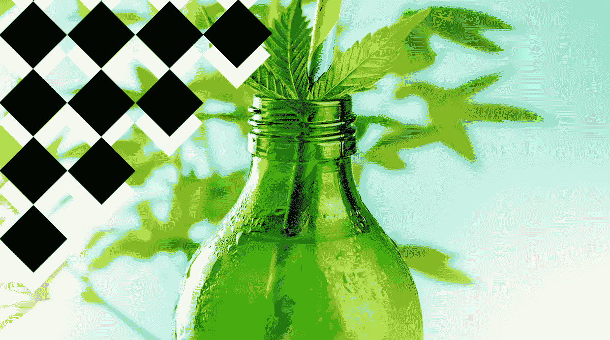
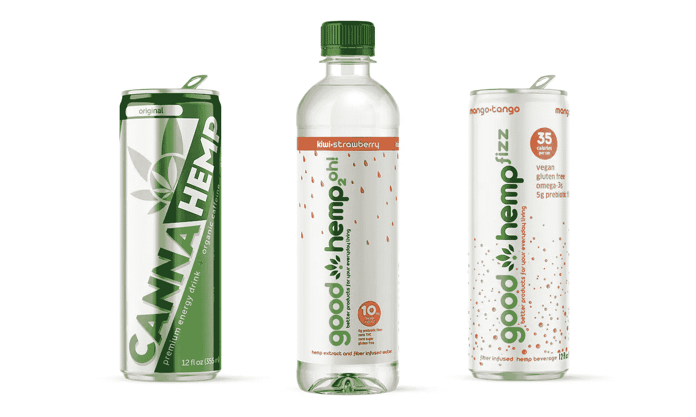
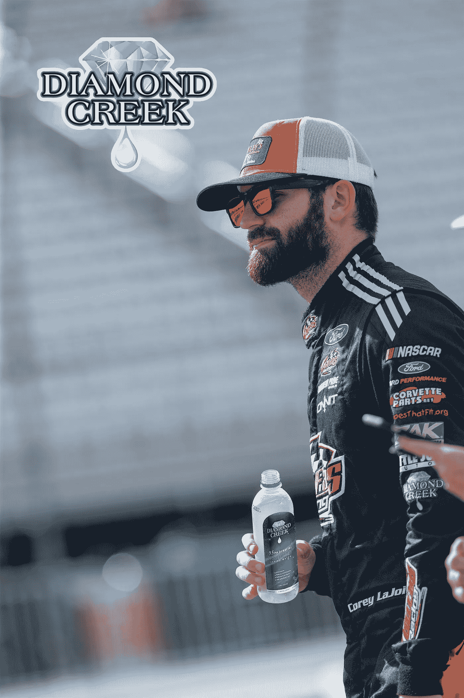
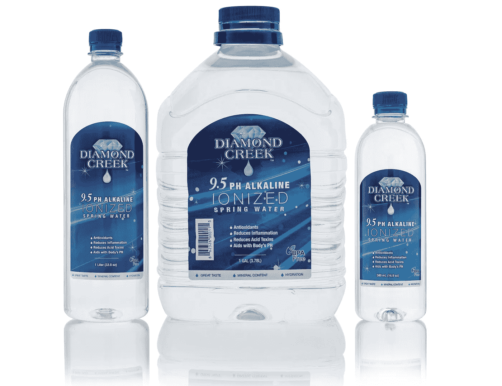

# 走向市场:大麻饮料以战略定位瞄准更大的受众

> 原文：<https://medium.datadriveninvestor.com/race-to-market-hemp-beverages-target-bigger-audience-with-strategic-positioning-dd7dc306f99d?source=collection_archive---------2----------------------->

By MysteryShot — Adobe Stock

随着禁令逐渐成为过去，大麻种植者和生产者已经准备好迎接美国和全球大麻产品前所未有的增长。不幸的是，几个因素继续阻碍行业加速发展，包括持续的 FDA 模糊，缺乏消费者教育，以及有限的零售货架空间。

在致命疾病、经济衰退和政治混乱的因素下，过去的一年对包括大麻在内的大多数行业都提出了挑战。毫无疑问，去年对于购物来说并不是一个好年景，但是当我们翻开全球疫情的新一页时，商家们正焦急地期待着零售流量的回归。

但是，如果 2020 年是退税的一年，那么 2021 年是向前发展的一年，至少根据总部位于北卡罗莱纳州的公开交易大麻饮料制造商 [Good Hemp](https://ghmpinvestorrelations.com/) (GHMP)的说法。在与首席执行官兼创始人比尔·阿莱西的采访中，我们讨论了他认为将有助于公司成为新兴大麻饮料行业的领导者的战略举措。

# 获得品牌知名度

对于新兴的大麻市场来说，在主流零售店获得知名度是很困难的。牛津俱乐部(T3)的首席趋势策略师马修·卡尔在给 T4 的一封电子邮件中提到，“我认为大麻饮料公司，如新时代饮料、夏洛特的网和其他公司，最大的问题是缺乏店内零售流量。”

好麻公司的首席执行官比尔·阿莱西对此深表赞同，他正在采取一些战略措施来推动公司向前发展。回顾过去一年，Alessi 表示，*“我们实际上已经成功扩大了我们的足迹，这在 COVID 领域相当重要。”*他接着说，*“虽然在疫情期间销售额没有爆炸式增长，但我们一直在集中精力做好基础准备，以便在零售业开始复苏时做好准备。”*

Image provided by Good Hemp

然而，Good Hemp 利用他们在疫情的休息时间来加强他们的在线业务，专注于开发他们的亚马逊商店，并对他们的网站进行更改，以改善他们直接面向消费者的购物体验。*“在我们的大麻饮料类别中，我们在所有主要的关键术语中都名列前茅，”* Alessi 说。*“这意味着，我们应该能够满足亚马逊一连串的算法挑战，以获得声誉，成为一个有良好销售业绩的知名大麻饮料供应商。”*

进一步提高零售曝光率的策略包括合作和收购，这将增加他们的实际货架空间，解决生产瓶颈，并增加他们的广告预算。而且，在广阔的体育世界中获得一个最忠实的粉丝群也不会有什么坏处。

# 纳斯卡提高了品牌忠诚度

纳斯卡因其忠实的粉丝群而广为人知。罗德岛州的 Performance Research 进行的一项[调查称，*“……在全国范围内随机采访了 1000 多名纳斯卡爱好者，超过一半(57%)的人表示他们对纳斯卡赞助商提供的产品有更高的信任度。相比之下，只有 16%的公众对奥运会赞助商持“较高”信任，只有 5%的公众对世界杯足球赛赞助商持“较高”信任。*](http://performanceresearch.com/independent-studies/loyal-nascar-fans-please-stand-up/#:~:text=According%20to%20the%20study,%20nationwide,employed%20full%20time%20(87%25).)

作为一名商人、连续创业者和创新者，Alessi 知道，当有人提到 NASCAR 时，人们会立即想到家喻户晓的大品牌，如 Tide、可口可乐、联邦快递等。为了在这些专注的观众面前获得知名度，该公司与体育和娱乐巨头 Spire Motorsports 联手。

*“我们与 Spire 达成交易有两个原因，”* Alessi 解释道。首先是因为作为协议的一部分，他们增加了广告预算，但此外，当你想到纳斯卡时，你会想到赛车迷……铁杆、忠诚的赛车迷非常支持赞助商

作为与 Spire 合作的附带利益，Good Hemp 还收购了创新风险投资公司(Innovation Ventures)前销售总裁 Rise' Meguiar，后者以 5 小时能量饮料而闻名。作为公司的创始成员之一，美光有近二十年的经验。Alessi 认为，*“她的专业知识是 5-hour 从一家初创公司发展成为价值数十亿美元的企业的重要原因。”*

# 钻石溪的宝贵机会

通过与 Spire 的合作，另一个战术举措很快浮出水面。[钻石溪](https://www.diamondcreekwater.com/)拥有 170 万美元的销售额，是全球 20 大碱性水品牌之一，也是纳斯卡杯系列车手科里·拉乔依的赞助商。

Image provided by Diamond Creek

马上认识到机会，好麻在 2020 年出戏收购公司。凭借近 2000 个零售点的货架空间，Diamond Creek 立即扩大了 Good Hemp 的零售知名度，但更值得注意的是，它带来了挖掘 NASCAR 金矿的机会。

在最近关于收购的新闻发布会上，瑞思美光说，*“这是一个很棒的战略收购，我对我们饮料在零售市场的未来扩张非常兴奋。我们不仅计划利用我们过去的关系和体育营销资产来扩大钻石溪品牌，而且随着大麻被主要零售连锁店越来越广泛地接受，这些新的关系对我们的大麻饮料的扩张也至关重要。”*

钻石溪首席执行官肯·摩根对合作关系表示兴奋，*“Good Hemp 有一个强大而知识丰富的团队，为公司赢得了一些非常有战略意义的分销合作伙伴。我们相信，通过我们的制造、供应链和零售合作伙伴关系，Diamond Creek 将能够加强 Good Hemp 在市场中的地位。”*

阿莱西期待利用钻石溪已建立的零售网络。然而，他承认，*“我们的零售策略不同于钻石溪，”*因为 Good Hemp 计划建立内部配送中心。

在与 Good Hemp 的主管 Chris Chumas 谈论他们的分销计划时，他解释道:“如今，Good Hemp 通过分销商将产品分销到我们的零售点，在我们完成生产后，我们将产品存放在分销仓库。钻石溪生产并直接运送到零售商的配送中心(无经销商)。通过将这两者结合起来并利用这些关系，我们可以扩展这两条产品线。"

Image provided by Diamond Creek

# 力争上游

随着大麻产业的扩大，许多产品将随着市场波动而变化。然而，像 Good Hemp 这样专注于建立一个可识别、可信赖的品牌并提供高质量、声誉好的产品的公司可能会经受住时间的考验。

***关于好的麻制品-***

优质大麻汽水和美人蕉大麻是功能性碳酸饮料，注入天然成分并由大麻籽油制成，被归类为“GRAS”(根据联邦食品、药品和化妆品法案第 201(s)和 409 节，因此无需经过 FDA 审查和批准)。

好麻 2oh！是一系列天然调味水，注入 10 毫克不含四氢大麻酚的大麻提取物和益生元纤维。

好的大麻饮料也可以在亚马逊和 goodhemplivin.com 买到。

***免责声明*** *本文作者以自由撰稿人的身份为好麻获得不到 1000 美元的经济补偿。除了提供服务的报酬，作者没有任何既得利益*

想和作者谈谈吗？[立即注册，与这位 DDI 专家交流！](https://www.ddichat.com/expert/kristina-etter/)