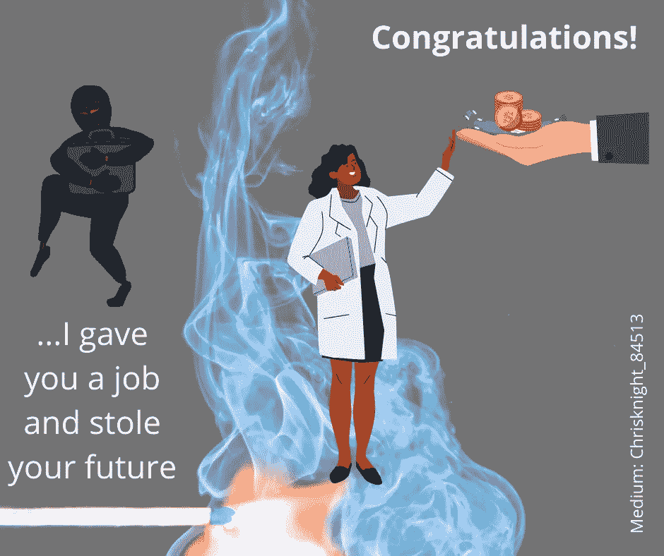

# 种族主义是金融不稳定的主要种族指标

> 原文：<https://medium.datadriveninvestor.com/racism-the-leading-racial-indicator-to-financial-instability-5bcdd0c833d9?source=collection_archive---------19----------------------->

## 人们经历分心，沸腾他们的情绪，让无情的机会篡夺人民的财务未来。

Source: Self Created Image with Canva

真理有时是一个晦涩的话题。通常，我们寻找藏在阳光下的光。当人们寻找不合理行为的意义时，领导者会变得不自在。避免财务责任的最简单方法是提供社会责任。

在自大萧条以来最严重的金融危机期间，乔治·弗洛伊德的死成为新闻传播的病毒事件并非巧合。以下是对引发金融不稳定的种族歧视事件的简要回顾:

**百年趋势**

**领先种族指标** : 1905 年尼亚加拉运动。1905 年:W.E.B. DuBois、William Trotter 等人组织尼亚加拉运动。这些人一起放弃了布克·华盛顿的通融政策。布克·华盛顿在他的亚特兰大妥协演说中提出了这些观点。尼亚加拉运动是全美有色人种协进会的先驱。

主导事件 1907 年:[国会](https://www.thebalance.com/u-s-congress-definition-duties-effect-on-economy-3305980)创立了[美联储体系](https://www.thebalance.com/the-federal-reserve-system-and-its-function-3306001)。美联储是对纽约尼克博克信托公司倒闭的回应。1907 年经济衰退期间，股市暴跌。衰退将持续近一年。

领先的种族指标:1917 年种族主义:在伊利诺伊州东圣路易斯的种族骚乱中，白人袭击了非洲裔美国人。1917 年的移民法案，也被称为亚洲禁区法案，规定了一个读写测试。该法案还建立了亚洲禁区。这个区域限制来自南亚、东亚和太平洋岛屿的移民。唯一的例外是日本和某些美国领土，如关岛和菲律宾。受限制的地理区域是世界上许多佛教徒、印度教徒、穆斯林和锡克教徒的家园。目的是将这些宗教团体拒于美国之外。琼斯法案也使有资格服兵役的波多黎各人成为美国公民。琼斯法案并没有使波多黎各人有资格在全国选举中投票。琼斯法案是选举中普遍歧视的基础。

 [## 如果资本主义失败了，那么还有什么选择呢？数据驱动的投资者

### 在当前政治领域的修辞之旅中，我们都可以面对面地接触到流行词汇，如…

www.datadriveninvestor.com](https://www.datadriveninvestor.com/2020/03/16/if-capitalism-is-a-failure-then-what-is-the-alternative/) 

主要事件:1919 年的股市崩盘。从 1919 年到 1922 年，企业破产率增加了两倍。企业倒闭率从每 10，000 家企业中的 37 家飙升至 120 家。避免破产的企业经历了 75%的利润下降。(资料来源:安东尼·帕特里克·奥布赖恩(1997 年)。“1920 年至 1921 年的大萧条”。在大卫·格拉斯纳，托马斯·f·库利(编辑。).商业周期和萧条:百科全书。纽约:加兰出版社。第 151-153 页。)

领先的种族指标:种族不公正 1943-1944 年的暴乱。1943 年:底特律的白人暴徒谋杀了 34 名非洲裔美国人。洛杉矶的白人暴徒袭击年轻的墨西哥人，导致著名的 Zoot Suit 暴动。警察只逮捕墨西哥青年，不逮捕白人。1944 年:Korematsu 诉美国，一个里程碑式的案件，裁定导致日裔美国人被拘留的驱逐令不违宪。

主要事件:1945 年衰退:这次衰退持续了 8 个月，从 2 月持续到 10 月，尽管对经历过的人来说感觉时间更长。GDP 持续下降，直到 1946 年达到-11.6%。这是第二次世界大战复员和军事武器需求急剧下降的自然结果。尽管商业支出强劲，但政府支出也有所下降。

**领先的种族指标**:废除种族隔离的尝试。1957 年:九名黑人学生试图废除小石城全白人中心高中的种族隔离政策。奥维尔·福伯斯州长下令禁止黑人参加。艾森豪威尔总统派联邦军队代表学生进行干预，允许学校入学。

主导事件:1957 年经济衰退。在这次衰退中，从 1957 年 8 月到 1958 年 4 月，1957 年第四季度 GDP 下降了 4.1%。1958 年，Q1 的国内生产总值又下降了 10%。失业率在 1958 年 7 月达到了 7.5%的峰值。美联储的[紧缩性货币政策](https://www.thebalance.com/contractionary-monetary-policy-definition-examples-3305829)被认为是经济放缓的原因。

主要种族指标 : 1960 年非暴力协调委员会(SNCC)。四名黑人学生开始在北卡罗来纳州格林斯博罗的伍尔沃斯午餐柜台静坐示威。六个月后，同样的四个学生终于被送达。学生静坐示威在整个南方仍在继续。这些静坐示威被广泛宣传，导致抗议和骚乱，但最终获得成功。静坐抗议取消了游泳池、公园、剧院、图书馆和其他公共设施的种族隔离。学生非暴力协调委员会(SNCC)的成立为年轻的黑人在非裔美国人民权运动提供了一席之地。约翰·肯尼迪，第一个天主教徒，被选为美国总统

主导事件:1960 年经济衰退。从 1960 年 4 月开始，这场衰退持续了 10 个月。衰退持续到 1961 年 2 月。1960 年 Q2 的国内生产总值为负 2.1%。第三季度国内生产总值增长 2.0%，但第四季度下降至-5.0%。失业率在 1961 年 5 月达到了 7.1%的峰值。约翰·肯尼迪总统用刺激支出结束了经济衰退。肯尼迪的对手理查德·尼克松声称经济衰退使他输掉了选举。尼克松在这段时间是副总统，所以选民指责共和党造成的。

**主要种族指标** : 1970 年:约翰逊总统签署了 1968 年民权法案，宣布住房融资、销售和租赁中的歧视为非法。国民警卫队被部署到杰克逊州立大学和肯特州立大学，以镇压学生抗议越南战争和种族歧视。(两所学校都有学生中枪。)

主导事件:1973 年经济衰退。这次衰退持续了 16 个月，从 1973 年 11 月到 1975 年 3 月。石油输出国组织(石油输出国组织)的 T4 因油价翻了两番而受到指责。

**领先种族指标**。1982 年的种族主义谋杀。底特律失业的汽车工人将失业归咎于日本人。紧张局势导致文森特·陈被谋杀，他是一个被误认为是日本人的美籍华人。这起谋杀引发了广泛的社会动荡和新闻报道。

主要事件:20 世纪 80 年代美国最严重的五次金融衰退。在此期间，经济遭受了两次衰退的双重影响。第一次衰退发生在 1980 年上半年。第二次衰退持续了 16 个月。第二次衰退从 1981 年 7 月持续到 1982 年 11 月。人们指责美联储通过提高利率来对抗通货膨胀。加息减少了商业支出。伊朗的石油禁运减少了美国的石油供应，加剧了经济状况。禁运使价格创历史新高。GDP 在 12 个季度中有 6 个季度是负增长。最糟糕的负季度是 1980 年的 Q2，为负 8.0%。直到 2008-2009 年的衰退，这是自大萧条以来最严重的季度下滑。

**领先种族指标**。罗德尼·金。1992 年:洛杉机几十年来的第一次骚乱，起因是四名白人警察因殴打非裔美国人罗德尼·金的录像被判无罪。

龙头事件。1990-1992 年储蓄贷款危机后的经济衰退。这次衰退持续了 9 个月，从 1990 年 7 月到 1992 年年中。1989 年的[储蓄和贷款危机](https://www.thebalance.com/savings-and-loans-crisis-causes-cost-3306035)被广泛认为是导致经济衰退的原因。1990 年第四季度国内生产总值为-3.6%，1991 年 Q1 为-1.9%。1992 年 6 月，失业率达到 7.8%。

**主要种族指标**:2006 年 7 月 30 日，六名同性恋男子被人用棒球棍和刀子袭击。袭击发生在这些人离开加州圣地亚哥同性恋骄傲节之后。一名受害者伤势严重，接受了广泛的面部重建手术。三名男子承认与袭击事件有关。所有罪犯都被判入狱。一名 15 岁少年也认罪。大范围的 LGBT 抗议发生了，为非歧视运动，“不问不说”变得高度政治化。

龙头事件。2007 年至 2009 年金融房地产崩溃。不用说，我们都经历了危机。这是我们对[次贷危机](https://www.thebalance.com/subprime-mortgage-crisis-effect-and-timeline-3305745)的记忆。不负责任的做法导致了 2007 年的全球银行信贷危机。

**总之**

历史告诉我们事件经常重复。*新闻的焦点是社交，但隐藏的议程是你的金融资产*。记住，在资本主义社会，要获得财富，你必须先获得它。对立政党制度是通过减少一方来增加另一方而存在的。

> 种族事件的正义不是金融崩溃的催化剂。相反，种族事件经常被当权者用来转移人们对其他单独引起的问题的注意力，以最小化对更糟糕行为的责任。

最成功的小偷会从那些不锁门的人那里偷东西。在社会动荡期间，人们敞开金融大门，去敲紧锁的社会大门。

目前，有些人掩盖金融失误，逃避不负责任的决定，并运行你的资产到地面，以增加他们的财富。历史上最大的财富转移正在发生。不要把目光从奖品上移开。

*社会不公需要正义*。

> 不幸的是，当坏人需要从你身上拿走某些东西时，社会正义通常就会出现。

天下没有“免费的午餐”。自由是有代价的。通常社会改革的成本是你的银行账户。试着不要迷失在人群中，以牺牲自己的财务前途为代价去解放他人。每个人都应该得到公正。当你追求正义时，看好你的钱包。坏演员带着你的资产逃走了。保护自己，不要在市场复苏时买入。长期来看，这里有一个熊市。乔治·弗洛伊德转移了市场的注意力。乔治应该得到公正，但没有人应该得到市场不公。

祝你知识成功！

****

关于 Christopher:Christopher Knight Lopez 是一名职业骗子，在他的职业生涯中，他与职业企业家进行了广泛的合作。在他 14 年的职业生涯中，Christopher 已经开了超过 7 家公司。克里斯托弗的目的是利用各种市场驱动的机会。Christopher 是注册项目经理(MPM)和认证财务分析师(AFA)。Christopher 之前通过了 65 系列证券执照考试。克里斯托弗也有他的总路线——人寿、意外、健康和健康维护组织。Christopher 已经管理了总计 2 . 86 亿美元的报告管理资产和建议资产。Christopher 在 29 个国家有工作经验，为各种业务筹集了超过 5000 万美元，在他的个人职业生涯中总收入超过 1300 万美元。Christopher 曾在高科技行业工作:生物技术、金融、证券、制造、房地产和住房抵押贷款。克里斯托弗是一名美国空军老兵。克里斯托弗热爱家庭、竞技体育、钓鱼、武术，并倡导企业家精神。克里斯托弗为崭露头角的企业家提供自助课程。克里斯托弗对导师的热情来自于企业家和骗子需要指导的信念。这个世界充满了关于企业家身份的相互矛盾的信息。在[www.christopherklopez.com 看更多。](http://www.christopherklopez.com.)

免责声明:这些信息并不意味着是一种投资建议或财务建议。不要把这种情况应用到你自己的个人环境中。各种风险包括:商业风险、投资风险、政治风险和其他风险。此信息仅用于信息和教育目的。请不要向作者寻求任何投资策略或哲学。针对自己的情况，请咨询自己的理财顾问或法律顾问。不是任何形式的推荐或认可。