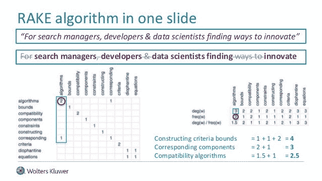

# RAKE:快速自动关键词提取算法

> 原文：<https://medium.datadriveninvestor.com/rake-rapid-automatic-keyword-extraction-algorithm-f4ec17b2886c?source=collection_archive---------0----------------------->

**自然语言处理分析的最基本和初始步骤是关键词提取**，因为没有关键词提取，就不可能进一步前进。众所周知，在自然语言处理中，我们有很多算法可以帮助我们提取文本数据中的关键词，但是**我们知道最常用的算法吗？**

大多数数据科学家和机器学习开发者使用的一些**主要文本处理算法**是


## TF-IDF

## 文本排名

## 耙子

# 什么是 RAKE 算法？



Rake，也称为**快速自动关键字提取**是一种非常高效的关键字提取算法，它对单个文档进行操作，以实现对**动态集合的应用；它**还可以非常容易地应用于新的领域，并且在处理多种类型的文档时也非常有效，尤其是遵循**特定语法约定的文本类型**。

Rake 基于这样的观察，即关键字经常包含多个带有标准标点符号**的单词**或**停用词**，或者我们可以说像**、【of】、【the】**等具有**最小词汇意义**的功能词。停用词通常在所有的**信息系统**中被丢弃，也不包括在各种文本分析中，因为它们被认为是无意义的。被认为带有与文本相关的含义的词被描述为带有的**内容，并被称为**内容词**。**

[](https://www.datadriveninvestor.com/2020/02/22/algorithms-for-fairness/) [## 公平算法|数据驱动的投资者

### 许多人都有算法偏见。软件工程师关心算法偏差，因为我们关心…

www.datadriveninvestor.com](https://www.datadriveninvestor.com/2020/02/22/algorithms-for-fairness/) 

**RAKE 算法**的输入参数包括停用词列表以及一组短语分隔符和单词分隔符。它使用**停用词**和**短语分隔符**将文档分割成候选关键词；这些候选关键字主要是帮助开发人员提取从文档中获取信息所需的准确关键字的单词。

**要安装耙子，使用给定命令:**

```
$ git clone [https://github.com/zelandiya/RAKE-tutorial](https://github.com/zelandiya/RAKE-tutorial)
```

**用于在 python 代码中导入 rake:**

```
import rake 
import operator
```

**加载文本并在其上应用耙子:**

```
filepath = "keyword_extraction.txt"rake_object = rake.Rake(filepath)text = "Compatibility of systems of linear constraints over the set of natural numbers. Criteria of compatibility of a system of linear Diophantine equations, strict inequations, and nonstrict inequations are considered.Upper bounds for components of a minimal set of solutions and algorithms of construction of minimal generatingsets of solutions for all types of systems are given. These criteria and the corresponding algorithms for constructing a minimal supporting set of solutions can be used in solving all the considered types of systems and systems of mixed types."sample_file = open(“data/docs/fao_test/w2167e.txt”, ‘r’)
text = sample_file.read()
keywords = rake_object.run(text) print “Keywords:”, keywords
```

## 候选关键字

如上所述，我们知道 RAKE 通过在停用词和短语分隔符的帮助下解析文档，将承载单词的主要内容分类为候选关键字。这基本上是通过以下一些步骤来完成的，首先，通过**特定单词分隔符**将文档文本分割成单词的**数组，其次，在**短语分隔符**和**停止单词位置**处，将该数组再次分割成连续单词**的**序列。最后，位于相同序列中的单词被分配到文本中的相同位置，并且一起被认为是候选键。**

```
sentenceList = rake.split_sentences(text)stopwordpattern = rake.build_stop_word_regex(filepath)phraseList = rake.generate_candidate_keywords(sentenceList, stopwordpattern)
```

## 关键词得分

在从文本数据中识别出所有候选关键词后，生成一个单词共现的**图，该图计算每个候选关键词的得分，并被定义为**成员单词得分**。在这个图的帮助下，我们基于图中顶点的**度**和**频率**来评估**用于计算单词分数的几个度量**。**

```
wordscores = rake.calculate_word_scores(phraseList)keywordcandidates = rake.generate_candidate_keyword_scores(phraseList, wordscores)
```

主要指标如下:

***词频(freq(w))***

***字度(deg(w))***

***度与频率之比(deg(w)/freq(w))***

***(Deg (w))。***

*(****【Freq(w))***偏爱频繁出现的单词，而不考虑它们共现的单词数。

***(Deg(w)/Freq(w)***偏爱主要出现在较长候选关键字中的单词。

每个候选关键词的最终得分计算为其成员词得分的**总和。**

## 相邻关键字

我们知道 Rake 是按停用词拆分候选关键词的，所以提取的关键词不包含**内部停用词；因此**，人们表示有兴趣将包含内部停用词的关键词识别为**邪恶轴心**。在同一文档中以相同的顺序查找彼此至少相邻两次的关键字。为此，将创建一个新的候选关键字，作为这些关键字和内部停用词的组合。这一部分要明白，只提取了极少数的**关联词**，增加了**的显著性**。

## 提取的关键词

在计算候选关键词得分之后，从文档中选择前 **T 个候选关键词**。 **T 值**是**图中字数的三分之一**。

```
sortedKeywords = sorted(keywordcandidates.iteritems(),key=operator.itemgetter(1), reverse=True)
totalKeywords = len(sortedKeywords)for keyword in sortedKeywords[0:(totalKeywords / 3)]: 
      print “Keyword: “, keyword[0], “, score: “, keyword[1]
```

**预期输出:**

```
Keywords: Keywords: [(‘household food security’, 7.711414565826329), (‘indigenous groups living’, 7.4), (‘national forest programmes’, 7.249539170506913), (‘wood forest products’, 6.844777265745007)…Keyword: minimal generating sets , score: 8.66666666667Keyword: linear diophantine equations , score: 8.5
Keyword: minimal supporting set , score: 7.66666666667 
Keyword: minimal set , score: 4.66666666667 
Keyword: linear constraints , score: 4.5
Keyword: upper bounds , score: 4.0
Keyword: natural numbers , score: 4.0
Keyword: nonstrict inequations , score: 4.
```

**使用以下命令评估您的 Rake 算法:**

```
$ python evaluate_rake.py data/docs/fao_test/ 10 …Precision 4.44 Recall 5.17 F-Measure 4.78
```