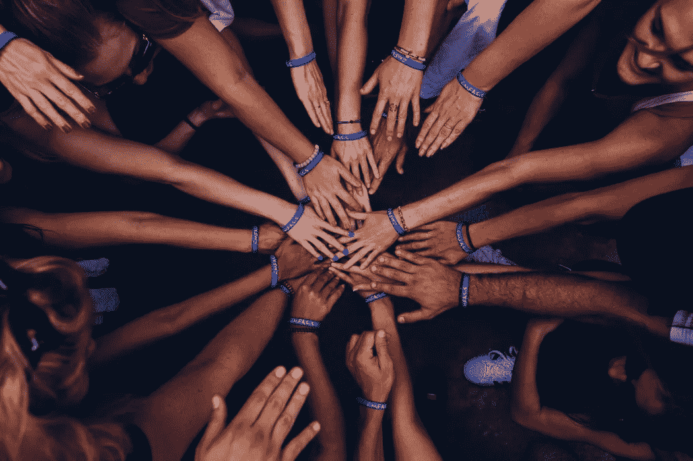

# 猖獗的资本主义也不是答案——共同担保才是

> 原文：<https://medium.datadriveninvestor.com/rampant-capitalism-is-not-the-answer-either-mutual-guarantee-is-fe3b2384733f?source=collection_archive---------9----------------------->

**来自互联网的意见:**

*"关于"创造一个能为全世界所有失业人员工作并确保其尊严和基本收入的方案"。显而易见的答案是资本主义猖獗。没有精英，没有统治者，没有君主，没有知识分子，没有政府可以把尊严和基本收入强加给所有人。在人类的世界里，我们最接近这一点的是猖獗的资本主义。它奖励工作和风险。人类，通过一群人道主义者(无论是宗教还是其他)，将试图帮助那些无法自助的人，因为这是我们社会关系的固有组成部分。”*

# 资本主义符合我们固有的本性

这种观点不无道理。

在我们所有的“个人真实”之后，我们以一种“公正”的方式与世界相关的方式是下面的公式:**“我的就是我的，你的就是你的”**。换句话说，我们都有类似的机会，我们面前都有一个自由的空间，有无限的机会和无限的资源，每个人都可以根据自己的能力和力量取得成功，而没有个人和国家的干涉。

猖獗的资本主义是一种经济心理，它迎合了我们以自我为中心、自私自利、贪得无厌、不断增长的享乐欲望。

所以这一切听起来很完美，起初几乎是田园诗般的。

# 然而，这个观点至少有三个问题。

1.  人类生活不是无休止地积累、积累物质财富、利润和成功创业。我们存在于大自然的完全整合和相互依存的系统中，在这个系统中，进化决定了一个独特的、无与伦比的人类角色，即我们的目的。不管我们是否同意，进化将继续推动我们，直到我们达到那个目标。 ***这个目标是人类通过变得与大自然的品质相似而融入大自然的系统——通过无私、相互负责和互补的相互联系与合作，在全球人类社会中无缝地相互融合。*** 除此之外，我们做什么、为什么工作、收集什么都是次要的，所有这些次要活动都必须保持在自然必需品和可用资源的最佳参数范围内，以保持自然的平衡和动态平衡。
2.  我们并不是生活在一个资源无限的世界里。我们生活在一个封闭的、有限的自然系统中，这个系统或多或少已经饱和了。当然，这给了一些人通过战争或其他方式有目的、有系统地“挑选”人类的想法。但是让我们说它不是一个积极的、令人愉快的“解决方案”,自然进化也不包含这样的“解决方案”。
3.  我们天生以自我为中心、贪得无厌、自圆其说的天性无法遵守不干涉他人、让他人获利、随心所欲成功的原则。我们与生俱来的天性，其实从挫败、羞辱他人、看到他人的损失、失败中获得的快乐，要比自己的收获、成功中获得的快乐更大。因此，不管事情是如何开始的，在我们迄今为止建立的每一个文明中， ***“我的就是我的，你的就是你的”的原则已经变成了“我的就是我的，你的也是我的”。***

# 结果，资本主义(任何形式)被证明是不成功的，就像共产主义、社会主义或任何其他形式(我们在历史上尝试过的各种形式的组合)一样，是一个公平、和平、可持续和进步的人类社会的基础和经济体系。

我们已经到达了一个独特的时代，所有积累的历史经验和生活，实时情况向我们证明，我们必须寻找一些全新的东西，因为无论我们根据我们固有的自私，自我辩护，古怪和个人主义的意识，对现实的感知做了什么尝试都失败了。我们已经完全耗尽了自我中心的发展，我们正在梦游般地走向一场似乎不可避免的全球性爆炸，我们之前提到过的“淘汰”,但其规模如此之大，以至于没有人能够再保证自己的生存。

幸运的是，我们有一条退路，我们有一个还没有尝试过的模板，尽管这个模板需要我们从根本上改变自己。

# 解决方法是遵循自然的完美模板

如前所述，我们在自然系统中并不是独立存在的，我们在自然中有一个预定的角色和目的，通过与自然的特性相似来融入自然。它是大自然的完美模板，将帮助我们重建人类社会，并找到能够同时满足我们固有的自然倾向和自然法则的经济体系。

在某种程度上，我们可以继续遵循我们的“资本主义原则”,竞争，不断工作，努力，投资获利，以增长为目标，永无止境的发展。但是，我们需要为他人、为整个集体积累利润，而不是以牺牲他人为代价为自己积累利润。

 [## 教科书行业如何最终被颠覆，并将继续改变|数据驱动…

### 就此而言，教科书产业在美国乃至全世界都有着悠久的历史。事实上，他们已经…

www.datadriveninvestor.com](https://www.datadriveninvestor.com/2018/09/25/how-the-textbook-industry-has-finally-been-disrupted-and-will-continue-to-change/) 

当然，起初这听起来很疯狂，很荒谬！但是当——通过一种独特的、有目的的和高度实用的教育方法——我们开始理解，而且感觉到，我们被锁在一个单一的、完全整合的和相互依赖的系统中，没有任何断开的机会，这将开始有意义。

# 互保“说得通”

如果我的生命、我的健康、繁荣和生存与集体的生命、健康、繁荣和生存错综复杂地交织在一起——就像我们生物体的细胞和器官一样——突然之间，尽我所能为他人、为整个集体服务变得非常有意义，而且是快乐地、自愿地、没有任何强迫地去做！

**这种“经济”、“生活方式”被称为“相互保证”，而这正是任何封闭的、有生命的自然系统(包括我们自己的生物机体)工作和生存的方式。**

***因此，解决方案是一种特殊的、“全球的、整体的教育方法”，它可以帮助我们感受、理解、完全接受我们在小的、有条不紊的组织环境中的“细胞”的相互融合和相互依赖。然后，基于有意识的理解和有形的、现实的感觉，人们会心甘情愿地接受并在这些小“细胞”中实现相互保证，这将成为新人类社会的基石。***

