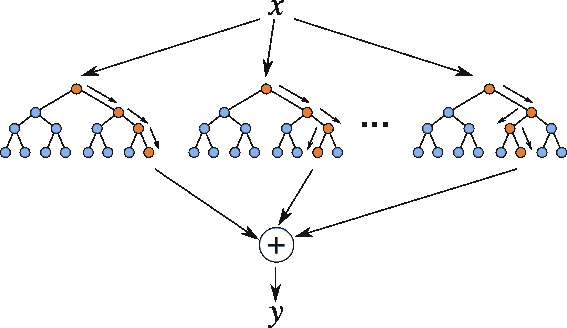

# 随机森林:利弊

> 原文：<https://medium.datadriveninvestor.com/random-forest-pros-and-cons-c1c42fb64f04?source=collection_archive---------2----------------------->

随机森林是一种监督学习算法。它用决策树的集合构建了一个森林。这是一种易于使用的机器学习算法，即使没有超参数调整，大多数时候也能产生很好的结果。

在这篇文章中，我将讨论使用随机森林的利与弊:

## 赞成的意见

*   随机森林可用于分类和回归任务。
*   随机森林适用于分类数据和数值数据。通常不需要对变量进行缩放或变换。
*   随机森林隐式地执行特征选择并生成不相关的决策树。它通过随机选择一组特征来构建每个决策树。当您必须处理数据中的大量要素时，这也使它成为一个很好的模型。
*   随机森林在一定程度上不受离群值的影响。这是通过宁滨变量来实现的。
*   随机森林可以很好地处理线性和非线性关系。
*   随机森林通常提供较高的准确性，并且很好地平衡了偏差-方差权衡。由于该模型的原则是对其构建的多个决策树的结果进行平均，因此它也会对方差进行平均。

 [## 一瞬间学会数据科学！？数据驱动的投资者

### 在我之前的职业生涯中，我是一名训练有素的古典钢琴家。还记得那些声称你可以…

www.datadriveninvestor.com](https://www.datadriveninvestor.com/2020/07/23/learn-data-science-in-a-flash/) 

## 骗局

*   随机森林不容易解释。它们提供了特征的重要性，但是它没有提供作为线性回归的系数的完全可见性。
*   对于大型数据集，随机森林的计算量可能很大。
*   随机森林就像一个黑盒算法，你很难控制模型做什么。

*来源:*

默西，施里拉塔。如何赢得数据科学面试？新学位出版社。Kindle 版。

## 获得专家视图— [订阅 DDI 英特尔](https://datadriveninvestor.com/ddi-intel)