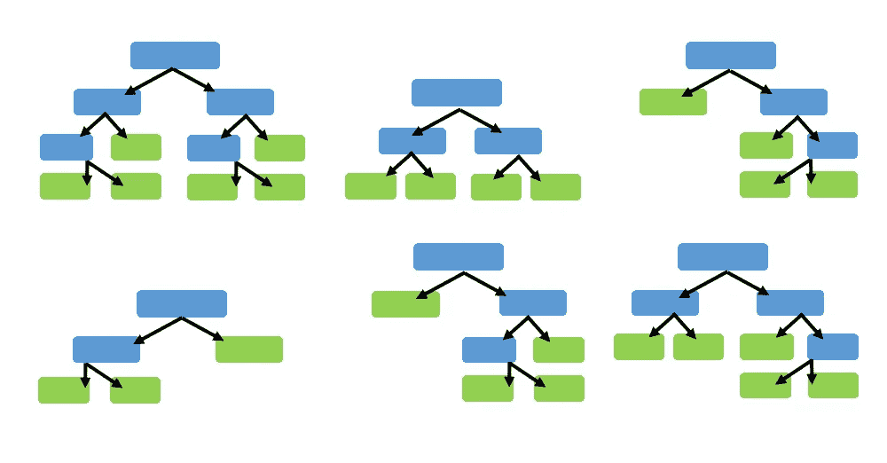
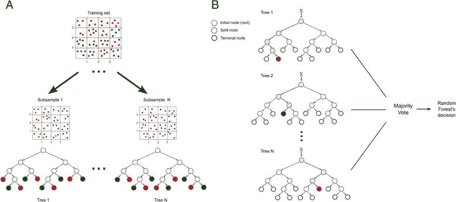

# 用 python 实现简单直观的随机森林方式

> 原文：<https://medium.datadriveninvestor.com/random-forest-simple-and-intuitive-way-with-python-45b53a8ba892?source=collection_archive---------4----------------------->

## 随机森林是机器学习中使用的一种强大而精确的方法，为了在机器学习中建立一个坚实的背景，随机森林是必须的。

the image can be found [here](https://i1.wp.com/www.forest-monitor.com/wp-content/uploads/2018/07/NS_mixed_forest.jpg?fit=3872%2C2592&ssl=1)

**决策树学习**是一种监督学习算法(有一个预定义的目标变量)，主要用于分类问题，它是一个非循环图，可以用来做决策。在图的每个分支节点中，检查特征向量的特定特征 j。如果特征值低于特定阈值，则跟随左分支；否则，遵循正确的分支。当到达叶节点时，将决定该示例所属的类。

你可以找到我关于决策树的帖子:

 [## 用 python 实现决策树简单直观的方法

### 决策树是机器学习的革命性算法之一，每个初学者都需要对决策树的概述

medium.com](https://medium.com/@zahraelhamraoui1997/decision-trees-easy-intuitive-way-with-python-23131eaad311) 

**随机森林**是一种监督学习算法。它构建的“森林”是决策树的集合，通常用“打包”方法训练。bagging 方法的一般思想是学习模型的组合增加了整体结果。随机森林的一个大优势是它可以用于分类和回归问题，这形成了当前机器学习系统的大多数。让我们看看分类中的随机森林，因为分类有时被认为是机器学习的构建块。下面你可以看到有两棵树的随机森林的样子

The image can be found [here](https://www.emutechnology.com/wp-content/uploads/2018/08/Random-Forest.png)

# 随机森林是如何训练的？

**随机森林**通过套袋方式训练。Bagging 或 Bootstrap 聚合包括随机采样训练数据的子集，**将模型**拟合到这些较小的数据集，并聚合预测。这种方法允许在训练阶段重复使用几个实例，假设我们是用替换进行采样。树打包包括对训练集的子集进行采样，为每个子集拟合一个决策树，并汇总它们的结果。

the image can be found [here](https://www.researchgate.net/profile/Mariana_Recamonde-Mendoza/publication/280533599/figure/fig5/AS:267770621329410@1440852899493/Random-forest-model-Example-of-training-and-classification-processes-using-random.png)

**随机森林**方法通过对特征空间应用 bagging 方法，引入了更多的随机性和多样性。也就是说，它不是贪婪地搜索最佳预测值来创建分支，而是随机采样预测值空间的元素，从而以相等或更高的偏差为代价增加更多的多样性并减少树的方差。这个过程也被称为“**特征打包**”，正是这种强大的方法产生了一个更健壮的模型。

 [## 数据驱动的投资者|微软比 Chrome 有“优势”

### 简史我从来不是浏览器的粉丝，确切地说，我只是一个浏览器的粉丝，Chrome。这是我的…

www.datadriveninvestor.com](https://www.datadriveninvestor.com/2020/03/29/microsoft-having-an-edge-over-chrome/) 

# 如何用随机森林进行预测？

请记住，在决策树中，一个新的实例从根节点到底部，直到它被分类到叶节点中。在随机森林算法中，每个新数据点都经历相同的过程，但现在它访问集合中所有不同的树，这些树是使用训练数据和特征的随机样本生长的。根据手头的任务，用于聚合的函数会有所不同。对于分类问题，它使用单个树预测的模式或最频繁的类(也称为多数投票)，而对于回归任务，它使用每棵树的平均预测。

# 随机森林方法的缺点:

尽管随机森林是机器学习中使用的一种强大而准确的方法，但您应该始终交叉验证您的模型，因为可能会出现过度拟合。此外，尽管其鲁棒性，随机森林算法是缓慢的，因为它必须在训练阶段生长许多树，正如我们已经知道的，这是一个贪婪的过程。

# Python 实现

# 结论:

随机森林是一个很好的算法，可以在模型开发过程的早期进行训练，看看它的表现如何。它的简单性使得建立一个“坏的”随机森林成为一个困难的命题。

我希望我能向你澄清一点随机森林是基本算法之一，我会上传更多的算法解释，因为为什么不:)

这些是我个人的研究，如果你有任何意见，请联系我。

[Github](https://github.com/zahrael97) ， [LinkedIn](https://www.linkedin.com/in/zahraelhamraoui97/) ， [Zahra Elhamraoui](http://zahraelhamraoui1997@gmail.com/) ， [Upwork](https://www.upwork.com/o/profiles/users/~01e52291fa456a8934/)

参考资料:

[1] [随机森林是如何训练的？](https://www.kdnuggets.com/2017/10/random-forests-explained.html)

[2] [随机森林](https://builtin.com/data-science/random-forest-algorithm)