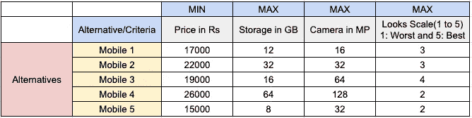
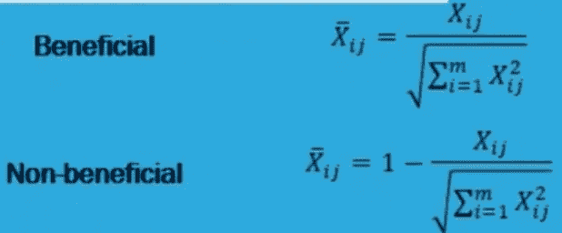
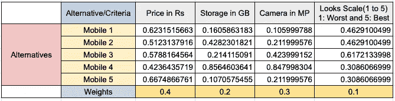
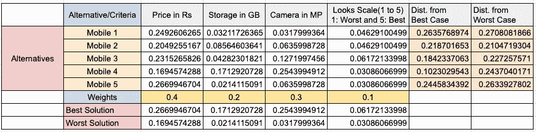
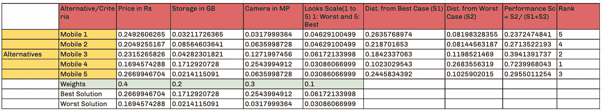
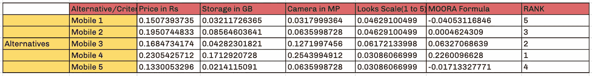

# 多准则决策下的优中选优(MCDM)——第二部分

> 原文：<https://medium.datadriveninvestor.com/ranking-and-selection-of-the-best-with-multi-criteria-decision-making-mcdm-part-two-78b3adc6cca5?source=collection_archive---------1----------------------->

## "寻找你的选择，挑选最好的，然后跟着它走."—帕特·莱利

Rank Higher

**第一部分链接**

 [## 基于多准则决策方法的实体排序——第一部分

### 你不能停留在排名第一的位置上，因为排名第二的人没有休息。他仍在改进他的网站——瑞安·琼斯

medium.com](https://medium.com/datadriveninvestor/ranking-of-entities-with-multi-criteria-decision-making-methods-part-one-706e6ef28719) 

**简短回顾:**在第一部分中，我们讨论了 MCDM 如何帮助我们解决排名和选择问题。此外，我们详细讨论了如何 WSM，WPM，层次分析法，修订层次分析法在实践中使用移动排名的例子。

从我们停下来的地方继续，快速浏览一下我们将在这个博客中讨论的内容:其他 MCDM 技术的工作——**伊莱克特**、**托普西斯**和**莫拉**。

## 四。ELECTRE(消除和选择翻译现实；英文翻译自法文原文)的方法

ELECTRE 方法的基本概念是通过使用**两两比较**分别在**每一个标准下的备选方案中处理**【等级关系】。****

**通过对备选方案的等级关系的连续评估，ELECTRE 方法得出了所谓的一致指数，该指数定义为支持备选方案 *Aj* 的等级高于或优于备选方案 *Ak、*的结论的证据数量，以及不一致指数，即一致指数的对应部分。**

**最后，ELECTRE 方法产生了一个二进制系统，在两个选择之间有一个等级关系。**

**通常，这种技术用于**从选项列表中排除不可接受的选项**。排除后，我们可以使用另一个 MCDA 来选择最佳选项。以前使用 Electre 方法的优点是，我们可以使用另一个 MCDA，它具有一组有限的备选方案，从而节省大量时间。**

## **动词 （verb 的缩写）TOPSIS(根据与理想解的相似性进行优先排序的技术)方法**

**该方法基于代表**“接近理想值”**的聚合函数。**

**TOPSIS 基于这样的概念，即所选择的备选方案与理想解之间的几何距离应该最短，与最差解之间的欧氏距离应该最长。这里，理想的解决方案是从有益属性中取**最大值，从非有益属性**中取**最小值(反过来是最坏情况的解决方案)。****

**TOPSIS 的一个假设是，标准是单调递增或递减的，并且还允许在标准之间进行权衡，其中一个标准中的差结果可以被另一个标准中的好结果否定。**

****示例**:以第一部分博客中的手机选择示例为例。目标是找到最物有所值的手机，其标准为[价格、存储、相机、外观]→[最低、最高、最高、最高]**

****

**Alternate Matrix**

**现在，我们对这个备选矩阵进行向量归一化(使用下面的公式):**

****

**Vector Normalization**

****

**After Vector Normalization Alternate Matrix**

****加权向量归一化备选矩阵**，即将每个准则的权重乘以向量归一化值后。**

****

**Weighted Vector Normalized Alternate Matrix**

**现在，我们形成理想的最佳解决方案和理想的最差情况解决方案，并从两者(最差和最佳)中找出具有替代选项的欧几里德距离。**

****

**Euclidean Distance Calculation**

****根据绩效得分查找排名****

****

**Ranking**

## **不及物动词基于比率分析的多目标优化方法**

**它简单易行，对许多研究问题非常有效。**

**莫拉公式**

****

**MOORA Formula**

**第一部分是我们想要最大化的有益属性的加权和，第二部分(减法部分)是我们想要最小化的非有益属性的加权和。**

****注意**:这里在矢量归一化中，我们使用标准公式，不考虑有益或非有益属性。**

**在交替矩阵归一化之后，我们应用 Moora 公式来寻找秩。**

****

**Ranking using Moora Formula on a vector normalized weighted alternate matrix**

## **结论**

**我讨论了 6 种不同的算法，用不同的规范化技术进行排序和选择。此外，还分享了何时使用哪种策略，以及使用特定策略的缺点。对于大多数选择问题，TOPSIS 和 MOORA 会为你工作。对于选择问题，你想消除最不利的选择，我建议使用 ELECTRE 方法。当所有标准的量纲都相同时，可以考虑 WSM 方法。**

## **我希望你能从这个博客中学到一些新的东西。如果你喜欢，点击👏并分享这篇文章。敬请期待下一期！**

** [## Shaurya Uppal -数据科学家- epiFi | LinkedIn

### 连接/关注数据科学领域的一些有见地的更新。

www.linkedin.com](https://www.linkedin.com/in/shaurya-uppal/) 

## 访问专家视图— [订阅 DDI 英特尔](https://datadriveninvestor.com/ddi-intel)**