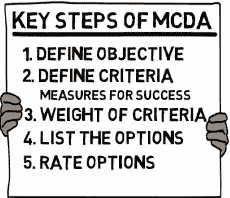
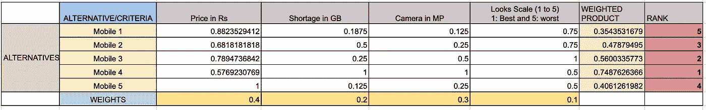

# 用多准则决策方法对实体进行排序(MCDM)——第一部分

> 原文：<https://medium.datadriveninvestor.com/ranking-of-entities-with-multi-criteria-decision-making-methods-part-one-706e6ef28719?source=collection_archive---------6----------------------->

Ranking with MCDM

> 你不能停留在排名第一的位置上，因为排名第二的人没有休息。他仍在改进他的网站——瑞安·琼斯

在日常生活中，我们都会遇到不同的多准则决策问题。例如——🛍购物:在 x 种候选产品中，我应该购买哪一种？

排名问题是数据科学家要解决的最有趣的问题。❤️
就像这样，我最近遇到了一个排名问题 ***我们想对用户进行排名，选出对我们的业务最有利的前 k 名*** 。对于这个问题，还有一个问题是，现在我没有数据可以处理，这意味着这是一个冷启动问题，数据会随着时间的推移而流入。

知道了我没有训练数据点的事实，我确信会有一个更好的方法来处理多标准的排序问题，并看到了这篇有趣的出版物“Triantaphyllou，E. (2000)”。多准则决策方法。在*多标准决策方法:比较研究*(第 5-21 页)。马萨诸塞州波士顿斯普林格其中讲授了**多准则决策方法(MCDM)**

 [## Shaurya Uppal 在 LinkedIn 上发表了一篇文章

### LinkedIn 学习#1💡:在任何业务中(电子商务、银行等。)我们都认为🤔为那些最了解我们的用户服务…

www.linkedin.com](https://www.linkedin.com/posts/shaurya-uppal_multi-criteria-decision-making-methods-activity-6710028008519962624-WebQ) 

## **摘要**

多准则决策(MCDM)或多准则决策分析(MCDA)被认为是一种复杂的决策工具，涉及定量和定性因素。

Key Steps

## 介绍

在定义了 MCDM 或 MCDA 的前四个关键步骤(如上图)后，在步骤 5 中，我们**处理数值以确定每个备选方案的排名。**

为了用多标准对不同实体进行处理和排序，我们可以使用以下算法:WSM、WPM、AHP、修正 AHP、ELECTRE、TOPSIS 和 MOORA 方法。

## 一、加权求和法

这是最简单也是最常用的。我们都在 ***中看到过这一点，我们的学校/大学成绩单*** 也是如此，目的是找出:
哪个学生在班上排名第一？
标准被定义为——学生的不同科目
标准的权重——是分配给特定科目的学分。

WSM 公式—

WSM formula

其中:A*WSM 分数是最佳方案的 WSM 分数，n 是决策标准的数量，aij 是根据第 j 个标准的第 I 个方案的实际值，Wj 是第 j 个标准的重要性的权重。

**如果不是这样，那么最后的结果就相当于*“苹果和橘子相加”***

 [## 一瞬间学会数据科学！？数据驱动的投资者

### 在我之前的职业生涯中，我是一名训练有素的古典钢琴家。还记得那些声称你可以…

www.datadriveninvestor.com](https://www.datadriveninvestor.com/2020/07/23/learn-data-science-in-a-flash/) 

## 二。加权乘积法

WPM 与上面的 WSM 非常相似，主要区别在于，在这个模型中，不是加法，而是乘法。

WSM Formula

我们可能会面临 INT 溢出的问题，因为我们要处理的是指数乘法，所以要对原始公式进行修改(添加对数):

WSM Formula Modified

注意:WPM 只给出了备选方案的性能值，而不是相对值，也就是说，我们在这里做的是分数排名。

## **三。层次分析法(**[**)AHP—方法**](http://web.cjcu.edu.tw/~lcc/Courses/TUTORIAL/AHP%20Tutorial.doc) **)**

AHP Method

在 AHP 方法中，我们对不同的备选方案进行两两比较，然后对它们进行排序。

AHP 方法发布了两次，第一个版本[Saaty，1980]声明以这样一种方式标准化替代矩阵，即每个标准的相对值总和为 1。

然后，Belton 和 Gear [1983]对这种 AHP 方法进行了修正，证明了每个标准的相对值总和等于 1 会导致排序不一致。他们建议将每个相对值除以相对值的最大值，而不是将 A1，A2，A3，…，Am 的相对值相加为 1。

AHP Formula

WSM 和层次分析法之间的相似之处是显而易见的。 **AHP 使用相对值而不是实际值**。因此，它可以用于一维或多维决策问题。

**AHP 为什么被修改的证明？**

Example of Alternate Matrix

**方法 1** —表示每个标准的相对值总和为 1。

通过方法 1 标准化后

Normalized Alternate Matrix

> AHP 得分— (0.45，0.47，0.08) → A2>A1>A3

在上面的矩阵中，我们引入一个新的备选项，比如说 *A4、*，它与 A2**相同**(即*A2*=*A4)*

> AHP 得分—(0.37，0.29，0.06，0.29)→ A1>A2=A4>A3

这造成了**排名不一致**，因为之前(在 A4 引入之前)我们说过 A2 > A1 和 A4 与 A2 相同，排名不应改变。

**方法 2** —提出将每个相对值除以相对值中的最大值。

通过方法 2 标准化后。

> AHP 得分(2/3，19/27，1/9，19/27) → A2=A4>A1>A3。

AHP 的方法 2 解决了排序不一致的问题，但许多研究人员质疑在决策过程中不应该考虑**相同的备选方案。**

## 让我们用目前所学的知识来解决一个问题

我想买一部新手机，在亚马逊上花 2-3 个小时，然后我就能列出 5 部最佳智能手机。对于这 5 部手机中哪一部最物有所值，我感到非常困惑。所以，我遵循我们学到的 MCDM 技术——

*   让我们构建一个备选矩阵，并定义判断智能手机的标准。
*   最佳手机的标准是[价格、存储、相机、外观]→[最低、最高、最高、最高]
*   在考虑了我的需求之后，我给每一个标准增加了权重。【价格，存储，相机，长相】→【0.4，0.2，0.3，0.1】(注:所有权重之和应等于 1)

Alternate Matrix

*   现在，我们需要标准化替代矩阵(使用下面的公式)。在我们的手机选择问题中，价格是非有利属性，而【存储、相机、外观】是有利属性。

Linear Normalization

*   标准化的替代矩阵—[注意:现在非有益属性的最佳值表示为 1，有益属性的最佳值也表示为 1。]

Normalized Matrix

*   **对该归一化矩阵应用加权求和法得到排序—**

WSM Ranking

*   **对这个归一化矩阵应用加权乘积法得到排序—**

WPM Ranking

**WSM、WPM 和 AHP 方法**简单，计算速度快，易于调整以适应许多规模的问题；不是数据密集型的。

在我的下一篇博客中，我们将讨论先进的 MCDM 方法 **ELECTRE、TOPSIS 和 MOORA 方法。我们还将对这些方法进行比较，以了解在问题中应该选择哪种方法。**

## 如果你喜欢这个博客，点击👏并分享这篇文章。敬请期待下一期！

 [## Shaurya Uppal -数据科学家- epiFi | LinkedIn

### 在 LinkedIn 上与我联系，了解一些有趣的数据科学知识。www.linkedin.com](https://www.linkedin.com/in/shaurya-uppal/) 

## 访问专家视图— [订阅 DDI 英特尔](https://datadriveninvestor.com/ddi-intel)