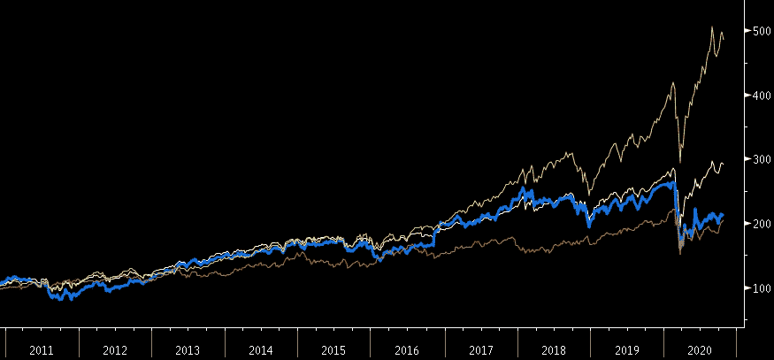

# d6tflow 量化投资快速原型

> 原文：<https://medium.datadriveninvestor.com/rapid-prototyping-for-quantitative-investing-with-d6tflow-3c238e272ffd?source=collection_archive---------7----------------------->



量化投资研究通常涉及管理复杂的数据依赖性和优化许多可调策略参数。d6tflow 是一个易于使用的 python 库，用于快速原型制作和实验管理，以管理量化投资研究工作流。

[](https://github.com/d6t/d6tflow) [## d6t/d6t 流量

### 对于数据科学家和数据工程师来说，d6tflow 是一个 python 库，它使得构建复杂的数据科学工作流…

github.com](https://github.com/d6t/d6tflow) 

所有代码都在 github 上[发布，你可以](https://github.com/d6tdev/d6tflow-binder-interactive/blob/master/example-trading.ipynb)[在这个互动笔记本](https://mybinder.org/v2/gh/d6tdev/d6tflow-binder-interactive/master?filepath=example-trading.ipynb)上试用。

# 为什么标准回溯测试代码不好

编写回溯测试的标准方式通常涉及函数，手动将数据缓存在 pickle 文件中，并到处传递参数。这很糟糕，因为:

*   必须手动跟踪功能、参数、文件
*   随着复杂性的增加，无法很好地扩展
*   比较不同模型/参数的输出很麻烦
*   其他人难以阅读和审计
*   生产成本高

# d6tflow 快速原型制作

与其写函数，量化投资代码不如写成一组任务，它们之间有依赖关系。那就是你的工作流程应该是一个 DAG。

这样做的好处是:

*   使用依赖项和参数轻松定义任务
*   智能运行具有依赖关系/参数的工作流
*   轻松比较不同模型/参数的结果
*   轻巧、易学但功能强大
*   代码伸缩性好，易于审计
*   快速生产

更多细节请看[你的机器学习代码可能不好的 4 个原因](https://github.com/d6t/d6t-python/blob/master/blogs/reasons-why-bad-ml-code.rst)

# d6tflow 的量化交易回溯测试示例

下面是一个典型的量化投资回溯测试的程式化例子。

通过 3 个简单的步骤，您将:

1.  定义回溯测试工作流程:获取宏观数据、生成交易信号、获取定价数据和执行回溯测试
2.  定义多种策略进行回溯测试:改变投资领域和回溯测试周期
3.  运行回溯测试并比较不同策略的 pnl 性能

github 上有[底层笔记本，你可以](https://github.com/d6tdev/d6tflow-binder-interactive/blob/master/example-trading.ipynb)[在这个交互式笔记本](https://mybinder.org/v2/gh/d6tdev/d6tflow-binder-interactive/master?filepath=example-trading.ipynb)上试用。

# 步骤 1:定义回溯测试工作流

使用 d6tflow，您可以定义具有依赖关系、参数和输入/输出数据的任务，而不是定义函数。

```
**import** **d6tflow**
**import** **pandas** **as** **pd**
**import** **numpy** **as** **np**
**import** **pandas_datareader** **as** **pddr**
**import** **datetime***#*************************************************************
*# define workflow*
*#**************************************************************# get economic data*
**class** **GetDataEcon**(d6tflow.tasks.TaskPqPandas):
    date_start = d6tflow.DateParameter() *# define backtest parameter*
    date_end = d6tflow.DateParameter() *# define backtest parameter* **def** run(self):
        df_gdp = pddr.DataReader('CPGDPAI', 'fred', self.date_start, self.date_end)
        self.save(df_gdp) *# save task output**# generate l/s signals*
@d6tflow.requires(GetDataEcon) *# define dependency*
**class** **TradingSignals**(d6tflow.tasks.TaskPqPandas):
    lookback_period = d6tflow.IntParameter() *# define strategy parameter* **def** run(self):
        df_gdp = self.inputLoad() *# load input data* *# generate l/s trading signals*
        df_signal = (df_gdp['CPGDPAI'].diff(self.lookback_period)>0)
        df_signal = df_signal.to_frame(name='position')
        df_signal['position'] = np.where(df_signal['position'],1,-1) self.save(df_signal)*# get stock prices*
@d6tflow.requires(GetDataEcon)
**class** **GetDataPx**(d6tflow.tasks.TaskPqPandas):
    symbols = d6tflow.ListParameter() *# define universe* **def** run(self):
        df = pddr.DataReader(self.symbols, 'yahoo', self.date_start, self.date_end)
        df_rtn = df['Adj Close'].pct_change()
        self.save(df_rtn)*# run backtest*
@d6tflow.requires(TradingSignals,GetDataPx)
**class** **Backtest**(d6tflow.tasks.TaskPqPandas):
    persist = ['portfolio','pnl'] *# save multiple outputs* **def** run(self):
        df_signal = self.input()[0].load()
        df_rtn = self.input()[1].load() *# combine signals and returns*
        df_portfolio = pd.merge_asof(df_rtn, df_signal, left_index=**True**, right_index=**True**) *# calc pnl*
        df_pnl = df_portfolio[list(self.symbols)].multiply(df_portfolio['position'],axis=0)
        df_pnl = df_pnl.add_prefix('rtn_') self.save({'portfolio':df_portfolio,'pnl':df_pnl})*# for demo purposes only: reset everything at every run*
**import** **shutil**
shutil.rmtree(d6tflow.settings.dirpath, ignore_errors=**True**)
```

# 第二步:制定策略

我们现在将定义我们想要回溯测试的 3 个策略:
1)基本策略
2)改变投资领域
3)改变时间段

创建新策略就像更改或添加新参数一样简单，d6tflow 会智能地计算出如何运行回溯测试。

```
*#*************************************************************
*# define different strategies to backtest*
*#*************************************************************strategies = {}
strategies['strategy1'] = dict(
    date_start=datetime.date(2018,1,1),
    date_end=datetime.date(2020,1,1),
    symbols = ['CAT','WMT'],
    lookback_period = 1
    )
strategies['strategy2'] = strategies['strategy1'].copy()
strategies['strategy2']['symbols']=['MSFT','FB'] # run another universe
strategies['strategy3'] = strategies['strategy1'].copy()
strategies['strategy3']['date_start']= datetime.date(2019,1,1) # run another time period
```

# 步骤 3:运行回溯测试并比较策略损益

对于每一个策略，我们希望运行回溯测试，并查看策略 pnl。首先，让我们通过给定最终任务和策略参数来定义工作流。

```
flow = d6tflow.WorkflowMulti(Backtest, strategies)
```

这样，d6tflow 自动执行所有回溯测试依赖项。在执行回溯测试之前，您可以看到到底执行了什么。这不仅可以很容易地看到将要发生的事情，还可以使代码易于审计。

```
flow.preview('strategy1')  # show which tasks will be run===== Luigi Execution Preview ===== 

└─--[Backtest-{'date_start': '2018-01-01', 'date_end': '2020-01-01', 'lookback_period': '1', 'symbols': '["CAT", "WMT"]'} (PENDING)]
   |--[TradingSignals- (PENDING)]
   |  └─--[GetDataEcon- (PENDING)]
   └─--[GetDataPx- (PENDING)]
      └─--[GetDataEcon- (PENDING)]

 ===== Luigi Execution Preview =====flow.run('strategy1') # run backtest including dependencies===== Luigi Execution Summary =====

Scheduled 4 tasks of which:
* 4 ran successfully:
    - 1 Backtest(date_start=2018-01-01, date_end=2020-01-01, lookback_period=1, symbols=["CAT", "WMT"])
    - 1 GetDataEcon(date_start=2018-01-01, date_end=2020-01-01)
    - 1 GetDataPx(date_start=2018-01-01, date_end=2020-01-01, symbols=["CAT", "WMT"])
    - 1 TradingSignals(date_start=2018-01-01, date_end=2020-01-01, lookback_period=1)

This progress looks :) because there were no failed tasks or missing dependencies

===== Luigi Execution Summary =====
```

运行了基本策略之后，我们现在可以运行附加策略了。美妙之处在于，所有可以重用的先前计算的数据都将被重用，而不必重新计算。对于不同领域的策略，只有 2 个任务需要重新运行。对于具有更新时间段的策略，d6tflow 智能地计算出所有任务都必须重新运行。

```
flow.run()===== Luigi Execution Summary =====

Scheduled 1 tasks of which:
* 1 complete ones were encountered:
    - 1 Backtest(date_start=2018-01-01, date_end=2020-01-01, lookback_period=1, symbols=["CAT", "WMT"])

Did not run any tasks
This progress looks :) because there were no failed tasks or missing dependencies

===== Luigi Execution Summary =====

===== Luigi Execution Summary =====

Scheduled 4 tasks of which:
* 2 complete ones were encountered:
    - 1 GetDataEcon(date_start=2018-01-01, date_end=2020-01-01)
    - 1 TradingSignals(date_start=2018-01-01, date_end=2020-01-01, lookback_period=1)
* 2 ran successfully:
    - 1 Backtest(date_start=2018-01-01, date_end=2020-01-01, lookback_period=1, symbols=["MSFT", "FB"])
    - 1 GetDataPx(date_start=2018-01-01, date_end=2020-01-01, symbols=["MSFT", "FB"])

This progress looks :) because there were no failed tasks or missing dependencies

===== Luigi Execution Summary =====

===== Luigi Execution Summary =====

Scheduled 4 tasks of which:
* 4 ran successfully:
    - 1 Backtest(date_start=2019-01-01, date_end=2020-01-01, lookback_period=1, symbols=["CAT", "WMT"])
    - 1 GetDataEcon(date_start=2019-01-01, date_end=2020-01-01)
    - 1 GetDataPx(date_start=2019-01-01, date_end=2020-01-01, symbols=["CAT", "WMT"])
    - 1 TradingSignals(date_start=2019-01-01, date_end=2020-01-01, lookback_period=1)

This progress looks :) because there were no failed tasks or missing dependencies

===== Luigi Execution Summary =====
```

现在我们可以很容易地比较不同策略的结果。我们加载回溯测试输出并计算策略 pnl。

```
data_pnl = flow.outputLoad(task=Backtest, as_dict=True)
for istrategy, df_pnl in data_pnl.items():
    print(f'pnl strategy #{istrategy}:', df_pnl['pnl'].sum().sum().round(3))pnl strategy #strategy1: -0.029
pnl strategy #strategy2: -0.16
pnl strategy #strategy3: -0.449
```

# 额外收获:更快速的原型制作

在最初的回溯测试之后，通常团队成员和其他利益相关者会有类似“如果你做了 XYZ 会怎么样？”。这通常意味着引入新的参数和/或更新任务。d6tflow 很容易容纳这样的问题。

1.  **新参数**:只需添加参数并运行回溯测试，d6tflow 就会智能地指出该做什么
2.  **更新任务**:编辑代码，重置任务，d6tflow 会自动重新计算所有下游依赖关系

假设我们想改变交易信号的任务。您重置了该任务，并且只需要重新计算 5 个步骤中的 2 个，即任务本身和 1 个下游依赖项，在本例中是回溯测试任务。

```
flow.reset(task=TradingSignals, confirm=False)flow.preview('strategy1')===== Luigi Execution Preview ===== 

└─--[Backtest-{'date_start': '2018-01-01', 'date_end': '2020-01-01', 'lookback_period': '1', 'symbols': '["CAT", "WMT"]'} (PENDING)]
   |--[TradingSignals- (PENDING)]
   |  └─--[GetDataEcon- (COMPLETE)]
   └─--[GetDataPx- (COMPLETE)]
      └─--[GetDataEcon- (COMPLETE)]

 ===== Luigi Execution Preview =====
```

# 后续步骤:将代码转换到 d6tflow

更新您的代码以使用 d6tflow 通常很容易，只需将您的旧函数包装到 d6tflow 工作流中。

参见[https://d6tflow.readthedocs.io/en/latest/transition.html](https://d6tflow.readthedocs.io/en/latest/transition.html)

# 参考

github 上有[底层笔记本，你可以](https://github.com/d6tdev/d6tflow-binder-interactive/blob/master/example-trading.ipynb)[在这个交互式笔记本](https://mybinder.org/v2/gh/d6tdev/d6tflow-binder-interactive/master?filepath=example-trading.ipynb)上试用。

# 放弃

这些材料以及与这些材料相关的任何其他信息或数据仅供参考。在任何情况下，这些材料或与该报告相关的任何信息或数据都不得被视为购买或出售任何公司任何证券的要约或邀约。也不得以任何方式将这些材料或与该报告相关的任何信息或数据作为法律、税务或投资建议。这些信息和数据并不打算用作投资决策的主要依据，此处包含的或传达的任何信息都不能预测适用公司证券的市场价格变动。陈述的事实和观点仅代表作者个人，不代表任何金融机构的官方观点。