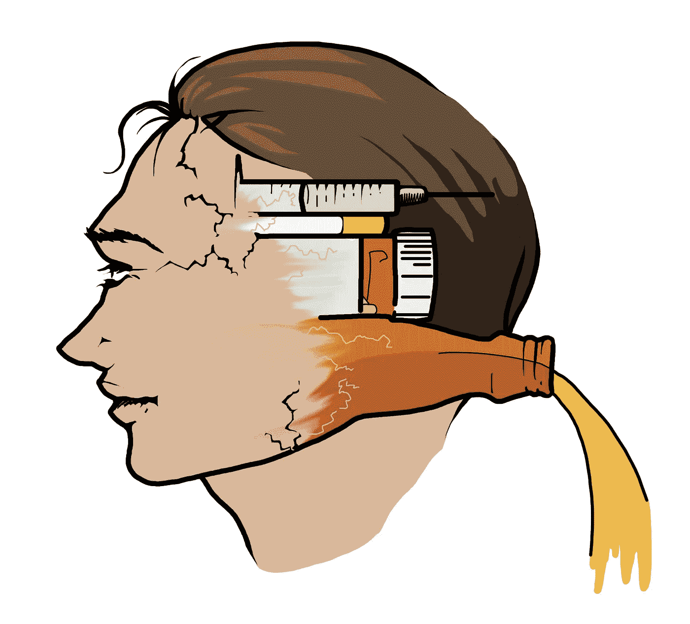

# 老鼠公园——上瘾不仅仅是生物学

> 原文：<https://medium.datadriveninvestor.com/rat-park-addiction-is-more-than-just-biology-66cd26623903?source=collection_archive---------13----------------------->

B 但是并不是所有的人都表现出上瘾的行为。有些人可能会做上瘾的活动，但他们可能不会达到上瘾的程度，而同时有些人会。《老鼠公园》是一系列为回答上瘾行为的原因而进行的研究。

# 老鼠公园

加拿大不列颠哥伦比亚省西蒙弗雷泽大学的 Bruce K. Alexander 和他的同事为老鼠设置了两种环境。一组老鼠被饲养在隔离的笼子里，另一组被饲养在一个老鼠公园里，这是一个在实验室里为老鼠设立的群体。

65 天后，将每组中的一半大鼠转移到另一组，80 天后，给大鼠提供清水以及水和吗啡的溶液。测试大鼠的消费行为。

这项研究的结论是

*   生活在群体中的大鼠比隔离的大鼠消耗更少的吗啡溶液。
*   隔离饲养但在 65 天后转移到群体中的生活在群体中的大鼠比在群体中饲养的大鼠消耗更多的吗啡溶液

# 这项研究表明了什么？

布鲁斯和他的研究表明，成瘾不仅仅是由成瘾物质或活动引起的疾病，还有环境因素。有道理。与对活动不感兴趣的人相比，对其他活动感兴趣或从事对他们有益的其他活动的人往往不会上瘾。通常，当人们抑郁或焦虑时，成瘾就会开始，并将成瘾活动作为逃避现实的一种手段。这些活动帮助他们感觉更好，暂时保持放松。

公园里的老鼠可以进行有趣的活动，因为公园里充满了老鼠喜欢的东西，如用于攀爬的平台，用于藏身的锡罐，用于四处撒播的木屑，以及用于锻炼的转轮。所以他们没有上瘾，或者他们更喜欢白开水而不是吗啡溶液。

隔离笼子里的老鼠没有发现其他让它们感兴趣的活动，因为它们孤独地生活在笼子里。他们喝的吗啡溶液比水多得多。

同样，人们也会上瘾。一个人有越多有益的、有趣的活动，他就越不可能上瘾。

 [## 在家工作如何提高我的工作效率|数据驱动型投资者

### 在家工作确实激发了我最大的潜能，让我更有效率。因为在家工作给了我…

www.datadriveninvestor.com](https://www.datadriveninvestor.com/2020/07/29/how-working-from-home-increased-my-productivity/) 

# 参考

1.  BRUCE K. ALEXANDER，BARRY L. BEYERSTEIN，PATRICIA F. HADAWAY 和 ROBERT B. COAMBS 心理学系，Simon Fraser University Burnaby，B.C. V5A IS6 Canada (1980)从[https://www.brucekalexander.com/pdf/Rat%20Park%201981%20PB&B.pdf](https://www.brucekalexander.com/pdf/Rat%20Park%201981%20PB&B.pdf)取回
2.  Hadaway，P.F .，Alexander，B.K .，Coambs，R.B. *等*大鼠住房和性别对吗啡-蔗糖溶液偏好的影响。*精神药理学* **66，**87–91(1979)。[https://doi.org/10.1007/BF00431995](https://doi.org/10.1007/BF00431995)
3.  Bruce k . Alexander[Addiction:The View from Rat Park(2010)](https://www.brucekalexander.com/articles-speeches/rat-park/148-addiction-the-view-from-rat-park)检索自[https://www . brucekalexander . com/articles-speechs/Rat-Park/148-Addiction-The-View-from-Rat-Park](https://www.brucekalexander.com/articles-speeches/rat-park/148-addiction-the-view-from-rat-park)

## 访问专家视图— [订阅 DDI 英特尔](https://datadriveninvestor.com/ddi-intel)