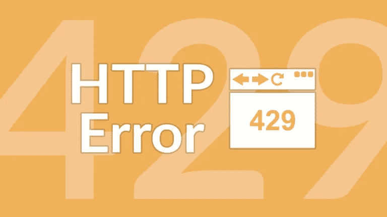

# 限制烧瓶 API 速率的最简单方法

> 原文：<https://medium.datadriveninvestor.com/rate-limit-a-flask-api-with-2-lines-of-code-c7976fb13436?source=collection_archive---------2----------------------->

## **添加 2 行代码**



对 API 进行速率限制以允许**更好的数据流**和**通过减轻 DDoS 之类的攻击来提高安全性**被认为是一种好的做法。速率限制将限制在指定时间段内从唯一 IP 地址发出的请求数量。

# 导入库

```
**from ratelimit import limits**
```

# 应用装饰器

```
@app.route(‘/endpoint/’, methods=[‘GET’])
**@limits(calls=1, period=1) #max 1 call per second** def respond(): #API code
```

如果超出限制，将引发以下异常。

```
raise RateLimitException(‘too many calls’, period_remaining)
```

仅此而已。正如开发人员被教导围绕 SQL 注入进行编码一样，速率限制是任何 API 都应该实现的另一个必要措施。