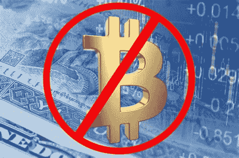
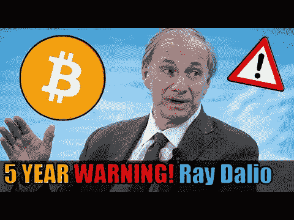
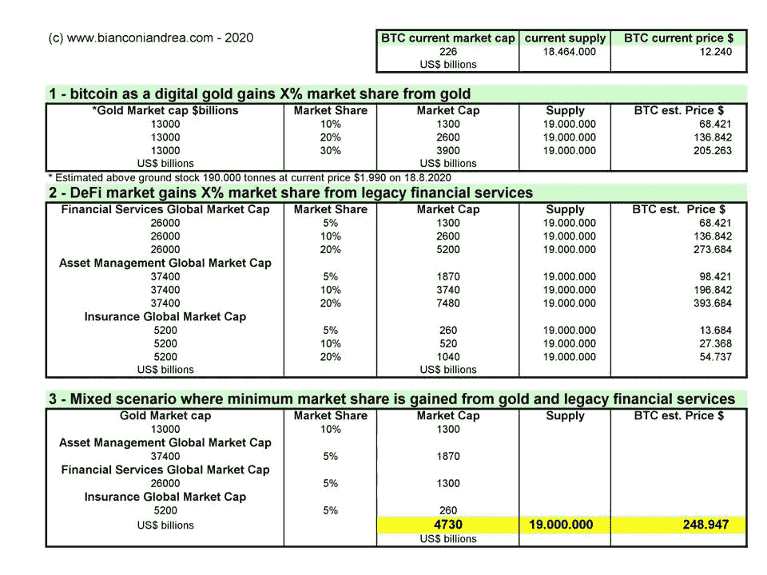
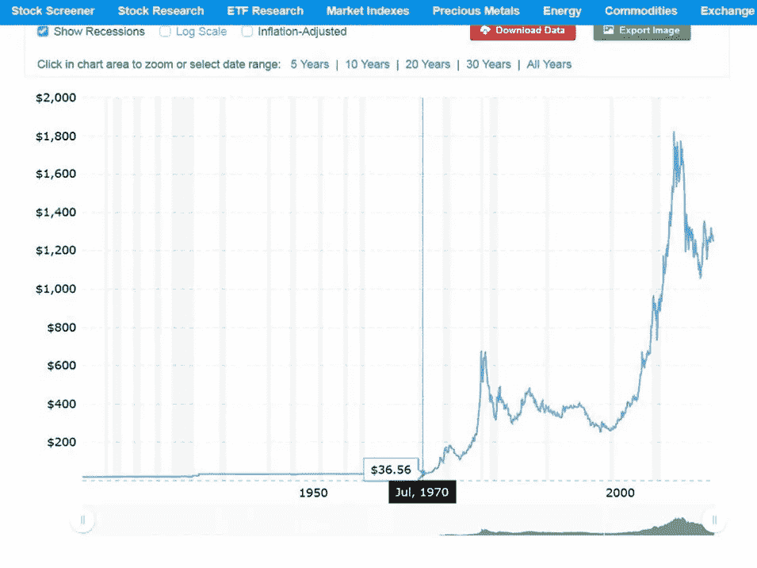

# 雷伊·达里奥又错了，比特币不会被禁止，原因如下

> 原文：<https://medium.datadriveninvestor.com/ray-dalio-is-wrong-again-bitcoin-will-not-be-banned-here-s-why-9be0c9e26193?source=collection_archive---------4----------------------->

不变的是，随着比特币价格飙升并挑战地心引力，无论是上涨还是下跌，机构投资者、央行行长和知名金融家的注意力突然被唤醒。总是在那时，我写一些东西来揭穿太常见的有缺陷的叙述和误解。无论是之前的[沃伦巴菲特，还是](https://cointelegraph.com/news/why-we-shouldnt-listen-to-warren-buffet-expert-take)[今天的](https://hackernoon.com/oops-ray-dalio-missed-the-biggest-of-all-paradigm-shifts-crypto-se4br2iq9)，他们的评论只是表明了对比特币是什么以及它代表什么的无知(请注意大写的 B，因为他们不知道)。

有人会建议投资几个小时高度娱乐和教育的时间来观看这两部优秀的获奖电影，由无题公司的研究员托尔斯滕·霍夫曼拍摄。

几天前，另一个著名的投资者，斯坦·德鲁肯米勒，透露他也持有 BTC 的股份。德鲁肯米勒追随其他著名的华尔街人士，如比尔·米勒、保罗·都铎·琼斯、迈克尔·诺沃格拉茨、Microstrategy 的首席执行官迈克尔·塞勒等等。德鲁肯米勒对推动比特币价格的因素有着本能的理解，至少在中短期内是如此。他指出，BTC 作为一个储值场所，对千禧一代和新西海岸的钱有很大的吸引力，正如你所知，他们有很多这样的东西他还说“*如果黄金的赌注成功了，比特币的赌注可能会更好，因为它更薄，流动性更差，贝塔系数更大*”

完全正确。嘿，哈利路亚，这给 cryptos 带来了更多的关注，更多的机构兴趣，我们都更开心了。

然而，在对比特币一无所知的杰出投资者中，[雷伊·达里奥最近说了一些值得注意的话。实际上没有什么新东西——因为它不时被提及——但仍然是值得一劳永逸地考虑和争论的东西。](https://www.zerohedge.com/crypto/bitcoin-tops-16k-dalio-warns-nations-will-outlaw-crypto-if-prices-keep-rising)

嘿，比特币制造者要小心了，因为根据雷伊·达里奥的说法，如果比特币和其他加密货币开始变得“重要”，政府将“取缔”比特币和其他加密货币。"

伙计们，别再玩没有银行的银行家游戏了。引用美国前总统欧巴马的话，不再有“*把自己的私人瑞士银行账户揣在口袋里*”伙计们。

雷伊·达里奥是最聪明的投资者之一，因此，谁知道呢，也许他希望一些廉价的“恐怖主义”将清洗掉一些弱者，这样他就可以像他的朋友们在他之前所做的那样，以低价买入一些。但是为了这个目的，让我们假设他真的说到做到。

所以我对他的问题是:为什么比特币应该被禁止？又是怎么做到的？这项禁令的实际效果如何？让我们看看。

## **为什么要禁止比特币？**

让我们先从为什么开始，因为如果我们澄清政府没有真正的理由禁止比特币，那么这种禁止的方式和实际效果只是抽象的思考。

我猜戴利奥认为，BTC 最终可能会威胁到各国法定货币的地位，甚至是美元的储备货币地位。暂且不论 BTC 何时变得“重要”——进而对政府变得“危险”——为了威胁其他货币，BTC 首先应该成为一种“货币”。

但是 BTC 并不是一种真正的货币，或者更确切地说，它也是许多其他事物中的一种货币，但只是在非常非常小的程度上。最重要的是，BTC 永远不会成为像美元或欧元那样的货币。事实是，BTC 没有成为一种货币的真正需要。比特币没有必要扩大作为支付手段的应用范围。顺便说一下，这和比特币批评者在提到比特币的缓慢采用路径和可扩展性问题时犯的错误是一样的。原因是，有大量更好的通货膨胀货币可以用来支付冰淇淋、浓缩咖啡或日常杂货。我可以称之为 SOLs，负债的存储。[cbdc(数字人民币、美元、欧元)](https://www.investopedia.com/terms/c/central-bank-digital-currency-cbdc.asp)来了，他们是 SOLs 的美好未来。金融科技数字支付系统(如中国的[蚂蚁集团](https://www.nasdaq.com/articles/how-ants-suspended-ipo-is-related-to-chinas-digital-yuan-2020-11-12)、支付宝、We Chat 等)形式的稳定硬币和数字法定货币。)都已经来了。所有这些数字货币都将相互竞争，并与美元争夺储备货币地位。事实上，中国是第一个发行 CBDC 的国家，作为阻止其他数字货币在本国市场与数字人民币竞争的先发制人之举。他们想阻止当地采用竞争性货币，如私营企业的货币，如 [Libra](https://medium.com/@andreabianconi/libra-untangled-what-lies-behind-facebook-s-digital-currency-project-part-i-f8fe2663e743) 或欧元或美元 CBDC。当然，他们一点也不关心 BTC。

## **比特币不是法定货币的威胁**

因此，BTC 仍然主要是价值储存地(SOV)T1 和 T2，这就是为什么 T3 的原因。它不与任何数字货币直接竞争。它不会对任何主要国家的货币或未来的发展中国家构成威胁。在某种程度上，BTC 只与黄金竞争。我说“仅在一定程度上”是因为(I)黄金拥有一些特殊的品质，使其成为黄金的更好替代品，尤其是对年轻人群和不富裕的人来说，因为它的便携性、抗胁迫性、稀缺性和储存成本都优于黄金，以及(ii)尽管 BTC，黄金仍将是黄金，尤其是对机构投资者和中央银行来说。这两者可以很容易地长期共存，但从长期来看，BTC 的趋势将是[不可避免地侵蚀黄金的市场份额，](https://medium.com/the-capital/bitcoin-goes-parabolic-and-its-not-the-price-ce63b167c612)以及全球遗留金融服务、资产管理和保险部门的市场份额。

I know what you think: I must be joking right? Nope

所以，让我们回到政府应该禁止比特币的原因。坦白地说，没有。BTC 不会对当前的金融体系构成威胁。我们都很清楚货币贬值的影响。美元和欧元购买力的下降对任何人来说都是显而易见的。

50 years of monetary inflation at work: how many US$ you would need to buy one ounce of Gold since 1970\. The chart is not updated but we are well over US$ 1.800 at the time of writing from US$ 36,56 in 1970.

这就是为什么投资者涌向黄金、白银、房地产、股票、农田、艺术品，当然还有比特币。政府会把它们和比特币一起全部封杀吗？当然不是。BTC 作为价值储存手段对政府的威胁并不比黄金、白银或农田更大。唯一的区别是比特币比黄金或白银更难被政府没收。如果戴利奥设想的场景是政府对主权财富基金的全面打压，那么人们应该更愿意涌入比特币而不是黄金，正是因为它的抗审查特性和弹性。如果你是一个政府，你是愿意征收房地产税，没收存在容易识别的银行和黄金经纪商的金条，还是四处奔走，试图找出人们把数字和字母串藏在哪里？

## **比特币不会对传统金融体系构成威胁**

现在让我澄清一些非常重要的事情。当人们提到比特币时(请再次注意大写的 B)，它不是一种货币，也不是一种 SOV，而是可编程的货币。我们正在谈论一场等同于古腾堡印刷机的革命。我们谈论的是一个全新的金融体系，它平行于并独立于传统的金融体系。每个比特币拥有者都是“自己的银行”。Andreas Antonopoulos 曾经说过“*如果将比特币视为西方世界的支付货币，那就大错特错了，因为比特币关乎其他一切和其他任何地方*”。确实如此。想一想在难以进入银行的国家，数百万人用它给家人汇款。想想那些因为恶性通货膨胀而大量使用 BTC 的国家，[比如委内瑞拉和阿根廷](https://www.coindesk.com/bitcoin-adoption-venezuela-research)。在那里，比特币被用来转移 SOV P2P，没有任何中介，几乎没有成本。

## **实际上无法执行的禁令？**

让我们看看政府如何实际执行对比特币的理论禁令。

全国性的禁令没有任何意义。如果中国或委内瑞拉不能有效地禁止它，我们也做不到。那么它必须是一个全球协调的全球性禁令。极不可能。

你如何执行禁令？除非关闭所有互联网连接，否则你无法强制执行。你应该关闭法定货币和加密交易所之间的所有大门。你应该完全禁止密码交换。但是很难想象在某个地缘政治上不可逾越的国家——也许在东半球的某个地方——不会有人建立一个秘密交易所。那么，不那么强制性的分散式 P2P 交易又会如何呢？

黑市呢？政府根本没有办法强制执行，即使是在中国这个警察国家。

而且即便如此，实际上，将比特币打入地下会有什么影响？它的价格将会爆炸，与它仍然合法的国家相比，这些国家的差价将会很大。

## 监管者的问题是控制，而不是彻底禁止

真正被忽视的问题是加密货币的隐私性和可替代性，这个问题一方面会反对监管机构，另一方面会反对加密货币及其开发者。他们想要后门。这是战斗的地方。[像 Monero 这样的隐私币就在那个](https://www.coindesk.com/spagni-fluffypony-monero-cryptographers-one-step-ahead-regulators)的前线。但是 BTC 也会直接受到影响，因为如果不增加隐私，它的可替代性也会受到损害。

但这是一个更复杂的问题，需要单独处理。我将在一篇新文章中深入探讨这个主题。

## **结论**

如果我们看看它的现实——为什么以及如何禁止比特币——很明显它不会发生。

它不会被禁止，就像印刷机的使用不会被禁止一样，尽管当局试图对违法者处以监禁。就像汽车和内燃机不能被禁止一样，尽管当局试图通过繁琐和威慑性的法规来减缓其采用。

这只猫已经出柜 12 年了。没有办法把它放回去。技术时钟不能倒转。

************************************************************

下面你会发现我的旧比特币文章的编年回顾和发表时的相对价格水平。**我回到了 2018 年，当时 BTC 的价格是 3.100 美元。享受+500%的驾驶体验**:

2018 年 11 月 9 日[https://medium . com/@ Andrea bianconi/the-latest-On-security-tokens-from-Zurich-s-crypto summit-5e 740 AC 5439 b](https://medium.com/@andreabianconi/the-latest-on-security-tokens-from-zurich-s-cryptosummit-5e740ac5439b)我写道“……这可能会导致加密市场在开始走高之前下跌”——11 月 14 日，BTC 开始跌至 2017 年 9 月以来的最低水平 3.100 美元——这是一个巨大的买入机会

2019 年 5 月 24 日[https://medium . com/the-capital/the-fundamental-reasons-to-beyond-the-bit coin-the-crypto-sector-2024 D8 BC 8395](https://medium.com/the-capital/the-fundamental-reasons-to-be-bullish-on-bitcoin-and-the-crypto-sector-2024d8bc8395)我写道:“……这将不可避免地反映在 BTC 和所有相关密码的升值上。这一进程正在进行，不可逆转”。BTC 价格 7.500 美元

2019 年 7 月 25 日[https://medium . com/@ Andrea bianconi/oops-ray-dalio-missed-the-large-of-all-paradigm-shift-crypto-79ce 826 c 1445](https://medium.com/@andreabianconi/oops-ray-dalio-missed-the-biggest-of-all-paradigm-shifts-crypto-79ce826c1445)我写道:“……最后，如果机构投资者、家族理财室、HNWI 和 UHNWI 开始将他们投资组合的 1%分配给加密领域，对比特币的价格会有什么影响？”BTC 价格 9.800 美元

2019 年 8 月 22 日[https://medium . com/the-capital/follow-the-money-buy-bit coin-and-gold-5c 28703 D8 ADF](https://medium.com/the-capital/follow-the-money-buy-bitcoin-and-gold-5c28703d8adf)我写道:“……但不管时机如何，上述宏观经济基本面是最强大的催化剂，将在可预见的未来推动大笔资金流向贵金属和加密。”BTC 价格 10.100 美元

2020 年 3 月 24 日[https://medium . com/the-capital/新冠肺炎-货币海啸对比特币和黄金的影响-a3fb4d14e97f](https://medium.com/the-capital/covid-19-and-the-effects-of-the-monetary-tsunami-on-bitcoin-and-gold-a3fb4d14e97f) 我写道“……虽然标准普尔 500 指数下跌 3%，但 BTC/美元上涨 10%，黄金/美元上涨 3.6%。这可能意味着弱者被淘汰，霍德勒/公牛队重新控制了局面”BTC 价格 6.700 美元

2020 年 5 月 17 日[https://medium . com/the-capital/what-Tudor-Jones-bit coin-investment-means-for-other-institutional-investors-and-for-bit coin-f 337 a 37 eeb 8d](https://medium.com/the-capital/what-tudor-jones-bitcoin-investment-means-for-other-institutional-investors-and-for-bitcoin-f337a37eeb8d)我写道:“……给你，一个理性的赌注和不对称的回报使你可能只将 1-2%的财富分配给 crypto，有一天这很可能成为你财富的最大部分。”BTC 价格 9.670 美元

2020 年 8 月 20 日[https://medium . com/@ Andrea bianconi/bit coin-goes-parabolic-and-the-not-the-price-c557f 90 a 694 a](https://medium.com/@andreabianconi/bitcoin-goes-parabolic-and-its-not-the-price-c557f90a694a)我写道:“……在比特币的协议层面，排除不利的技术发展或目前不可想象的问题，唯一合理的问题是，它的未来价格将是今天价格的几倍。”BTC 价格 11.500 美元。

2020 年 11 月 13 日。我写作时的想法。价格是 16.350 美元，看起来我们可能会在这里有一个短期的顶部。回调到 14000 美元是很有可能的。到$ 12.000–13.000 将是一个更好的机会，为下一阶段增加更多。

# crypto #区块链@ think block tank @ untitled-Inc #比特币# cbdc #数字货币#monero

www.bianconiandrea.com—2020 年

****************************************************************

如果你喜欢这篇文章，请在左下角“鼓掌”x 次，这样它会被更多的人分享。多谢

****************************************************************

**法律免责声明**:本网站及其中包含的信息仅供一般指导，不构成法律意见。因此，它不应被用来替代就具体问题与律师的磋商。本文中的所有信息均按“原样”提供，不保证完整性、准确性、及时性或任何形式的明示或暗示的担保。

**投资免责声明**:本网站及其中包含的信息无意成为与所提交材料相关的建议或信用分析的来源，本网站中包含的信息和/或文件不构成投资建议。

© [www.bianconiandrea.com](http://www.bianconiandrea.com) — 2020