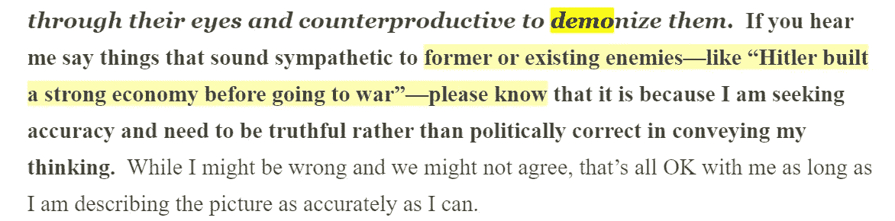
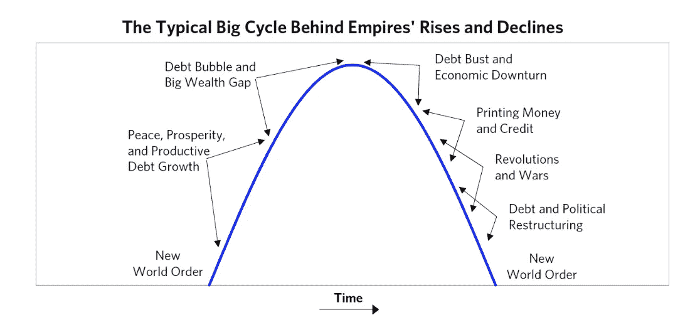
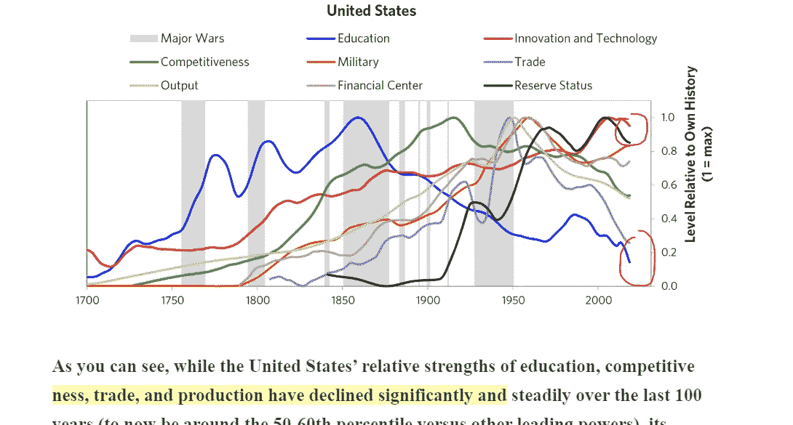
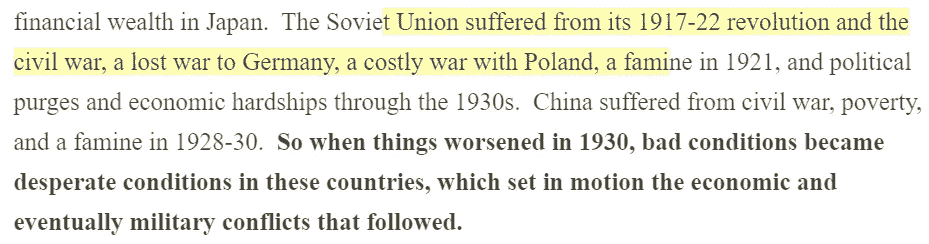
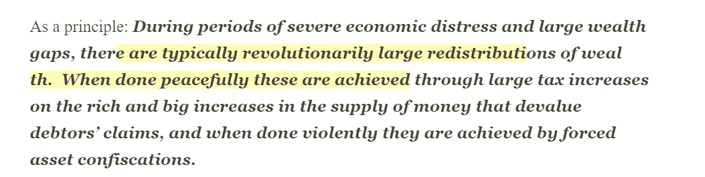
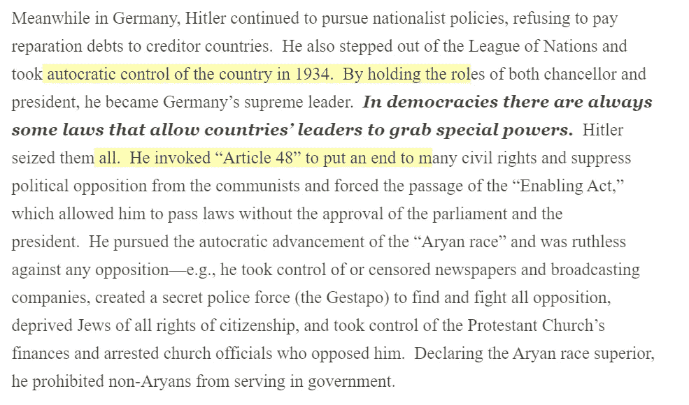

# [雷伊·达里奥]美国和美元的大周期

> 原文：<https://medium.datadriveninvestor.com/ray-dalio-the-big-cycle-of-the-united-states-and-the-dollar-15de15a0c68c?source=collection_archive---------4----------------------->

 [## 第四章:美国和美元的大周期，第一部分

### 这是关于美国帝国及其沿着典型的主导力量大循环的道路的两部分章节的第一部分…

www.linkedin.com](https://www.linkedin.com/pulse/chapter-4-big-cycle-united-states-dollar-part-1-ray-dalio/) 

当谈到改变世界秩序时，什么是真的，什么是假的？有很多帝国的兴衰。今天我们有两个超级大国，中国和美国，但这个时候也会过去。

我们也应该从敌人的角度看问题，以便更好地了解整个经济。

资本主义是为国家增长创造财富的方式，但也是那些庞大国家灭亡的原因。经济和财富差距之间有差距，富人和穷人之间也有变化。就像史提夫·福布斯不喜欢财产税，比如愚蠢的想法。

我靠，美国真的在减速，这是人之常情。

在有子弹战争之前，总是有经济战争，财富差距助长了战争进程。

中国和美国互相争斗是有原因的，背后有一段完整的历史。我确信这种事情会一次又一次地发生。

看起来美国正处于一个经济繁荣的好时代，或者说是一个好位置，但是这些事情将会改变，而且已经改变了。

一如既往，财富永远不会消失，它会被重新安置在世界上许多不同的地方。

希特勒能够控制权力，利用规则和法律是有原因的。希特勒确实创造了一个良好的经济，当然，这是用许多不同种族的鲜血完成的，但这是一个有效的政策。

 [## 如何在不牺牲孩子或财务的情况下安全理智地离婚|数据驱动…

### 在美国，七月是以孩子为中心的离婚月。作为 cdfaⓡ的专业人士，我可以向你保证，从长远来看…

www.datadriveninvestor.com](https://www.datadriveninvestor.com/2020/07/28/how-to-divorce-safely-and-sanely-without-sacrificing-your-children-or-your-finances/) 

取决于每个国家的信仰，它的经济已经发生了变化。

**进入专家视角—** [**订阅 DDI 英特尔**](https://datadriveninvestor.com/ddi-intel)