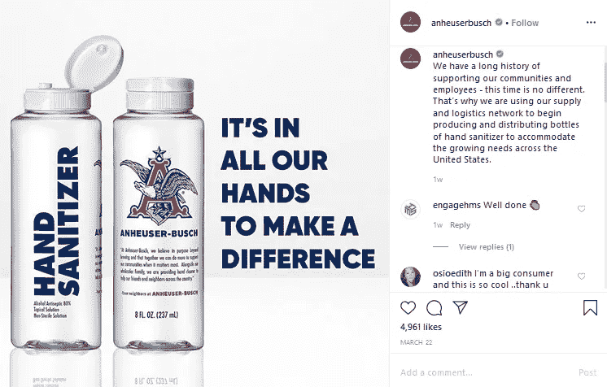
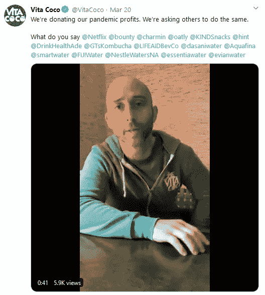

# 新冠肺炎时代的企业重组

> 原文：<https://medium.datadriveninvestor.com/re-framing-businesses-during-the-time-of-covid-19-tips-from-mark-schaefer-3426275c5deb?source=collection_archive---------21----------------------->

## Mark Schaefer 分享了他对新冠肺炎如何改变我们接触客户方式的见解。

Photo by [Clay Banks](https://unsplash.com/@claybanks?utm_source=medium&utm_medium=referral) on [Unsplash](https://unsplash.com?utm_source=medium&utm_medium=referral)

我们正在经历疯狂的、前所未有的时代。

疫情冠状病毒一夜之间改变了我们的生活方式。从我们关心安全的方式到我们工作的方式，一切都不一样。

由于疫情，医疗保健行业承受着病例数量激增的负担。另一方面，全球经济遭受了巨大打击。

根据联合国劳工机构国际劳工组织(ILO)发布的估计，全球将有 2470 万人因危机而失业。

随着各国进入封锁模式，各垂直行业的企业都在努力继续运营。

那么，你的企业能做些什么来度过这段艰难时期呢？

让我们来看看。

# 在冠状病毒疫情肆虐期间，你能做些什么来拯救你的企业？

[马克·谢弗](https://medium.com/u/3340d9dd0981?source=post_page-----3426275c5deb--------------------------------)为努力维持业务的企业家和经理们提供了一些重要的建议。

根据马克的说法，企业应该这样做:

Source: [YouTube](https://www.youtube.com/watch?v=hID6EjgNz6o)

# 1.粉碎规则手册

非常时期需要非常手段。

我们正在经历的完全是破坏性的。

要度过这场风暴，你需要忘记所有的规则。你可能已经准备好了一份详细的营销计划，但是从目前的情况来看，它可能根本不相关。

根据马克的说法，现在所有企业最关心的问题应该是相关性。他敦促企业家们退后一步，思考这样一个问题:“人们还在乎你做什么吗？”

他分享了一个个人例子来解释为什么企业现在需要灵活性。

他的一个迈阿密客户联系了他，因为他需要社交媒体策略方面的帮助。但是一个星期后，客户说他们的重点已经转移了。他们的供应链很短，处于危机状态。

对于业务来说，马克暂时无关紧要。

# 2.重构你的商业模式

获得相关性的最好方法是了解你的客户现在需要什么。根据他们的需求，企业需要重新构建他们的战略、技能、核心竞争力和商业模式。

随着冠状病毒疫情，每个人的生活方式都发生了变化。随着这一转变，出现了许多未得到满足的新需求。如果你能找到满足这些需求的方法，你可能会在你的生意中找到一些稳定性。

底线是什么？

你必须创新。

在播客中，马克告诉我们，他所在县的一个养牛场主正在将他的牛排送到人们的家中。这个地区所有的餐馆都关门了；甚至杂货店的肉也快卖完了。所以，很明显，对他的牛排有需求。

通过将 B2B 模式转变为 B2C 模式，牧场主能够保持现金流。

# 3.与其推销，不如专注于帮助

现在，每个人都在失去一些重要的东西。

这可能是一个爱人，一份工作，或者他们的身体或精神健康。

企业需要意识到这种情绪的转变。如果你试图在悲伤的时候积极推销你的产品，你不会找到任何买家。

马克说，把它想象成试图在葬礼上卖东西。你不会给别人优惠券吧？处理这种情况的最好方法是问别人你如何能帮助他们走出损失。

他建议企业向顾客伸出援手，尽可能地帮助他们。他还认为，在危机情况下帮助他们可以建立长期的忠诚度。

从密苏里州的安海斯-布希公司获得灵感。他们决定利用他们的供应和物流网络来生产和分销洗手液，以满足不断增长的需求。

*Image via* [*Instagram*](https://www.instagram.com/p/B-BKAadDJPD/)

4.做正确的事

在他的书《营销反叛:最人性化的公司获胜》中，马克强调了公司在业务中采取更人性化方法的必要性。

在我们抗击冠状病毒危机之际，企业表现出同情心再合适不过了。他认为企业应该做正确的事情，即使这会造成伤害。

即使这会让你的口袋有点痛，你也要努力。现在是企业回馈社区的时候了。

例如，总部位于纽约的饮料品牌 Vita Coco 已承诺向饥饿救济组织“喂饱美国”和“没有饥饿的孩子”全国运动捐赠 100 万美元，以解决饥饿问题。

在 Twitter 上发布的一段视频中，他们的联合创始人兼首席执行官迈克尔·科尔班(Michael Kirban)敦促其他企业和企业家，尤其是那些销售额飙升的企业和企业家，回馈社会。

*Image via* [*Twitter*](https://twitter.com/VitaCoco/status/1241063436462837762?ref_src=twsrc%5Etfw%7Ctwcamp%5Eembeddedtimeline%7Ctwterm%5Eprofile%3Avitacoco%7Ctwcon%5Etimelinechrome&ref_url=https%3A%2F%2Fwww.businesswire.com%2Fnews%2Fhome%2F20200320005496%2Fen%2FVita-Coco-Reinvests-Incremental-Profits-Relief-Efforts)

但是如果你没有钱进行大额捐赠呢？

你还有其他方法可以帮忙。首先，照顾好你的员工。一定要尽你所能帮助他们。

此外，与参与帮助社区或直接向有需要的人捐赠食物和衣服的组织合作。

# 这并不容易，但我们可以一起度过难关

冠状病毒对大大小小的企业的影响将是巨大的。为了在这个充满挑战的时代生存下来，你需要准备好调整你的战略和核心竞争力。

您需要认识到，在封锁期间，客户的需求已经发生了变化。如果你想保持你的业务运行，你需要重新构建你的业务，以满足未满足的需求。

除了保持相关性之外，你需要理解你的客户可能正在遭受巨大的损失，无论是个人损失还是职业损失。当联系你的客户时，你需要采取一种更加敏感和人性化的方式。

**关于作者**

[谢恩·巴克](https://shanebarker.com/)是[内容解决方案](https://contentsolutions.io/)和[礼品制作](http://gifographics.co/)的创始人兼首席执行官。你可以在[推特](https://twitter.com/shane_barker)、[脸书](https://www.facebook.com/ShaneBarkerConsultant/)、 [LinkedIn](https://www.linkedin.com/in/shanebarker/) 、 [Instagram](https://www.instagram.com/shanebarker/) 、 [iTunes](https://podcasts.apple.com/us/podcast/shane-barkers-marketing-madness-podcast/id1472142690) 上和他联系。